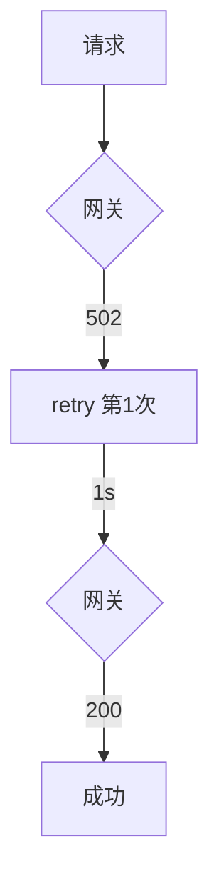

# Day 14 企业案例集：容错设计

**篇幅**：案例专题 · 约 3500 字

---

## 案例 1：智链科技理财 API 高峰限流

### 背景

DeepSeek 在理财问答高峰返回 `429 Too Many Requests`，Body 含 `retry-after` 提示（本课程未解析 Header，统一指数退避）。

### 问题

Day 12 `LLMClient` 一次 429 即失败，内测差评「偶发不能用」。

### 方案（Day 13）

```python
client = ResilientLLMClient.from_env(policy=RetryPolicy(max_attempts=4))
result = client.complete(messages)
```

- `is_retryable_error` 识别 429  
- 默认 1s、2s 退避，多数用户在 3s 内获得回复

### 教训

**限流是可恢复错误**；与 401 认证失败严格区分。

---

## 案例 2：某银行网关 502 抖动

### 背景

企业私有 LLM 网关前置 Nginx，发布窗口偶发 502，持续 < 5s。

### 监控



### 参数调优

| 场景 | max_attempts | base_delay |
|------|--------------|------------|
| 内网网关 | 4 | 0.5 |
| 公网 SaaS | 3 | 1.0 |
| 批处理离线 | 6 | 2.0 |

### 教训

退避参数应来自 **SLO 与 P99 延迟**，非拍脑袋。

---

## 案例 3：ConfigError 误重试事故（反面教材）

### 背景

某学员把 `except Exception` 无差别重试，缺 Key 时循环 10 次，日志 10 万行，触发告警风暴。

### 正确做法

```python
if isinstance(exc, (ConfigError, ModelValidationError)):
    return False  # is_retryable_error 已实现
```

### 教训

**配置错误 fail-fast**；重试是给**瞬时故障**的，不是给**上线前没配 Key** 的。

---

## 案例 4：超时与重试叠加

### 场景

单次 `complete` 允许 60s；策略 `max_attempts=3`。

最坏情况：3 × 60s = 180s 用户等待（若每次均超时且可重试）。

### 产品决策

赵岩要求 CLI **120s 总预算** → Day 14 将讨论「总超时」与「单次超时」分层。

### 技术选项

1. 降低 `timeout_seconds` 至 30  
2. 减少 `max_attempts`  
3. 自定义 `retryable` 不重试超时（见 FAQ）

---

## 案例 5：AWS / Google 客户端对比

| 实践 | NexusAgent | 业界 SDK |
|------|------------|----------|
| 指数退避 | ✅ | ✅ |
| 最大尝试 | ✅ | ✅ |
| Jitter | ❌ 选修 | ✅ 默认 |
| 断路器 | ❌ | 部分 |
| 幂等 Token | ❌ Day 30+ | POST 慎用 |

---

## 案例 6：CI 中的 flaky transport

`resilient_client_demo.py` 模式：

```python
def make_flaky_transport(fail_times=2):
    state = {"n": 0}
    def transport(...):
        state["n"] += 1
        if state["n"] <= fail_times:
            raise APIError(..., status_code=503)
        return sample_json
    return transport
```

**价值**：无真实网络即可验证重试路径，`pytest` 全绿。

---

## 案例 7：Day 14 cli_assistant 用户体验

### 用户故事

> 作为理财用户，我希望网络抖一下时助手**自动再试**，而不是让我重新输入问题。

### 实现要点

- 使用 `ResilientLLMClient`  
- `on_retry_log=True` 时可打印「正在重试…」  
- `messages` 历史不因重试而重复追加 user 消息（重试在 complete 内部）

---

## 容错设计检查清单

- [ ] 可重试状态码白名单文档化  
- [ ] `max_attempts` 与退避上限  
- [ ] Config / 401 不重试  
- [ ] 重试日志可观测  
- [ ] 测试含 flaky transport  
- [ ] 文档说明最坏延迟

---

*授课实录：[15_授课实录.md](15_授课实录.md)*
