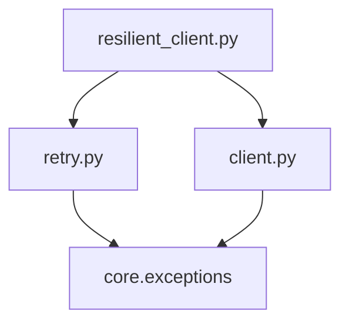

# Day 13 与 Day 12 客户端对照表

**目的**：说明 `ResilientLLMClient` 如何在不修改 Day 12 核心的前提下增加容错

---

## 总览

| 维度 | Day 12 `LLMClient` | Day 13 `ResilientLLMClient` |
|------|-------------------|---------------------------|
| 代码位置 | `src/llm/client.py` | `src/llm/resilient_client.py` |
| 需求 | ZL-NA-REQ-012 | ZL-NA-REQ-013 |
| 继承 | — | 继承 `LLMClient` |
| `complete` | 直接 HTTP + 解析 | 外包 retry + timeout |
| 失败行为 | 一次失败即抛 | 可重试则退避再试 |
| 传输层 | urllib / Mock | **不变**（复用父类） |
| 解析层 | `parse_chat_completion` | **不变** |

---

## 方法对照

### complete

**Day 12**：

```python
def complete(self, messages: list[ChatMessage]) -> ChatCompletionResult:
    body = build_request_body(messages, self.config)
    raw = self._transport(self.env.chat_completions_url, self._headers(), body)
    return parse_chat_completion(raw)
```

**Day 13**：

```python
def complete(self, messages: list[ChatMessage]) -> ChatCompletionResult:
    return self._complete_resilient(messages)
    # _complete_resilient = retry(with_timeout(super().complete))
```

**等价点**：成功路径最终仍执行父类 `complete` 逻辑。

**升级点**：429/503 等可自动重试；单次调用有 `timeout_seconds` 上限。

---

## 构造参数对照

| 参数 | Day 12 | Day 13 新增 |
|------|--------|-------------|
| `config` | ✅ | ✅ |
| `env` | ✅ | ✅ |
| `transport` | ✅ | ✅（flaky 测试） |
| `sample_path` | ✅ | ✅ |
| `policy` | — | `RetryPolicy` |
| `on_retry_log` | — | `bool` |

---

## 异常行为对照

| 场景 | Day 12 | Day 13 |
|------|--------|--------|
| 首次 503 | 立即 `APIError` | sleep 后重试 |
| 连续 503 达 max | 同左 | 用尽后 `APIError` |
| `ConfigError` | 立即失败 | 立即失败（不重试） |
| 401 | 立即失败 | 立即失败 |
| 超时 | urllib 60s 或挂起 | `APIError` 超时，可重试 |

---

## 模块依赖图



Day 12 **不依赖** Day 13——单向依赖。

---

## 演示脚本对照

| Day 12 | Day 13 |
|--------|--------|
| `llm_client_demo.py` | `resilient_client_demo.py` |
| 稳定 Mock | flaky transport + 重试日志 |
| `LLMClient` | `ResilientLLMClient` |

---

## 何时用哪个客户端

| 场景 | 推荐 |
|------|------|
| 单元测传输/解析 | `LLMClient` + 稳定 transport |
| 生产 CLI / 助手 | `ResilientLLMClient` |
| 确定性失败测试 | `LLMClient` |
| 重试策略测试 | `ResilientLLMClient` + flaky transport |

---

## Day 14 衔接

`cli_assistant` 默认：

```python
from llm.resilient_client import ResilientLLMClient
client = ResilientLLMClient.from_env(on_retry_log=True)
```

多轮 `messages` 在 CLI 层维护，`complete` 容错由 Day 13 模块承担。

---

*补充阅读：[19_讲师补充阅读.md](19_讲师补充阅读.md)*
