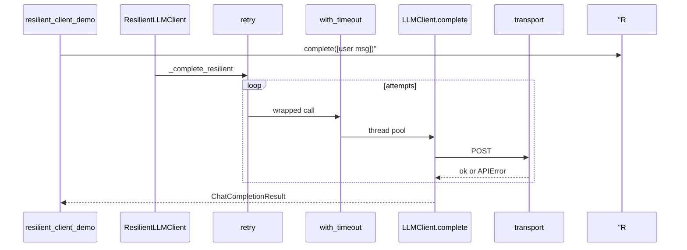

# Day 13 完整代码走查

**目标**：逐文件带读，建立「从 demo 到生产」全景  
**建议时长**：90 分钟自学或 45 分钟课堂串讲

---

## 文件 1：`llm/retry.py`

### 1.1 常量与判定（L28–48）

```python
DEFAULT_RETRYABLE_STATUS = frozenset({429, 500, 502, 503, 504})

def is_retryable_error(exc: BaseException) -> bool:
    if isinstance(exc, (ConfigError, ModelValidationError)):
        return False
    if isinstance(exc, APIError):
        code = exc.status_code
        if code is None:
            return True
        if code in DEFAULT_RETRYABLE_STATUS:
            return True
        return False
    return False
```

**走读要点**：

- `frozenset` 不可变，模块级常量  
- 先排除配置/校验错误  
- `APIError` 分支最后 `return False` 覆盖 401 等

### 1.2 RetryPolicy（L51–63）

`@dataclass` + `__post_init__` 校验，与 Day 8 Pydantic 校验互补（策略对象用 dataclass 足够）。

### 1.3 retry 装饰器（L66–114）

关键循环：

```python
for attempt in range(1, max_attempts + 1):
    try:
        return func(*args, **kwargs)
    except BaseException as exc:
        ...
```

`functools.wraps` 在 L93。

### 1.4 with_timeout（L117–139）

`ThreadPoolExecutor(max_workers=1)` — 单任务池，避免线程泄漏堆积。

### 1.5 便捷函数（L142–163）

`api_retry`、`apply_resilience` 封装常见组合。

---

## 文件 2：`llm/resilient_client.py`

### 2.1 类声明（L20–26）

文档字符串明确：**429/5xx/网络重试；Config/Validation 立即失败**。

### 2.2 `__init__`（L28–41）

```python
super().__init__(config, env=env, transport=transport, **kwargs)
self.policy = policy or RetryPolicy()
self._complete_resilient = self._build_resilient_complete()
```

**走读**：父类构造完成后才构建装饰函数，确保 `transport` 就绪。

### 2.3 `_build_resilient_complete`（L43–57）

```python
@retry(...)
@with_timeout(self.policy.timeout_seconds)
def _call(messages: list[ChatMessage]) -> ChatCompletionResult:
    return super(ResilientLLMClient, self).complete(messages)
```

装饰器顺序：**retry 在上，with_timeout 在下**（先应用 timeout，再包 retry）。

### 2.4 `_log_retry`（L59–65）

用户可见反馈，分母 `max_attempts - 1` 表示重试次数上限。

### 2.5 `complete`（L67–68）

一行转发，保持公共 API 简洁。

---

## 文件 3：`day13/decorator_demos.py`

| 函数 | 作用 |
|------|------|
| `log_call` | 无参装饰器 + wraps |
| `repeat(times)` | 装饰器工厂 |
| `greet` / `count` | 演示用例 |

---

## 文件 4：`day13/retry_demos.py`

`flaky_api` 前两次 429，第三次成功。`base_delay=0.05` 课堂加速。

---

## 文件 5：`day13/async_demos.py`

`asyncio.gather` 三协程并发，各 0.1s。

---

## 文件 6：`day13/resilient_client_demo.py`

### 6.1 `make_flaky_transport`

状态计数 `state["n"]`，前 N 次 503，之后读样本 JSON。

### 6.2 main

```python
policy = RetryPolicy(max_attempts=4, base_delay=0.05, ...)
client = ResilientLLMClient(..., transport=make_flaky_transport(2), on_retry_log=True)
```

`fail_times=2` + `max_attempts=4` → 第 3 次 transport 成功。

---

## 调用链总图



---

## 走读自检清单

- [ ] 能默写 `is_retryable_error` 分支  
- [ ] 能说出 `max_attempts` 含首次  
- [ ] 能解释装饰器应用顺序  
- [ ] 能 trace `resilient_client_demo` 打印的 3 次 transport  
- [ ] 知道 Day 12 `client.py` 哪一行未被修改

---

*知识竞赛：[21_课堂知识竞赛.md](21_课堂知识竞赛.md)*
