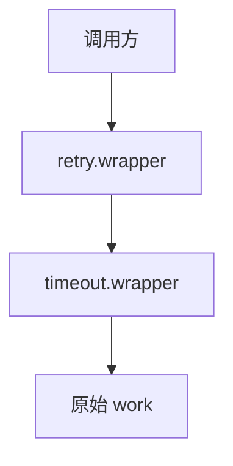

# Day 13 装饰器深度讲义

**篇幅**：进阶讲义 · 约 4000 字  
**适用**：第 2 周选修、讲师集训

---

## 第一章 函数是一等公民

在 Python 中，函数对象可以：

```python
def shout(f):
    return f

def hello():
    return "hi"

assert shout(hello) is hello
```

装饰器利用**函数作为返回值**包装原函数，在不修改原函数源码的前提下增强行为——与 Go 的 middleware、Java 的 AOP 思想相通，但实现更轻量。

---

## 第二章 无参装饰器解剖

```python
import functools

def log_call(func):
    @functools.wraps(func)
    def wrapper(*args, **kwargs):
        print(f"  → 调用 {func.__name__}")
        return func(*args, **kwargs)
    return wrapper
```

### 2.1 闭包捕获

`wrapper` 闭包捕获 `func` 变量。多次装饰不同函数时，各 `wrapper` 捕获各自 `func`，互不干扰。

### 2.2 *args 与 **kwargs

转发任意签名，使装饰器**通用**。若写死 `(a, b)`，无法装饰无参或仅 kwargs 的函数。

### 2.3 @ 语法糖时间

装饰在**函数定义时**执行，非每次调用：

```python
@log_call
def greet(): ...

# 定义完成时已完成 greet = log_call(greet)
```

---

## 第三章 带参装饰器工厂

```python
def repeat(times: int):
    def decorator(func):
        @functools.wraps(func)
        def wrapper(*args, **kwargs):
            result = None
            for _ in range(times):
                result = func(*args, **kwargs)
            return result
        return wrapper
    return decorator
```

调用栈：

```
repeat(3)        → 返回 decorator
decorator(count) → 返回 wrapper
wrapper()        → 循环调用 count
```

`retry(max_attempts=3)` **完全同构**，仅 `wrapper` 内逻辑为 try/except + sleep。

---

## 第四章 functools.wraps 源码级理解

`wraps(wrapped)` 返回 `decorator`，把 `wrapper` 的 `__dict__` 更新为 `wrapped` 的元数据，并设置 `__wrapped__` 指向原函数。

用途：

1. `inspect.signature` 正确  
2. 文档生成  
3. `unittest.mock.patch` 路径  
4. 调试器显示真实函数名

**反例**：堆栈显示 `wrapper` 层叠十层，无法定位业务函数。

---

## 第五章 装饰器链与顺序

```python
@retry(max_attempts=3)
@with_timeout(60)
def work():
    ...
```

Python 从下往上装饰：

```
work = retry(3)(with_timeout(60)(work))
```

调用时从外往里：`retry.wrapper` → `timeout.wrapper` → `work`。



**记忆口诀**：**最后写的装饰器最先包装，最先执行的外层逻辑。**

---

## 第六章 类方法与装饰器

```python
class C:
    @retry(max_attempts=2)
    def method(self, x):
        ...
```

`wrapper` 接收 `(self, x)`，`*args` 自然转发。注意：若装饰器在 `__init__` 内动态创建（如 `ResilientLLMClient`），每个实例一份 `wrapper` 闭包。

---

## 第七章 装饰器 vs 继承 vs 组合

| 手段 | 适用 |
|------|------|
| 装饰器 | 横切：日志、重试、超时 |
| 继承 | is-a，`ResilientLLMClient` is `LLMClient` |
| 组合 | has-a，持有 client 实例代理 |

NexusAgent 选择 **继承 + 方法级装饰闭包**：对外类型仍是 LLM 客户端家族，容错可开关。

---

## 第八章 常见陷阱

### 8.1 忘记返回 wrapper

```python
def bad_deco(func):
    def wrapper(*a, **k):
        return func(*a, **k)
    # 忘记 return wrapper → None
```

### 8.2 装饰器副作用

在 `decorator(func)` 阶段做 IO，会在 import/定义时执行，难调试。

### 8.3 重入与线程安全

`retry` 无全局状态，线程安全。若 `on_retry` 写共享计数器需加锁。

---

## 第九章 标准库装饰器赏鉴

| 装饰器 | 模块 | 用途 |
|--------|------|------|
| `@property` | builtin | getter |
| `@staticmethod` | builtin | 无 self 方法 |
| `@lru_cache` | functools | 记忆化 |
| `@dataclass` | dataclasses | 数据类 |

对比 `@retry`：均为**变换函数或类定义时的行为**。

---

## 第十章 实验作业

1. 实现 `@timer` 打印耗时  
2. 实现 `@count_calls` 统计调用次数  
3. 将 `@timer` 与 `@retry` 叠在同一函数，观察顺序影响

---

*企业实践：[23_重试策略企业实践.md](23_重试策略企业实践.md)*
