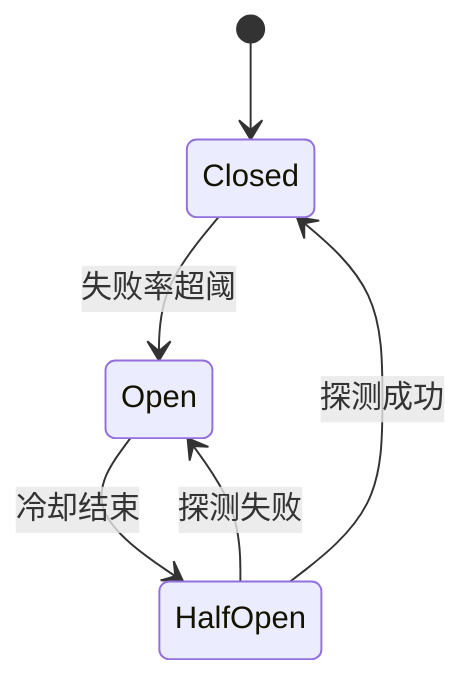

# Day 13 重试策略企业实践

**篇幅**：工程实践 · 约 3800 字  
**视角**：DevOps + 后端架构

---

## 一、重试不是银弹

周航在运维复盘中的原话：

> 「无上限重试等于分布式 DDoS 自己。」

企业级重试必须同时定义：

1. **Which** — 哪些错误可重试  
2. **How many** — 上限次数  
3. **How long** — 退避与总超时预算  
4. **Observable** — 日志、指标、告警

Day 13 的 `RetryPolicy` + `is_retryable_error` 是这四点的教学最小实现。

---

## 二、状态码策略矩阵（扩展版）

| 码 | 语义 | NexusAgent | 常见企业策略 |
|----|------|------------|--------------|
| 400 | Bad Request | 不重试 | 不重试 |
| 401 | Unauthorized | 不重试 | 不重试 |
| 403 | Forbidden | 不重试 | 不重试 |
| 404 | Not Found | 不重试 | 不重试 |
| 408 | Request Timeout | 未列入 | 可重试（讨论项） |
| 429 | Rate Limit | 重试 | 重试 + 尊重 Retry-After |
| 500 | Internal Error | 重试 | 重试 |
| 502 | Bad Gateway | 重试 | 重试 |
| 503 | Unavailable | 重试 | 重试 |
| 504 | Gateway Timeout | 重试 | 重试 |

**选修**：解析 `Retry-After` Header 覆盖 `base_delay`。

---

## 三、指数退避参数选型

### 3.1 _latency 预算法_

产品要求 P95 响应 < 5s：

```
max_attempts × avg_call + sum(sleeps) < 5000ms
```

若单次 LLM 调用 P95 = 2s，`max_attempts=3`，sleep 1+2=3s → 最坏 2+1+2+2+2 = 9s **超标** → 需减少 attempts 或降低 timeout。

### 3.2 默认值辩护

| 参数 | 默认 | 理由 |
|------|------|------|
| max_attempts | 3 | 平衡成功率与延迟 |
| base_delay | 1s | 人类可感知「稍等」 |
| backoff_factor | 2 | 业界常见 |
| max_delay | 30s | 防止单次 sleep 过长 |

---

## 四、可观测性

### 4.1 on_retry 钩子

```python
def metrics_retry(attempt, exc, sleep_for):
    logger.warning("llm_retry", extra={
        "attempt": attempt,
        "status_code": getattr(exc, "status_code", None),
        "sleep": sleep_for,
    })
```

### 4.2 推荐指标

- `llm_retry_total` Counter  
- `llm_call_duration` Histogram  
- `llm_final_failure` Counter（用尽 attempts）

`on_retry_log=True` 是控制台版 metrics。

---

## 五、测试策略

### 5.1 flaky transport 模式

`resilient_client_demo.make_flaky_transport` 是企业测试的缩影：

- 确定性失败次数  
- 无真实网络  
- CI 稳定

### 5.2 表驱动测试

| case | fails | max | expect calls |
|------|-------|-----|--------------|
| ok first | 0 | 3 | 1 |
| 503×2 | 2 | 4 | 3 |
| 401 | 1 | 3 | 1 |

---

## 六、与断路器的关系

重试解决**短时故障**；断路器在**持续故障**时快速失败，保护下游。



Day 13 未实现断路器；持续 503 会用尽 `max_attempts` 后失败——**有界伤害**。

---

## 七、幂等与 POST

Chat Completions 为 POST，重试可能导致重复生成。缓解：

1. 客户端去重（同一 user 消息 id）  
2. 服务端幂等键  
3. 业务层接受「偶尔 duplicate」

理财问答 MVP 可接受；支付类 API 不可接受。

---

## 八、多租户与限流

429 常因**租户配额**。企业应对：

- 全局限流器（token bucket）  
- 按用户队列  
- 退避 + jitter 避免同步重试风暴

---

## 九、运行手册片段（Runbook）

**症状**：日志大量 `⏳ 重试 ... HTTP 503`

1. 查供应商状态页  
2. 若区域故障，升 `max_delay` 或降流量  
3. 若仅本租户，查 Key 配额  
4. 若非 429/5xx，查是否误配 retryable

**症状**：无重试，立即 ConfigError

1. 查 `.env` / `DEEPSEEK_API_KEY`  
2. **不要**通过加大 `max_attempts`「修复」

---

## 十、Day 13 在企业成熟度模型中的位置

| 级别 | 能力 |
|------|------|
| L0 | 无重试（Day 12） |
| L1 | 有界重试 + 退避（Day 13）← 我们在这 |
| L2 | + jitter + Retry-After |
| L3 | + 断路器 + 幂等 |
| L4 | + 多 AZ 降级路由 |

---

*Sprint 回顾：[24_Sprint2阶段回顾.md](24_Sprint2阶段回顾.md)*
