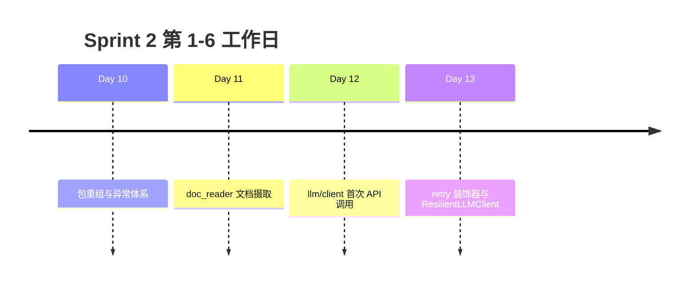

# Sprint 2 阶段回顾（Day 10 - Day 13）

**Sprint 2 主题**：工程化基础设施 — 包、文件、网络、容错

---

## 四日脉络



---

## Day 10 recap

| 交付 | 要点 |
|------|------|
| 包结构重组 | `src/` 布局、`PYTHONPATH` |
| `core/exceptions` | NexusError 层次 |
| 模块导入 | 绝对导入、避免循环 |

**能力**：代码组织清晰，异常可追踪。

---

## Day 11 recap

| 交付 | 要点 |
|------|------|
| `tools/doc_reader.py` | 批量读 txt |
| 编码回退链 | utf-8 → gbk → ... |
| `StorageError` | 带 path 上下文 |
| `get_path` | sample_docs / doc_output |

**能力**：可靠把磁盘文档读入内存。

---

## Day 12 recap

| 交付 | 要点 |
|------|------|
| `llm/client.py` | LLMClient、urllib |
| `llm/env.py` | 环境变量、Mock |
| `llm/response.py` | parse_chat_completion |
| `APIError` | HTTP/API 错误 |

**能力**：首次出站 HTTP，OpenAI 兼容调用。

---

## Day 13 recap（今日）

| 交付 | 要点 |
|------|------|
| `llm/retry.py` | retry、with_timeout、RetryPolicy |
| `llm/resilient_client.py` | ResilientLLMClient |
| `is_retryable_error` | 429/5xx vs Config/401 |
| `functools.wraps` | 装饰器元数据 |
| `async_demos` | asyncio 预习 |

**能力**：LLM 调用具备有界重试与超时，瞬时故障自愈。

---

## 横向能力矩阵

| 能力 | D10 | D11 | D12 | D13 |
|------|-----|-----|-----|-----|
| 标准库优先 | ✅ import | ✅ pathlib | ✅ urllib | ✅ concurrent.futures |
| 统一异常 | ✅ | ✅ StorageError | ✅ APIError | ✅ 可重试判定 |
| 路径注册 | ✅ get_path | ✅ 扩展 | ✅ chat_completion_sample | ✅ |
| 可测试 | ✅ | ✅ pytest | ✅ Mock transport | ✅ flaky transport |
| 生产模块 | ✅ core/tools | ✅ doc_reader | ✅ llm/client | ✅ llm/retry |
| 横切关注点 | — | — | — | ✅ 装饰器 |

---

## 数据流全景（Sprint 2 第 6 天末）

```
磁盘 .txt ──doc_reader──► 清洗文本 ──(Day15+)──► Prompt messages
                                                    │
                                                    ▼
                                         ResilientLLMClient.complete
                                          [@retry @with_timeout]
                                                    │
                                                    ▼
                                              assistant 回复
                                                    │
                                                    ▼
                                         Day14 cli_assistant 多轮
```

---

## 技术债与演进

| 债/限制 | 计划偿还日 |
|---------|------------|
| 线程超时无法强杀 urllib | Day 16 异步 |
| 无 jitter | 选修 / Day 25 |
| 无断路器 | Day 30+ |
| 同步阻塞 CLI | Day 14 先可用 |

---

## Sprint 2 剩余预告

| 日 | 主题 |
|----|------|
| Day 14 | cli_assistant 多轮对话 |
| Day 15 | Prompt 与文档上下文 |
| Day 16 | 流式 SSE |

---

## 自我评估问卷

1. 能否在无网络下演示 503 重试？  
2. 能否解释为何不改 `client.py`？  
3. 能否写出 `RetryPolicy` 四个核心字段？  
4. 能否对比 `LLMClient` 与 `ResilientLLMClient`？

四题皆「能」→ Sprint 2 前半达标。

---

*精读：[25_retry精读.md](25_retry精读.md)*
