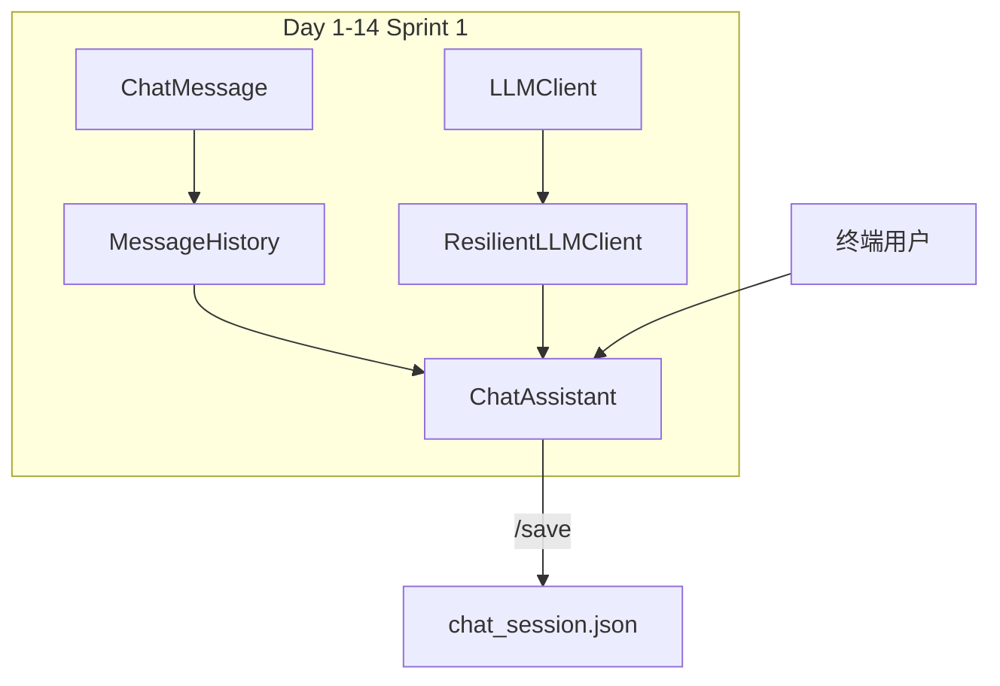

# Day 14 旁白解读：把十四天的积木搭成一座桥

> **前置要求**：完成 Day 1–13，尤其 `ResilientLLMClient`、`MessageHistory`、`ChatMessage`

---

## 旁白

2026 年 7 月 19 日，周日。智链科技会议室挂着一条横幅：**「Sprint 1 收官日 — 让助手在终端里活起来」**。

赵岩打开内测反馈表：

> 「用户不想要『问一句答一句就忘』的机器人。他们要**能记住上文**、**能保存会话**、**网络抖一下也别崩**的 CLI 助手。」

陈默在白板上画出今日架构：

```
用户输入 → ChatAssistant._process_line
              ├─ 斜杠命令 → handle_command（本地处理）
              └─ 普通文本 → chat_turn → ResilientLLMClient.complete(messages)
```

林晓盯着 `cli_assistant.py` 里短短两百行代码，忽然意识到：

> 「Day 8 的 `ChatMessage`、Day 10 的 `MessageHistory`、Day 13 的 `ResilientLLMClient`……今天不是新发明，是**十四天模块的第一次握手礼**。」

周航举起测试报告：

> 「`run_scripted` 让 CI 不用 `input()` 也能验多轮对话。`pytest tests/day14/` 全绿，阶段项目一可以签字。」

下午庆功茶歇，陈默预告 Day 15：

> 「对话越长，发给 API 的 token 越多。明天做 **Token 计数器**，让你看见『记忆』的代价。」

---

## 今日在架构中的位置



---

## 林晓的学习建议

1. 先跑 `assistant_demos.py`，确认默认 system 与客户端类型  
2. 再跑 `cli_assistant_demo.py`，观察脚本模式多轮输出  
3. 本地 `NEXUS_LLM_MOCK=1 python3 src/chat/cli_assistant.py` 体验 `/help`、`/clear`、`/history`  
4. 阅读 `chat_turn` 三步：add_user → complete → add_assistant  
5. 对照 `tests/day14/test_cli_assistant.py` 理解 `run_scripted` 契约  
6. 运行 `sprint1_review.py`，在里程碑清单前给自己点一杯虚拟奶茶

---

## 与前后日的衔接

| 方向 | 内容 |
|------|------|
| 回顾 Day 8–10 | `ChatMessage` 三角色；`MessageHistory` 增删存取 |
| 回顾 Day 12–13 | `complete(messages)` 与弹性重试 |
| 今日核心 | `ChatAssistant` 多轮编排 + 斜杠命令 + 双运行模式 |
| 预告 Day 15 | Token 计数、`usage` 字段解析、上下文成本 |
| 预告 Day 16 | 流式 SSE、`async` 超时 |

---

## Sprint 1 收官寄语

> 你不是在写「又一个 demo」，而是在交付**企业可验收**的终端 AI 助手原型。  
> 能聊、能记、能存、能扛抖动 —— 这四件事，就是 ZL-NA-REQ-014 的全部灵魂。

---

*下一篇：[01_企业背景与今日任务.md](01_企业背景与今日任务.md)*
