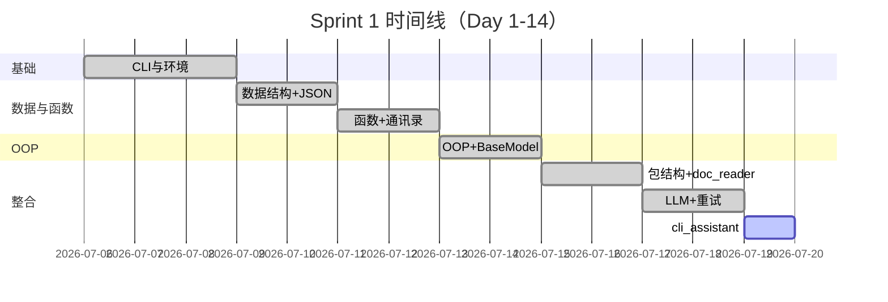

# Day 14 企业背景与今日任务

**日期**：2026 年 7 月 19 日  
**Sprint**：Sprint 1 收官日 — 阶段项目一交付

## 晨会纪要

### 赵岩（产品）

> 「Sprint 1 最后一天。内测用户要能在终端里**连续追问**理财条款，助手得记住『刚才说的产品名』。今天交付 `cli_assistant`，明天开始算 token、控成本。」

### 陈默（架构）

> 「`ChatAssistant` 是编排层，不重复实现 HTTP 或重试。注入 `ResilientLLMClient` 与 `MessageHistory`，符合依赖倒置。命令用斜杠前缀，与 LLM 对话路径分离。」

### 周航（DevOps）

> 「验收必须 CI 友好：`run_scripted` 替代 `input()`。退出时自动 `save_history`。Mock 模式 `NEXUS_LLM_MOCK=1` 保证流水线无 Key 也能绿。」

## 任务分配

| ID | 任务 | 负责人 | 优先级 |
|----|------|--------|--------|
| ZL-NA-REQ-014 | 实现 `chat/cli_assistant.py` | 全员 | P0 |
| ZL-NA-071 | `COMMANDS` 七项斜杠命令 | 林晓 | P0 |
| ZL-NA-072 | `run_scripted` / `run_interactive` | 林晓 | P0 |
| ZL-NA-073 | `cli_assistant_demo.py` 验收脚本 | 助教 | P0 |
| ZL-NA-074 | `sprint1_review.py` 里程碑回顾 | 陈默 | P1 |
| ZL-NA-075 | `tests/day14/` 全绿 | 周航 | P0 |

## Definition of Done

- [ ] `NEXUS_LLM_MOCK=1 python3 src/chat/cli_assistant.py` 可交互多轮对话
- [ ] `/help`、`/exit`、`/clear`、`/history`、`/save`、`/system` 行为符合需求
- [ ] `NEXUS_LLM_MOCK=1 python3 src/day14/cli_assistant_demo.py` 脚本验收通过
- [ ] `pytest tests/day14/ -v` 全绿
- [ ] 能口述：`chat_turn` 与 `handle_command` 的分工
- [ ] 能解释：为何 `/clear` 保留 system 消息
- [ ] 完成 Sprint 1 自评（见 [24_阶段项目评审标准.md](24_阶段项目评审标准.md)）

## 今日节奏

| 时段 | 内容 |
|------|------|
| 09:00-10:00 | Sprint 1 回顾、`ChatAssistant` 类图 |
| 10:15-12:00 | `handle_command` + `chat_turn` 实现与演示 |
| 14:00-15:30 | `run_interactive` / `run_scripted`、异常处理 |
| 15:45-17:00 | 阶段项目评审、庆功复盘、Day 15 预习 |

## 环境准备

```bash
cd nexus-agent-platform
export PYTHONPATH=src
export NEXUS_LLM_MOCK=1

python3 src/day14/assistant_demos.py
python3 src/day14/cli_assistant_demo.py
python3 -m pytest tests/day14/ -v
```

## Sprint 1 里程碑一览



---

*下一篇：[02_需求文档.md](02_需求文档.md)*
