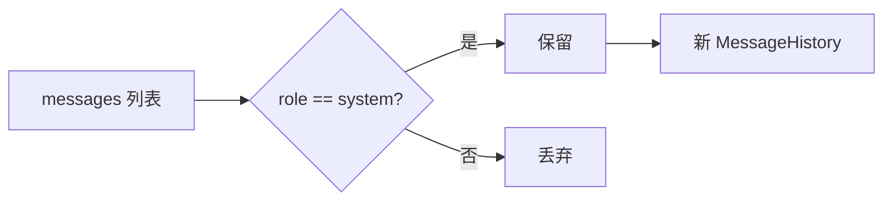

# ZL-NA-REQ-014 需求文档（扩展）

本文档补充主需求中的边界场景、可测试性与未来演进，供架构评审与课后扩展使用。

---

## 1. 用户故事

### US-014-01 连续追问

> **作为** 理财顾问  
> **我希望** 助手记住上一轮提到的产品名称  
> **以便** 我追问「那它的风险等级呢？」时无需重复上下文  

**验收**：`run_scripted(["介绍稳健盈", "风险等级？"])` 第二次请求 payload 含首轮 user/assistant。

### US-014-02 会话恢复

> **作为** 开发者  
> **我希望** 退出后再次启动能加载 `chat_session.json`  
> **以便** 调试长对话不必从头输入  

**验收**：`save_history` + `load_history` 往返后 `messages` 条数一致。

### US-014-03 CI 无人工

> **作为** DevOps  
> **我希望** 流水线用 `run_scripted` 验多轮  
> **以便** 不阻塞在 `input()`  

**验收**：`cli_assistant_demo.py` exit code 0。

---

## 2. 命令行为细则

### `/clear` 语义

- 重建 `MessageHistory(system_msgs)`，不修改 system 内容本身
- 适用于用户想「换话题但保留人设」

### `/system` 语义

- **追加** system 消息，非替换（与 OpenAI 多 system 实践一致）
- 无参数返回：`用法：/system 你的系统提示词`

### 未知命令

- 返回：`未知命令 {cmd}，输入 /help 查看帮助。`
- `handled=True`，不调用 LLM

---

## 3. 可测试性契约

| 公共 API | 测试关注点 |
|----------|------------|
| `is_command` | 以 `/` 开头（strip 后） |
| `handle_command` | 返回 `(handled, message, should_exit)` 三元组 |
| `chat_turn` | 历史递增；Mock 响应写入 assistant |
| `run_scripted` | 遇 `/exit` 提前 break；输出列表顺序稳定 |
| `_process_line` | 命令 vs 对话分流；异常转字符串 |

---

## 4. 依赖模块版本假设

| 模块 | 职责 |
|------|------|
| `models.ChatMessage` | role/content 校验 |
| `services.MessageHistory` | add_*、save、load |
| `llm.resilient_client.ResilientLLMClient` | complete + 重试 |
| `core.paths.get_path("chat_session")` | 默认会话路径 |
| `core.exceptions` | ConfigError、APIError、NexusError |

---

## 5. 扩展 backlog（非本期）

| ID | 描述 | 目标日 |
|----|------|--------|
| ZL-NA-014-E01 | 显示每轮 token 用量 | Day 15 |
| ZL-NA-014-E02 | `/undo` 撤销上一轮 | 选修 |
| ZL-NA-014-E03 | 多会话 profile 切换 | Sprint 3 |
| ZL-NA-014-E04 | 流式逐字打印 | Day 16 |

---

## 6. 合规与安全

- 会话 JSON 可能含用户输入，**不得**提交含真实客户 PII 的文件到 Git
- `day14/data/.gitignore` 已忽略本地会话文件
- 生产环境需配置 Key 轮换与日志脱敏（Sprint 后期）

---

*下一篇：[03_架构设计.md](03_架构设计.md)*
