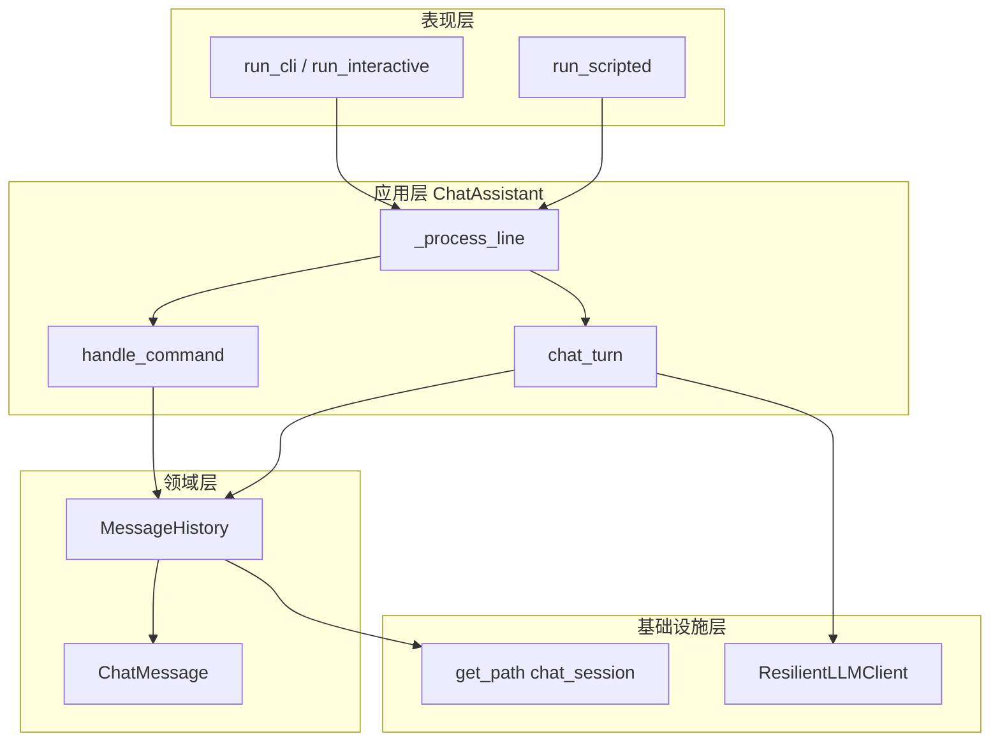
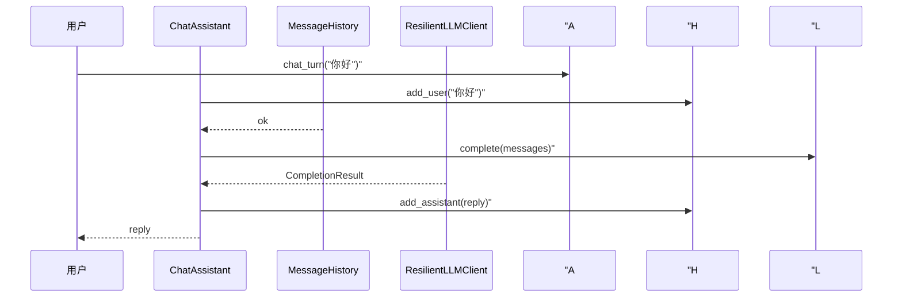

# Day 14 架构设计

## 1. 设计目标

将 Sprint 1 已交付模块组合为**可运行、可测试、可扩展**的 CLI 多轮对话助手，遵循：

- **编排不侵入**：`ChatAssistant` 不修改 `LLMClient` / `retry` 实现
- **依赖注入**：`client`、`history`、`history_path` 可替换
- **双入口统一**：交互与脚本共用 `_process_line`

## 2. 分层架构



## 3. 核心类：ChatAssistant

### 3.1 构造参数

| 参数 | 默认 | 说明 |
|------|------|------|
| `client` | `ResilientLLMClient(ModelConfig())` | LLM 调用 |
| `history` | `MessageHistory()` | 消息列表 |
| `system_prompt` | `DEFAULT_SYSTEM_PROMPT` | 无 system 时注入 |
| `history_path` | `get_path("chat_session")` | 持久化路径 |
| `on_retry_log` | `False` | 是否打印重试日志 |

### 3.2 关键方法职责

| 方法 | 职责 |
|------|------|
| `is_command` | 判断是否斜杠命令 |
| `handle_command` | 本地处理七项命令，返回是否退出 |
| `chat_turn` | 单轮 LLM 对话 |
| `_process_line` | 统一行处理（命令 / 对话 / 异常） |
| `run_interactive` | `while` + `input_fn` |
| `run_scripted` | 遍历 `lines`，收集 `outputs` |
| `save_history` / `load_history` | JSON 持久化 |

## 4. 数据流：一轮对话



## 5. 命令处理与对话分离

**设计理由**：斜杠命令不应进入 LLM，避免浪费 token 与不可预测解析。

```
_process_line(line)
    if is_command(line):
        return handle_command(line)   # 本地
    else:
        return chat_turn(line)        # 远程 LLM
```

## 6. 异常策略

| 异常 | 层级 | 行为 |
|------|------|------|
| `ConfigError` | `_process_line` | 打印配置错误，继续循环 |
| `APIError` | `_process_line` | 打印 API 失败，继续循环 |
| `NexusError` | `_process_line` | 打印通用错误 |
| `NexusError` | `save_history` on exit | 静默忽略，避免退出崩溃 |

`chat_turn` **向上抛出** API/Config 异常，由 `_process_line` 统一转用户可读字符串——便于 `run_scripted` 断言。

## 7. 文件与包布局

```
nexus-agent-platform/src/
├── chat/
│   ├── __init__.py          # 导出 ChatAssistant
│   └── cli_assistant.py     # 本日核心
├── day14/
│   ├── cli_assistant_demo.py
│   ├── assistant_demos.py
│   ├── sprint1_review.py
│   └── constants.py
└── tests/day14/
    └── test_cli_assistant.py
```

## 8. 与 SOLID 对照

| 原则 | 体现 |
|------|------|
| SRP | 历史归 `MessageHistory`，HTTP 归 `LLMClient`，编排归 `ChatAssistant` |
| OCP | 新命令只需扩展 `handle_command` 与 `COMMANDS` |
| LSP | 可注入 `LLMClient` 子类或 Mock transport |
| ISP | 测试只依赖公开方法，不碰私有网络细节 |
| DIP | `ChatAssistant` 依赖 `LLMClient` 抽象而非 `urllib` |

---

*下一篇：[04_流程图与示意图.md](04_流程图与示意图.md)*
