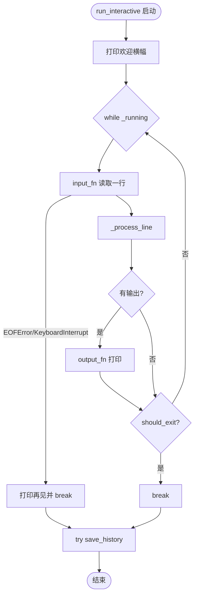
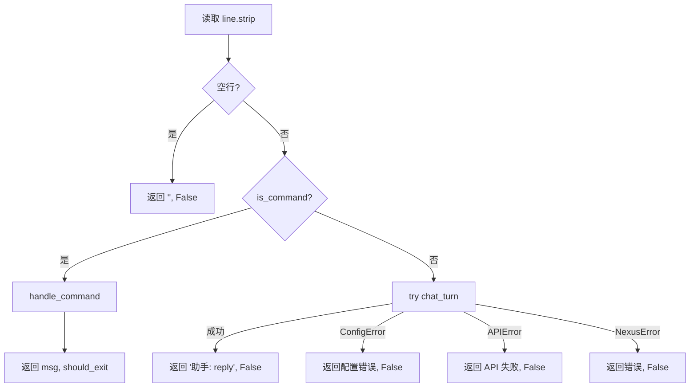
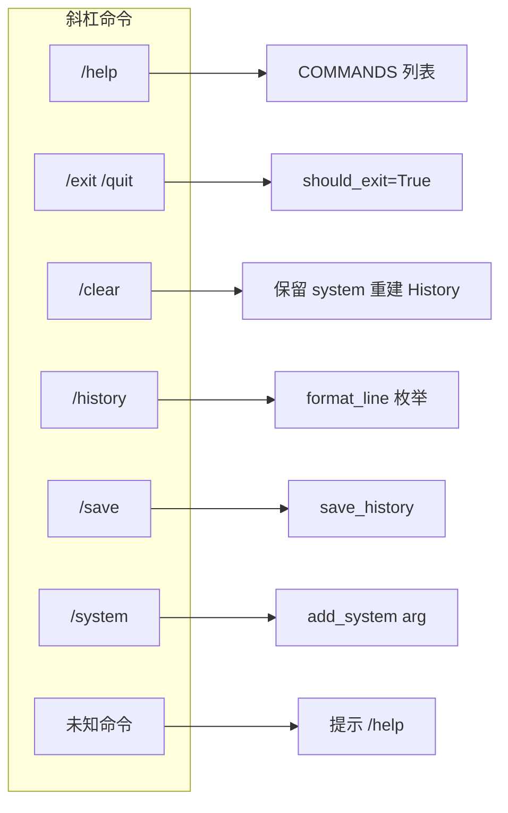
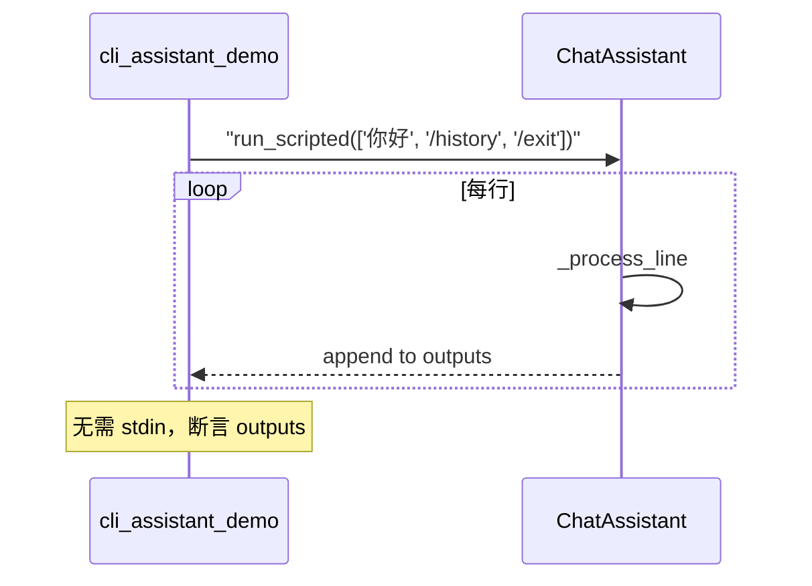
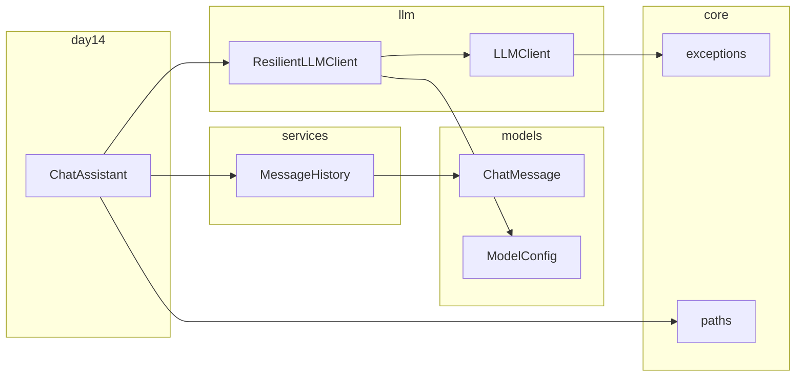
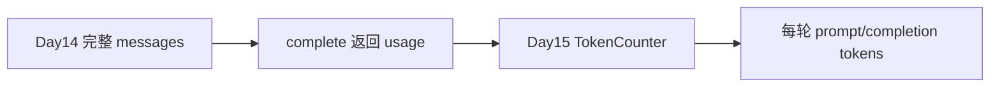

# Day 14 流程图与示意图

## 1. 交互式主循环



## 2. _process_line 决策树



## 3. handle_command 分支



## 4. chat_turn 三步曲

```
┌─────────────┐     ┌──────────────────┐     ┌─────────────────┐
│ add_user    │ ──► │ client.complete  │ ──► │ add_assistant   │
│ 校验+追加   │     │ 全量 messages    │     │ 写入回复        │
└─────────────┘     └──────────────────┘     └─────────────────┘
```

## 5. run_scripted 与 CI



## 6. 模块依赖全景（Sprint 1 收官）



## 7. 会话文件生命周期

```
启动 ChatAssistant
    → 可选 load_history()
用户对话多轮
    → /save 或退出时 save_history()
    → JSON 写入 history_path
下次启动 load_history() 恢复
```

## 8. Day 15 衔接示意



明日将在 `complete` 的 `usage` 字段上挂载计数器，可视化「对话变长」的成本曲线。

---

*下一篇：[05_课堂笔记_上午.md](05_课堂笔记_上午.md)*
