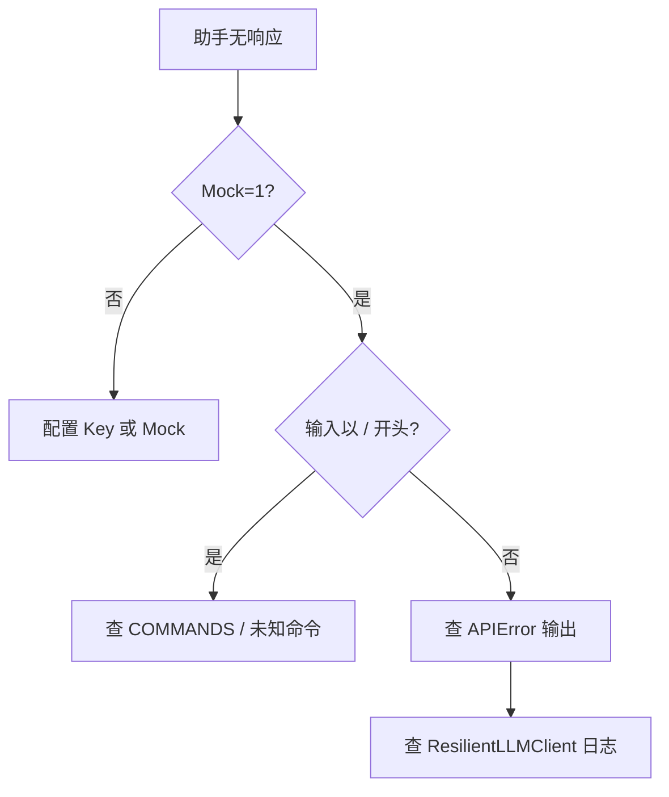

# Day 14 常见问题与排错指南

---

## 环境类

### Q1：`ModuleNotFoundError: No module named 'chat'`

**原因**：未设置 `PYTHONPATH=src`。

**解决**：

```bash
cd nexus-agent-platform
export PYTHONPATH=src
```

### Q2：`ConfigError: API key not configured`

**原因**：未开启 Mock 且未配置 Key。

**解决**：

```bash
export NEXUS_LLM_MOCK=1
# 或配置 NEXUS_LLM_API_KEY
```

### Q3：交互式运行没有任何回复

**检查**：

1. 是否误输入斜杠命令（如 `/hello` 会走未知命令分支）  
2. 是否空行（`_process_line` 跳过）  
3. Mock transport 是否返回合法 JSON 结构  

---

## 命令类

### Q4：`/clear` 后助手「失忆」是否正常？

**是**。`/clear` 设计为清空 user/assistant，仅保留 system。若需完全重置人设，需手动 `/system` 或重启并 `load_history` 空文件。

### Q5：`/save` 路径在哪里？

默认 `get_path("chat_session")`，常见为 `src/day14/data/chat_session.json`（视 `paths` 配置而定）。`/save` 输出会打印完整路径。

### Q6：`/system` 写了但没生效？

`/system` 是**追加** system 消息。模型对多条 system 的服从度因模型而异。可 `/clear` 后只保留新 system 做对比实验。

---

## 代码类

### Q7：`run_scripted` 与 `run_interactive` 输出格式不一致？

`run_scripted` 经 `_process_line` 返回原始 `msg`；对话成功时带前缀 `助手: `。`handle_command` 返回不带该前缀。这是预期行为。

### Q8：测试 `test_api_error_handled` 失败

确认注入的 client transport 抛出 `APIError` 且被 `_process_line` 捕获。不要在外层再包一层吞异常的装饰器。

### Q9：`chat_turn` 后历史条数不对

一轮成功对话至少增加 2 条（user + assistant），加上原有 system。用 `/history` 或 `len(assistant.history.messages)` 核对。

---

## 持久化类

### Q10：`load_history` 未自动调用

当前 `ChatAssistant.__init__` **不自动 load**。若需恢复会话，显式调用：

```python
a = ChatAssistant()
a.load_history()
a.run_interactive()
```

（可作为选修扩展）

### Q11：JSON 乱码或解析失败

确认 `MessageHistory.save` 使用 UTF-8。文件勿手动删引号。损坏文件可删除后重新对话。

---

## CI 类

### Q12：流水线卡在 `input()`

**禁止**在 CI 直接跑 `run_cli()`。使用 `cli_assistant_demo.py` 或 `run_scripted`。

### Q13：pytest 偶发失败

检查 Mock transport 的 `state["i"]` 是否在多测试间共享。每个测试应新建 `ChatAssistant` 与 client。

---

## 排错流程图



---

## 获取帮助

1. 阅读 [11_CLI助手详解.md](11_CLI助手详解.md)  
2. 对照 [20_完整代码走查.md](20_完整代码走查.md)  
3. 课堂答疑区标签 `#day14-cli`

---

*专题详解见 [11_CLI助手详解.md](11_CLI助手详解.md)*
