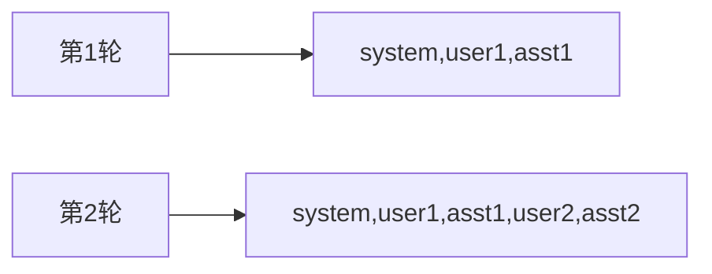

# Day 14 CLI 助手详解

本文深入讲解 `chat/cli_assistant.py` 的设计与实现细节。

---

## 1. 模块职责

`cli_assistant.py` 是 Sprint 1 的**应用编排层**：

- 不实现 HTTP  
- 不实现重试退避  
- 负责：读用户输入、维护上下文、路由命令、调用 LLM、持久化会话  

---

## 2. COMMANDS 字典

```python
COMMANDS = {
    "/help": "显示帮助",
    "/exit": "退出助手",
    "/quit": "退出助手（同 /exit）",
    "/clear": "清空对话历史（保留 system）",
    "/history": "查看当前对话记录",
    "/save": "保存对话到文件",
    "/system": "设置系统提示（/system 文本）",
}
```

**设计**：单一数据源，`/help` 自动枚举，避免帮助文本与实现漂移。

---

## 3. ChatAssistant 构造

```python
def __init__(
    self,
    *,
    client: LLMClient | None = None,
    history: MessageHistory | None = None,
    system_prompt: str = DEFAULT_SYSTEM_PROMPT,
    history_path: Path | None = None,
    on_retry_log: bool = False,
) -> None:
```

| 参数 | 测试技巧 |
|------|----------|
| `client` | 注入 `make_mock_client()` |
| `history` | 预置消息测 `/history` |
| `system_prompt=""` | 跳过默认 system |
| `history_path` | `tmp_path` 隔离写盘 |

---

## 4. handle_command 解析算法

```python
parts = raw.split(maxsplit=1)
cmd = parts[0].lower()
arg = parts[1].strip() if len(parts) > 1 else ""
```

- 命令名小写化，`/EXIT` 与 `/exit` 等价  
- `maxsplit=1` 保留 `/system` 后空格与换行在内的全文  

---

## 5. chat_turn 与 LLM 契约

```python
result = self.client.complete(self.history.messages)
reply = result.message.content
self.history.add_assistant(reply)
```

**多轮本质**：每次 `complete` 发送**当前完整列表**。模型侧「记忆」实为客户端重复发送历史。



---

## 6. 双模式对比

| 维度 | run_interactive | run_scripted |
|------|-----------------|--------------|
| 输入 | `input_fn` | `lines` 列表 |
| 输出 | `output_fn` 即时打印 | 收集 `list[str]` |
| 退出 | `/exit` 或 Ctrl+C | `done=True` break |
| 保存 | 结束自动 save | 不自动 save（除非脚本含 /save） |
| 场景 | 人工使用 | pytest、demo |

---

## 7. run_cli 入口

```python
def run_cli() -> None:
    ChatAssistant().run_interactive()

if __name__ == "__main__":
    run_cli()
```

`python3 src/chat/cli_assistant.py` 即走此路径。

---

## 8. 与 day14 演示脚本关系

```
cli_assistant.py     ← 核心实现
day14/
  assistant_demos.py ← 构造 + /help，无多轮
  cli_assistant_demo.py ← 多轮 run_scripted 验收
  sprint1_review.py  ← 里程碑打印
```

---

## 9. 扩展点（讲师提示）

| 扩展 | 切入位置 |
|------|----------|
| 新斜杠命令 | `COMMANDS` + `handle_command` |
| 启动时 load | `__init__` 末尾或 `run_cli` |
| Token 显示 | `chat_turn` 读 `result.usage`（Day 15） |
| 流式打印 | 替换 `complete` 为 stream API（Day 16） |

---

## 10. 心法总结

> CLI 助手不是「再写一个 LLM 客户端」，而是「让客户看见十四天工程化成果的窗口」。  
> 命令本地做，对话远程做；脚本可测，交互可炫；退出能存，错误能扛。

---

*练习见 [12_课堂练习册.md](12_课堂练习册.md)*
