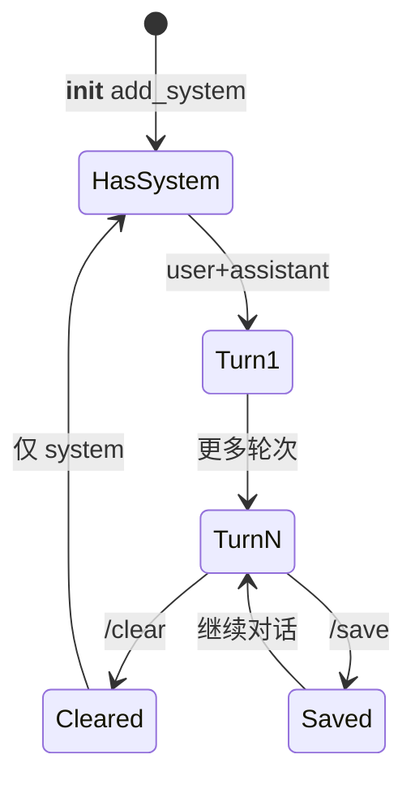

# Day 14 深度扩展：对话状态管理

> 选修专题，理解多轮助手背后的「状态」概念，为 Day 15 Token 与后续会话治理打基础。

---

## 1. 什么是对话状态

在 `ChatAssistant` 中，**对话状态** ≈ `MessageHistory.messages` 列表的当前快照：

- 有序  
- 含 role/content  
- 每轮对话后单调增长（除非 `/clear`）  



---

## 2. 状态转换表

| 事件 | 状态变化 |
|------|----------|
| `add_user` | +1 user |
| `add_assistant` | +1 assistant |
| `/clear` | 重置为非 system 消息为空 |
| `/system x` | +1 system |
| `load_history` | 整体替换 messages |
| `save_history` | 磁盘镜像，内存不变 |

---

## 3. 隐式状态 vs 显式状态

| 类型 | 本项目中 |
|------|----------|
| 隐式 | `_running`（交互循环是否继续） |
| 显式 | `history.messages` |
| 外部 | `history_path` 文件、`ModelConfig` |

**工程建议**：核心业务状态放 `MessageHistory`；UI 标志放 Assistant。

---

## 4. 一致性与并发

当前 CLI **单线程**，无并发写 history 问题。若未来 Web 多用户：

- 每用户独立 `MessageHistory` 实例  
- 会话 ID 映射到存储  
- 乐观锁或版本号防覆盖  

---

## 5. 状态爆炸与 Token

每轮 `complete` 发送全量历史 → `prompt_tokens` 近似随轮次线性或超线性增长。

**治理策略（预告）**：

| 策略 | 说明 | 引入日 |
|------|------|--------|
| 计数可视化 | 知道何时太长 | Day 15 |
| `/clear` | 人工重置 | Day 14 |
| 滑动窗口 | 只保留最近 K 轮 | 选修 |
| 摘要压缩 | 旧对话 summarize | Sprint 后期 |

---

## 6. system 消息策略

本项目支持**多条 system**：

- 默认 `DEFAULT_SYSTEM_PROMPT`  
- 用户 `/system` 追加  

替代方案（未采用）：

- **单 system 替换**：实现简单但丢失历史人设变更记录  
- **system 放配置文件**：适合固定部署，不适合 CLI 动态改  

---

## 7. 持久化格式

`MessageHistory.save` 写出 JSON 列表，每项为 `ChatMessage.to_dict()`。

**恢复语义**：`load` 替换整个 `self.history`，进行中的未保存对话会丢失 —— 故退出时 `save_history` 重要。

---

## 8. 状态机实现选修

可将 `_process_line` 视为 Mealy 机：输入行 → 输出字符串 + 是否终止。

```python
# 伪代码
class DialogState(Enum):
    IDLE = "idle"
    AWAITING_LLM = "awaiting"  # 未来异步流式可用

# Day 14 同步模型下始终 IDLE
```

---

## 9. 与 Day 15 衔接

Token 计数是**状态的度量维度**：不仅「有多少条消息」，更要「占多少 token」。明日将解析：

```json
"usage": {
  "prompt_tokens": 120,
  "completion_tokens": 45,
  "total_tokens": 165
}
```

---

## 10. 小结

对话状态管理 = **内存列表 + 持久化 + 用户命令触发的重置**。  
`ChatAssistant` 用最少代码完成状态编排，是 Sprint 1 工程化思维的集中体现。

---

*案例集见 [14_企业案例集_终端AI助手.md](14_企业案例集_终端AI助手.md)*
