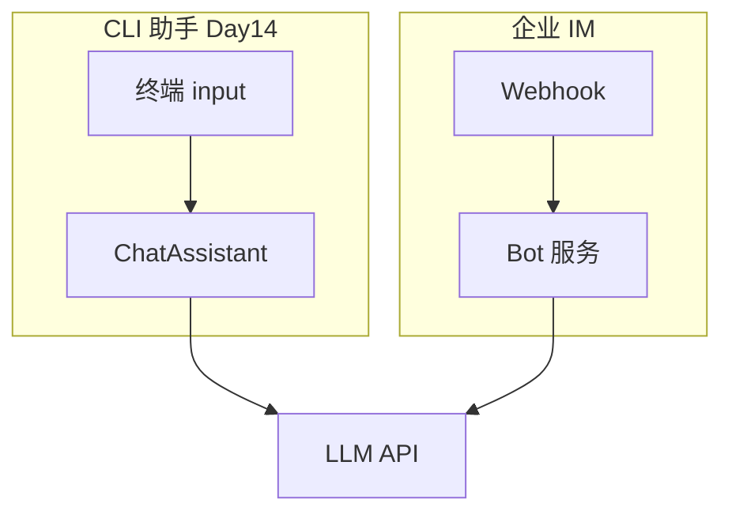

# Day 14 企业案例集：终端 AI 助手

真实行业中「终端 / CLI 形态」的 AI 助手屡见不鲜。本文对比智链 `ChatAssistant` 与业界实践。

---

## 案例 1：OpenAI 官方 CLI（历史产品）

**场景**：开发者通过终端调用 GPT。

**启示**：

- 斜杠命令（如设置模型）与对话分离 —— 与 `COMMANDS` 同构  
- API Key 环境变量配置 —— 对应 `NEXUS_LLM_MOCK` / `NEXUS_LLM_API_KEY`  
- 会话可导出 JSON —— 对应 `/save`  

---

## 案例 2：银行内部合规问答终端

**场景**：理财经理在隔离内网终端查询产品条款。

**需求映射**：

| 企业需求 | Day 14 实现 |
|----------|-------------|
| 多轮追问 | `chat_turn` 全量 history |
| 合规人设 | `DEFAULT_SYSTEM_PROMPT` + `/system` |
| 会话审计 | `/save` → JSON 归档 |
| 网络抖动 | `ResilientLLMClient` |

**差距**：生产需审计日志、权限、脱敏 —— Sprint 后期补齐。

---

## 案例 3：DevOps 值班机器人（Slack vs CLI）

**对比**：



**核心相同**：维护 `messages`、路由命令、调用 LLM。  
**表现不同**：输入输出适配器（`input_fn` vs Slack Event API）。

---

## 案例 4：可脚本化验收（智链特色）

`run_scripted` 体现 **Testability as a Feature**：

- 金融产品迭代快，CLI 行为必须有回归测试  
- `cli_assistant_demo.py` 即最小验收剧本  

**企业 DoD**：任何面向内部的 CLI AI 工具，应提供 `--script` 或 stdin 批处理模式。

---

## 案例 5：Mock 优先的培训环境

智链培训课程用 `NEXUS_LLM_MOCK=1`：

- 零 Key 成本  
- 确定性输出便于教学  
- CI 不依赖外网  

类比：金融机构 UAT 环境的「仿真核心系统」。

---

## 案例 6：失败友好（弹性设计）

| 故障 | 用户看到 | 系统行为 |
|------|----------|----------|
| 503 瞬时 | 可能无感（重试成功） | ResilientLLMClient |
| 503 持续 | API 调用失败 | 主循环继续 |
| Key 错误 | 配置错误 | 不重试，提示修复 |

**文化**：**不崩溃的 CLI** 比「炫技堆栈」更受运维青睐。

---

## 案例 7：从 CLI 到产品路线图

```
Day 14 CLI 助手
    → Day 15 Token 成本看板
    → Day 16 流式体验
    → Sprint 3 Web / API 网关
    → 企业知识库 RAG 整合
```

今日 CLI 是**最小可验证产品（MVP）**，不是终点。

---

## 讨论题

1. 若合规要求「禁止 assistant 给出投资建议」，应改 system 还是后处理？  
2. `/save` 的 JSON 是否应加密存储？  
3. 多顾问共用一台机器，如何隔离 `history_path`？  

**讲师参考**：system + 输出过滤；视合规等级；按 OS 用户或会话 ID 分文件。

---

*授课实录见 [15_授课实录.md](15_授课实录.md)*
