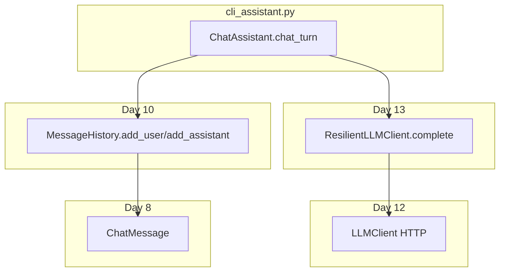

# Day 14 模块整合对照表

Sprint 1 收官：从 Day 1 到 Day 14 模块如何汇入 `ChatAssistant`。

---

## 总览矩阵

| Day | 模块/能力 | 在 cli_assistant 中的体现 |
|-----|-----------|---------------------------|
| 1–3 | CLI、环境、`PYTHONPATH` | `run_cli`、`run_interactive` |
| 4–5 | 数据结构、JSON | `save`/`load` JSON 会话 |
| 6–7 | 函数、模块化 | `handle_command` 分支函数 |
| 8 | `ChatMessage` | 三条 role 消息 |
| 9 | `BaseModel` 校验 | `add_user` 失败返回 err |
| 10 | 包结构、`paths` | `get_path("chat_session")` |
| 11 | `doc_reader` | system 提示「企业文档」语境 |
| 12 | `LLMClient.complete` | `chat_turn` 调用链 |
| 13 | `ResilientLLMClient` | 默认 `client` |
| 14 | `ChatAssistant` | 编排整合 |

---

## 导入关系

```python
from core.exceptions import APIError, ConfigError, NexusError
from core.paths import get_path
from llm.client import LLMClient
from llm.resilient_client import ResilientLLMClient
from models import ChatMessage, ModelConfig
from services import MessageHistory
```

---

## 调用链对照



---

## 异常层次（Day 10）

| 异常 | 来源示例 | Day 14 处理 |
|------|----------|-------------|
| `ConfigError` | 无 API Key | `_process_line` 提示 |
| `APIError` | 503/401 | `_process_line` 提示 |
| `NexusError` | 其他业务错 | 通用提示 |

---

## 路径与数据（Day 10）

```python
self.history_path = history_path or get_path("chat_session")
self.history.save(self.history_path)
self.history = MessageHistory.load(self.history_path)
```

---

## 测试对照（Day 6+ 测试习惯）

| 模式 | 引入日 | Day 14 用法 |
|------|--------|-------------|
| 单元测试 | Day 6+ | `tests/day14/` |
| Mock transport | Day 12 | `make_mock_client` |
| tmp_path | pytest | `test_save_and_load_history` |
| 脚本断言 | Day 14 | `run_scripted` |

---

## 与 Day 12 客户端差异

| 维度 | Day 12 demo | Day 14 cli_assistant |
|------|-------------|----------------------|
| 调用次数 | 单次 | 多轮循环 |
| 历史 | 手动组 list | `MessageHistory` 自动维护 |
| 入口 | 脚本 main | 交互 + 脚本双模式 |
| 容错 | 可选 | 默认 `ResilientLLMClient` |

---

## 与 Day 13 _retry 对照

| Day 13 | Day 14 |
|--------|--------|
| `retry` 装饰器 | 用户无感，内嵌于 client |
| `on_retry_log` | `ChatAssistant(on_retry_log=...)` 透传 |
| 503 重试 | 成功后正常回复；最终失败显示 API 错误 |

---

## 向前看

| Day | 新模块 | 与 Day 14 关系 |
|-----|--------|----------------|
| 15 | Token 计数 | 挂在 `chat_turn` 的 `usage` |
| 16 | 流式 SSE | 替换 `complete` 输出方式 |
| 17+ | RAG | 丰富 system 与检索上下文 |

---

## 自检清单

- [ ] 能说出 5 个以上 import 来自哪一天的模块  
- [ ] 能画从 `input` 到 `complete` 的调用链  
- [ ] 能解释为何 Day 14 几乎不改 `llm/client.py`  

---

*补充阅读 [19_讲师补充阅读.md](19_讲师补充阅读.md)*
