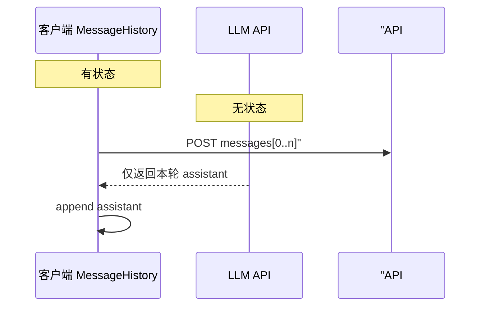

# Day 14 多轮对话深度讲义

从原理到实践，系统理解 CLI 多轮助手。

---

## 第一章：无状态 API 与有状态客户端

大模型 HTTP API 本质是**无状态**：每次请求独立，服务端不记录上一轮。

**多轮对话** = 客户端在每次请求 body 里携带完整 `messages` 数组：

```json
[
  {"role": "system", "content": "你是助手"},
  {"role": "user", "content": "你好"},
  {"role": "assistant", "content": "你好！"},
  {"role": "user", "content": "继续"}
]
```

`ChatAssistant` 的 `MessageHistory` 就是该数组的**内存真相源**。



---

## 第二章：三条消息角色

| role | 用途 | Day 14 |
|------|------|--------|
| system | 人设、规则 | 默认 + `/system` |
| user | 用户输入 | `chat_turn` 追加 |
| assistant | 模型回复 | `complete` 后追加 |

模型训练对齐 ChatML 风格，顺序一般为 system 在前，user/assistant 交替。

---

## 第三章：上下文窗口与长度

模型有 **context window** 上限（如 32K token）。历史越长：

- `prompt_tokens` 越大  
- 延迟可能增加  
- 费用可能增加  

Day 14 用 `/clear` 人工截断；Day 15 用数字看见增长；未来可用滑动窗口或摘要。

---

## 第四章：命令层设计哲学

斜杠命令是 **REPL 元命令** 传统（如 IRC、Slack）：

- 不消耗 LLM 配额  
- 确定性行为，便于测试  
- 用户心智：`/` 开头 = 控制面板  

`is_command` + `handle_command` 是轻量命令分发器，无需 argparse 子命令。

---

## 第五章：错误恢复与对话连续性

| 场景 | 行为 |
|------|------|
| API 失败 | 显示错误，**不**追加 assistant |
| user 已追加 | 失败轮次 user 仍在 history |
| 用户继续输入 | 下一轮带失败 user 上下文 |

**选修讨论**：是否在 API 失败时回滚 user？本期不回滚，简化实现；产品可要求失败时 `pop` user。

---

## 第六章：持久化语义

`save_history` 序列化当前内存状态。  
**不是**增量日志，是**快照**。

恢复：

```python
b = ChatAssistant(history_path=path)
b.load_history()
```

注意：默认 `__init__` 可能再注入 default system —— 测试时用已有 system 的文件或 `system_prompt=""` 协调。

---

## 第七章：测试策略

| 层级 | 测什么 |
|------|--------|
| 命令 | `handle_command` 三元组 |
| 单轮 | `chat_turn` + mock client |
| 集成 | `run_scripted` 多行 |
| 持久化 | tmp_path 往返 |

Mock transport 按调用次数返回不同响应，验证**多轮**而非单次。

---

## 第八章：与弹性客户端协作

```
用户感知：一次提问一次回答
实际：ResilientLLMClient 可能多次 HTTP（重试）
```

重试对 `MessageHistory` **透明** —— 只有成功后才 `add_assistant`。

---

## 第九章：产品化路线图


---

## 第十章：Sprint 1 哲学总结

多轮对话助手教会我们：

1. **复杂功能 = 简单模块组合**  
2. **可测试性要在一开始就设计**（`run_scripted`）  
3. **用户可见错误与内部重试分离**  

恭喜完成 Sprint 1 理论闭环。

---

*阶段总结 [23_Sprint1阶段总结.md](23_Sprint1阶段总结.md)*
