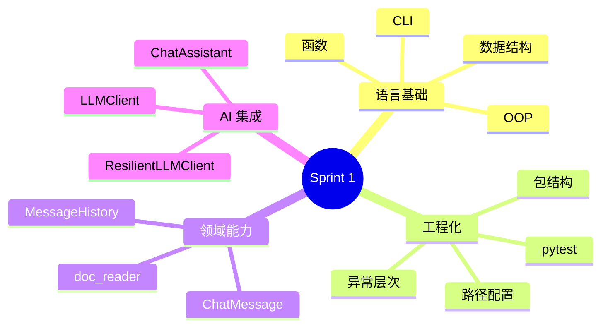

# Sprint 1 阶段总结（Day 1–14）

**阶段名称**：Phase 1 / Sprint 1  
**收官日**：2026-07-19（Day 14）  
**交付物**：命令行多轮对话 AI 助手（ZL-NA-REQ-014）

---

## 🎉 里程碑达成

恭喜！你已完成从 **Python 零基础环境** 到 **可验收 AI 终端助手** 的完整 Sprint。

运行庆祝命令：

```bash
cd nexus-agent-platform
export PYTHONPATH=src
python3 src/day14/sprint1_review.py
```

你将看到 Day 1–14 全部 ✅。

---

## 能力雷达



---

## 每周回顾

### 第 1 周：语言与结构（Day 1–7）

- 终端、虚拟环境、项目骨架  
- 列表、字典、JSON 读写  
- 函数分解、通讯录小项目  

**关键词**：能写、能拆、能存。

### 第 2 周：对象与包（Day 8–11）

- `ChatMessage`、`BaseModel` 校验  
- 包重组、`__init__.py` 导出  
- `doc_reader` 读企业文档  

**关键词**：能建模、能组织。

### 第 3 周：AI 与收官（Day 12–14）

- Day 12：首次 API 调用  
- Day 13：重试与超时  
- Day 14：**多轮 CLI 整合交付**  

**关键词**：能调、能扛、能聊。

---

## 代码资产清单

| 路径 | 说明 |
|------|------|
| `models/message.py` | ChatMessage |
| `services/message_history.py` | MessageHistory |
| `llm/client.py` | HTTP 调用 |
| `llm/resilient_client.py` | 弹性包装 |
| `chat/cli_assistant.py` | 阶段项目一 |
| `tests/day14/` | 验收测试 |

---

## 你现在能做什么

1. 在终端运行多轮 AI 对话，使用七项斜杠命令  
2. 用 Mock 模式在无 Key 环境开发与 CI  
3. 用 `run_scripted` 编写回归测试  
4. 读懂并扩展 `handle_command`  
5. 向他人讲解「无状态 API + 有状态 history」  

---

## 团队贡献叙事（面试/汇报用）

> 「我参与 NexusAgent Sprint 1，从 Python 基础做到 CLI 多轮助手。我负责整合 MessageHistory 与 ResilientLLMClient，实现斜杠命令与双运行模式，并通过 pytest 与脚本 demo 完成 CI 验收。」

---

## 不足与下阶段

| Sprint 1 未覆盖 | 计划 |
|-----------------|------|
| Token 可视化 | Day 15 |
| 流式输出 | Day 16 |
| 异步并发 | Day 16+ |
| RAG 检索 | 后续 Sprint |
| Web UI | 后续 Sprint |

---

## 庆功清单

- [ ] 运行 `cli_assistant.py` 完成一次 5 轮以上对话  
- [ ] `pytest tests/day14/ -v` 全绿截图  
- [ ] 填写 [24_阶段项目评审标准.md](24_阶段项目评审标准.md) 自评  
- [ ] 给未来的自己写一句 Day 14 感悟（选修）  

---

## 导师寄语

Sprint 1 不是终点，是你工程师身份的**起点**。  
明天起，我们不仅关心「能不能答」，还关心「答一次花多少 token」。  
**Sprint 1，正式收官。干得漂亮！**

---

*评审标准 [24_阶段项目评审标准.md](24_阶段项目评审标准.md)*
