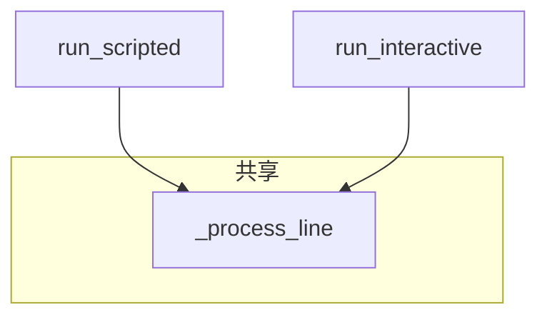

# cli_assistant 精读

对 `ChatAssistant` 进行源码级精读，适合 Sprint 1 收官复盘。

---

## 精读目标

读完本文你应能：

1. 在不看文档情况下默写 `handle_command` 七分支  
2. 解释 `_process_line` 为何是「唯一真相入口」  
3. 设计一条新命令且不破坏现有测试  

---

## 第一节：类型注解与依赖

```python
from typing import Callable
from pathlib import Path
```

- `client: LLMClient | None` — 接受父类类型，便于注入 Mock  
- `input_fn: Callable[[str], str]` — 可测试性钩子  

**精读笔记**：`|` 联合类型是 Python 3.10+ 风格，与项目一致。

---

## 第二节：COMMANDS 作为注册表

当前是 dict，扩展命令两步：

```python
COMMANDS["/count"] = "显示消息条数"
# handle_command 增加 if cmd == "/count": ...
```

**对比 argparse subparsers**：斜杠 REPL 场景 dict 足够；无需过度设计插件系统。

---

## 第三节：__init__ 中的 system 注入时机

```python
if system_prompt and not self._has_system_message():
    self.history.add_system(system_prompt)
```

| 场景 | 行为 |
|------|------|
| 全新 history | 注入 default |
| 传入含 system 的 history | 不重复注入 |
| `system_prompt=""` | 跳过 |

`test_assistant_has_default_system` 锁死第一条为 system。

---

## 第四节：handle_command 精读

### 解析策略

```python
parts = raw.split(maxsplit=1)
cmd = parts[0].lower()
```

**为何 lower**：用户大小写不敏感。  
**为何 maxsplit=1**：`/system` 后内容可含空格。

### 返回值契约

每个分支必须返回 `(True, msg, should_exit)` 或未知命令同样 `handled=True`。

**反模式**：未知命令 `handled=False` 会掉进 LLM，浪费且危险。

---

## 第五节：chat_turn 精读

### 校验顺序

1. 空字符串 → 本地短消息  
2. `add_user` 失败 → 不调用 API（省钱）  
3. API 调用  
4. `add_assistant`  

### result 对象

```python
reply = result.message.content
```

Day 15 将追加：

```python
# usage = result.usage  # 预习
```

---

## 第六节：_process_line 精读

这是 **Application Service** 模式：协调命令与领域对话。

```python
return f"助手: {reply}", False
```

前缀仅对话分支有，命令分支无 —— UI 层差异化。

异常映射表：

| 异常 | 用户文案前缀 |
|------|--------------|
| ConfigError | 配置错误: |
| APIError | API 调用失败: |
| NexusError | 错误: |

---

## 第七节：run_scripted vs run_interactive

### scripted

- 纯函数味道：输入 lines → 输出 outputs  
- 无副作用要求（除非命令含 /save）  
- **不**自动 save  

### interactive

- 副作用：退出 save  
- 处理信号：EOF、KeyboardInterrupt  



---

## 第八节：与 day14 脚本精读

### cli_assistant_demo.py

```python
for line in script:
    outputs = assistant.run_scripted([line])
```

**为何逐行**：打印 `>>> {line}` 清晰；等价于一次 `run_scripted(script)` 若不需中间打印。

### assistant_demos.py

只测构造与 `/help`，**最小冒烟**。

### sprint1_review.py

纯打印 `MILESTONES`，无 import ChatAssistant —— 仪式与代码解耦。

---

## 第九节：测试精读要点

`make_mock_client` 用闭包 `state["i"]` 递增响应索引 —— 多轮必备技巧。

`test_clear_keeps_system`：

```python
a.history.add_user("hello")
a.handle_command("/clear")
assert len(a.history.messages) == 1
```

`test_api_error_handled_in_scripted` 验证**韧性在上、友好在下**。

---

## 第十节：精读思考题

1. 若把 `add_assistant` 移到 `try` 外之前，会有何 bug？  
2. `self._running` 在何处被设为 False？（精读发现：仅 True，靠 `break` 退出 —— 可讨论冗余）  
3. Day 15 如何在不大改结构下显示 token？  

**参考**：1. API 失败时不应写入 assistant；2. `_running` 可简化；3. 在 `chat_turn` 读 `usage` 打印或记入计数器对象。

---

## 精读结语

`cli_assistant.py` 是 **Sprint 1 的句号**，也是 **Sprint 2 的逗号**。  
精读至此，你已具备阅读中等规模 Python 应用编排层的能力。

**Sprint 1 完成，致敬你的坚持。**

---

*Lab 见 [26_实操Lab手册.md](26_实操Lab手册.md)*
