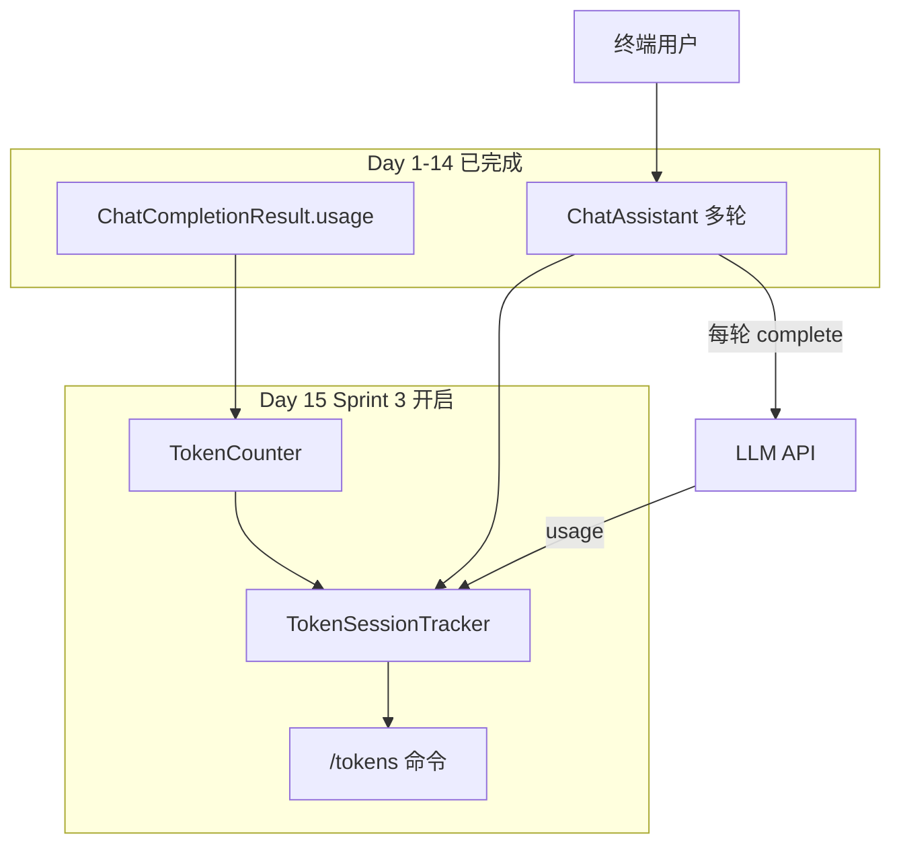

# Day 15 旁白解读：看见「记忆」的代价

> **前置要求**：完成 Day 14 `ChatAssistant`、Day 5 `ChatCompletionResult` 与 `usage` 字段

---

## 旁白

2026 年 7 月 20 日，周一。智链科技会议室换了新横幅：**「Sprint 3 启动 — 从能聊到懂用量」**。

赵岩把财务部的邮件投屏：

> 「上个月内测 API 账单涨了 340%。产品问：用户只是多聊了几轮，为什么钱翻了三倍？」

陈默在白板上画了一条上扬曲线：

```
第 1 轮 prompt ≈ 200 tokens
第 5 轮 prompt ≈ 1,800 tokens（含全部历史）
第 10 轮 prompt ≈ 4,000 tokens……
```

林晓盯着 Day 14 的 `chat_turn`，忽然醒悟：

> 「我们每轮都把**完整 messages** 发给 API。对话越长，输入 token 呈线性甚至超线性增长——这不是 bug，是**多轮对话的物理定律**。」

周航举起监控截图：

> 「API 已经返回 `usage.prompt_tokens` 了，Day 5 就解析过。今天要做的是：**本地估算 + 会话累计 + 费用可视化**，让每个人输入 `/tokens` 就能看见账单。」

下午站会，陈默预告 Day 16：

> 「用户还抱怨『等整段回复太慢』。明天做流式输出——字一个个蹦出来，体验变了，但 token 计数逻辑不变。」

---

## 今日在架构中的位置



---

## 林晓的学习建议

1. 先跑 `token_principle_demos.py`，感受中英混合估算差异  
2. 再跑 `token_counter_demo.py`，对比 API 回报与本地估算  
3. 运行 `assistant_token_demo.py`，体验 `/tokens` 报表  
4. 阅读 `estimate_tokens` 与 `_is_cjk` 的启发式规则  
5. 对照 `tests/day15/test_token_counter.py` 理解验收契约  
6. 用 Mock 模式连续对话 5 轮，观察 prompt tokens 如何增长

---

## 与前后日的衔接

| 方向 | 内容 |
|------|------|
| 回顾 Day 5 | `parse_chat_completion` 解析 `usage` 三字段 |
| 回顾 Day 14 | `messages_snapshot` 在 `complete` 前截取 |
| 今日核心 | `TokenCounter` + `TokenSessionTracker` + `/tokens` |
| 预告 Day 16 | 流式 SSE、`async`、首 token 延迟 |
| 预告 Day 17+ | RAG 检索也会消耗 prompt token |

---

## 今日一句话

> **Token 是大模型世界的「克」与「元」——看不见它，就无法治理成本与上下文。**
