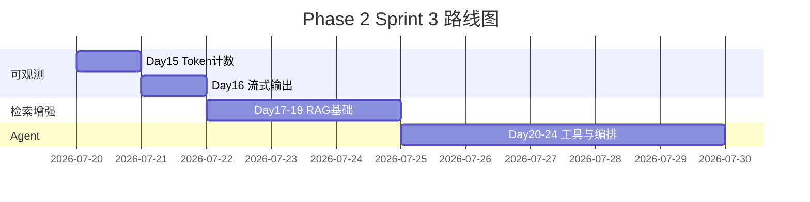

# Day 15 企业背景与今日任务

**日期**：2026 年 7 月 20 日  
**Sprint**：Sprint 3 首日 — Phase 2 启动

## 晨会纪要

### 赵岩（产品）

> 「Sprint 1 交付了能记住上下文的 CLI 助手。财务反馈：多轮对话后单次调用输入 token 暴涨。用户需要**用量可见**；运维需要**成本预警**。今天交付 Token 计算器，让 `/tokens` 成为内测标配。」

### 陈默（架构）

> 「计量分两层：**API 回报**是计费权威；**本地估算**是发送前沙盘。MVP 用启发式，不绑 `tiktoken`，降低环境复杂度。`TokenSessionTracker` 挂到 `ChatAssistant`，可选 `track_tokens=False` 保持向后兼容。」

### 周航（DevOps）

> 「验收：`pytest tests/day15/ -v` 全绿；`assistant_token_demo.py` 脚本可 CI。Mock 模式固定 `usage` 样本，避免流水线依赖真实账单。」

### 林晓（学员代表）

> 「我想搞懂：为什么『你好世界』和 `Hello world` 估算 token 差这么多？今天能讲清楚吗？」

陈默点头：「上午原理，下午代码。」

## 任务分配

| ID | 任务 | 负责人 | 优先级 |
|----|------|--------|--------|
| ZL-NA-REQ-015 | 实现 `llm/token_counter.py` | 全员 | P0 |
| ZL-NA-081 | `estimate_tokens` 中英启发式 | 林晓 | P0 |
| ZL-NA-082 | `TokenUsage` / `TokenCost` 数据类 | 林晓 | P0 |
| ZL-NA-083 | `TokenSessionTracker` 会话累计 | 助教 | P0 |
| ZL-NA-084 | `cli_assistant` 集成 `/tokens` | 林晓 | P0 |
| ZL-NA-085 | `day15/*` 演示脚本 | 助教 | P1 |
| ZL-NA-086 | `tests/day15/` 全绿 | 周航 | P0 |

## Definition of Done

- [ ] `python3 src/day15/token_principle_demos.py` 输出四组样本文本估算
- [ ] `python3 src/day15/token_counter_demo.py` 展示 API vs 本地偏差
- [ ] `NEXUS_LLM_MOCK=1 python3 src/day15/assistant_token_demo.py` 含 `/tokens` 输出
- [ ] `pytest tests/day15/ -v` 全绿
- [ ] 能口述：`prompt_tokens` / `completion_tokens` / `total_tokens` 含义
- [ ] 能解释：多轮对话为何导致 prompt 持续增长
- [ ] 能说明：为何 MVP 不用 `tiktoken`（扩展阅读见 13 篇）

## 今日节奏

| 时段 | 内容 |
|------|------|
| 09:00-09:30 | Sprint 3 启动会、Phase 2 路线图 |
| 09:30-10:30 | Token 原理科普、BPE 直觉（不深挖数学） |
| 10:45-12:00 | `estimate_tokens` 与 `TokenCounter` 实现 |
| 14:00-15:30 | `TokenSessionTracker` + `ChatAssistant` 集成 |
| 15:45-17:00 | 多轮膨胀实验、`/tokens` 演示、Day 16 预习 |

## 环境准备

```bash
cd nexus-agent-platform
export PYTHONPATH=src
export NEXUS_LLM_MOCK=1

python3 src/day15/token_principle_demos.py
python3 src/day15/token_counter_demo.py
python3 src/day15/assistant_token_demo.py
python3 -m pytest tests/day15/ -v
```

## Sprint 3 全景（Day 15–24 预览）



## 与 Sprint 1 的差异

| 维度 | Sprint 1（Day 1–14） | Sprint 3 起（Day 15+） |
|------|---------------------|------------------------|
| 关注点 | 功能闭环、能对话 | 可观测、成本、体验 |
| 集成点 | `ChatAssistant` 编排 | 计量层挂接 |
| 用户价值 | 「记得住」 | 「花多少看得见」 |
