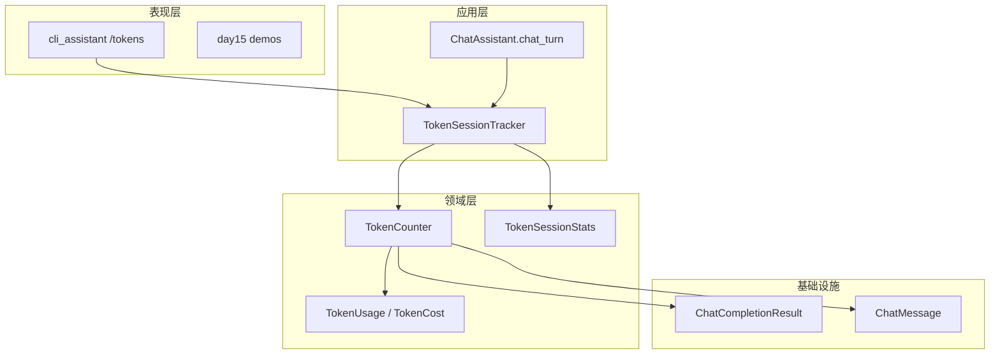
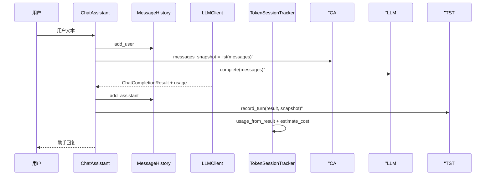

# Day 15 架构设计

**需求**：ZL-NA-REQ-015  
**模块**：`llm/token_counter.py` + `chat/cli_assistant.py` 扩展

---

## 1. 设计目标

1. **计量与对话解耦**：`TokenCounter` 可独立单测；`ChatAssistant` 仅编排挂接  
2. **权威与估算并存**：API `usage` 计费；本地 `estimate_*` 预警  
3. **零额外依赖**：MVP 不引入 `tiktoken`  
4. **向后兼容**：`track_tokens=False` 行为等同 Day 14

---

## 2. 模块分层



---

## 3. 核心类职责

| 类/函数 | 职责 | 依赖 |
|---------|------|------|
| `estimate_tokens(text)` | 纯文本启发式估算 | 无 |
| `estimate_message_tokens` | 单条消息 + overhead | `ChatMessage` |
| `estimate_messages_tokens` | 消息列表求和 | `list[ChatMessage]` |
| `TokenUsage` | 单次调用三字段 + 可选 `estimated_prompt` | `ChatCompletionResult` |
| `TokenCost` | 输入/输出费用与 `total` | `TokenUsage` |
| `TokenCounter` | 估算、解析、计费、偏差比较 | 上述全部 |
| `TokenSessionStats` | 会话累计状态 | `TokenUsage`, `TokenCost` |
| `TokenSessionTracker` | 对外 `record_turn` / `report` | `TokenCounter` |

---

## 4. 数据流：单轮对话



**关键**：`messages_snapshot` 必须在 `add_assistant` 之前截取，且包含本轮 user、不含 assistant 回复。

---

## 5. CJK 启发式算法

```python
def estimate_tokens(text: str) -> int:
    cjk = sum(1 for c in text if _is_cjk(c))
    other = len(text) - cjk
    other_tokens = (other + 3) // 4 if other else 0
    return cjk + other_tokens
```

| 字符类型 | Unicode 范围（节选） | 规则 |
|----------|---------------------|------|
| CJK 统一汉字 | U+4E00–U+9FFF | 1 字 ≈ 1 token |
| CJK 扩展 A | U+3400–U+4DBF | 1 字 ≈ 1 token |
| CJK 标点 | U+3000–U+303F | 1 字 ≈ 1 token |
| 其他（英文、数字、空格） | — | 4 字符 ≈ 1 token（向上取整） |

`MESSAGE_OVERHEAD_TOKENS = 4` 覆盖 OpenAI 风格 messages 的 role/name 等格式开销近似值。

---

## 6. 费用模型

```
input_cost  = prompt_tokens / 1_000_000 × input_price_per_m
output_cost = completion_tokens / 1_000_000 × output_price_per_m
total       = input_cost + output_cost
```

默认常量（教学近似）：

- `DEFAULT_INPUT_PRICE_PER_M = 1.0`（元）
- `DEFAULT_OUTPUT_PRICE_PER_M = 2.0`（元）

输出 token 单价更高，体现「生成比阅读贵」的行业惯例。

---

## 7. ChatAssistant 集成点

```python
# 构造
self.track_tokens = track_tokens
self.token_tracker = TokenSessionTracker() if track_tokens else None

# chat_turn
messages_snapshot = list(self.history.messages)
result = self.client.complete(self.history.messages)
if self.token_tracker:
    self.token_tracker.record_turn(result, messages_snapshot)

# handle_command /tokens
return True, self.token_tracker.report(), False
```

`COMMANDS` 新增 `/tokens` 条目，与 Day 14 七命令并列。

---

## 8. 设计权衡

| 决策 | 选项 A | 选项 B | 选择 | 理由 |
|------|--------|--------|------|------|
| 分词 | tiktoken 精确 | 启发式 | B | 教学环境零依赖 |
| 计量时机 | 仅 API 后 | 发送前+后 | 发送前+后 | 对比教学价值 |
| 展示 | 每轮自动打印 | `/tokens` 按需 | 按需 | 不干扰对话体验 |
| 存储 | 持久化报表 | 内存会话 | 内存 | MVP 范围 |

---

## 9. 扩展点（未实现）

- 注入 `estimate_fn: Callable[[str], int]` 替换启发式  
- `TokenSessionStats` 导出 JSON 供 BI  
- 与 Day 16 流式 `usage` 在 `on_finish` 回调汇总
