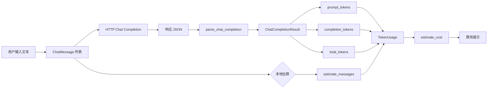
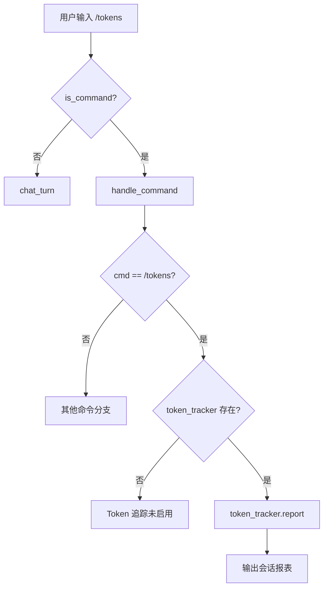
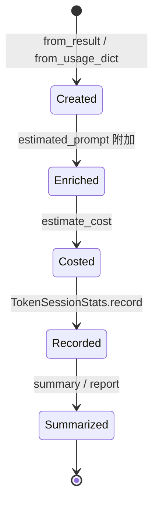
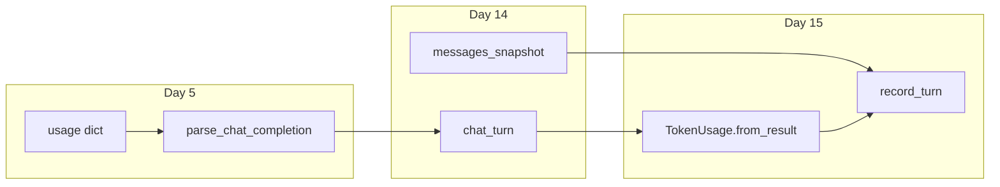
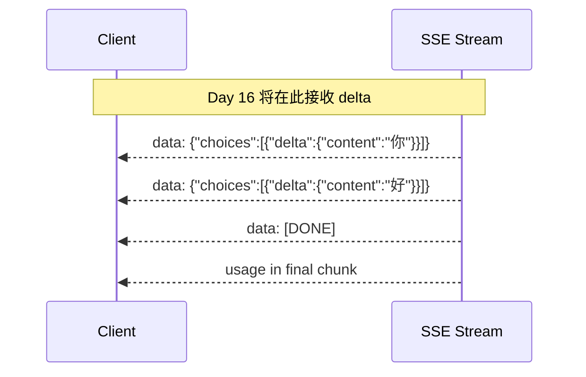

# Day 15 流程图与示意图

---

## 1. Token 在 LLM 调用中的位置



---

## 2. `/tokens` 命令流程



---

## 3. 多轮上下文 token 增长

```mermaid
xychart-beta
    title "多轮对话 prompt_tokens 增长示意（Mock 估算）"
    x-axis [轮1, 轮2, 轮3, 轮4, 轮5, 轮6, 轮7, 轮8]
    y-axis "prompt tokens" 0 --> 800
    line [120, 220, 320, 420, 520, 620, 720, 820]
```

> 假设：system 固定 80 tokens，每轮新增 user 40 + assistant 60（含历史全部重发）。

**规律**：在无裁剪策略时，第 n 轮 prompt ≈ system + Σ(前 n 轮所有消息)。

---

## 4. 中英混合估算示意

| 文本 | 字符数 | CJK 数 | other | 估算 tokens |
|------|--------|--------|-------|-------------|
| `Hello world` | 11 | 0 | 11 | (11+3)//4 = 3 |
| `你好世界` | 4 | 4 | 0 | 4 |
| `NexusAgent 智链科技平台` | 16 | 6 | 10 | 6 + (10+3)//4 = 9 |
| `理财产品年化收益率约为 3.5%-4.2%` | 22 | 14 | 8 | 14 + (8+3)//4 = 16 |

运行 `token_principle_demos.py` 可在终端复现。

---

## 5. TokenUsage 生命周期



---

## 6. 与 Day 5 / Day 14 拼接图



---

## 7. 成本计算公式卡片

```
┌─────────────────────────────────────────┐
│  输入费用 = prompt_tokens ÷ 10⁶ × ¥1.0   │
│  输出费用 = completion_tokens ÷ 10⁶ × ¥2.0│
│  合计     = 输入费用 + 输出费用          │
└─────────────────────────────────────────┘
```

示例：`prompt=42, completion=18`  
→ 输入 ¥0.000042 + 输出 ¥0.000036 = **¥0.000078**

---

## 8. Day 16 流式预览（今日不实现）



流式下 `completion_tokens` 仍在流结束后由 API 汇总返回。
