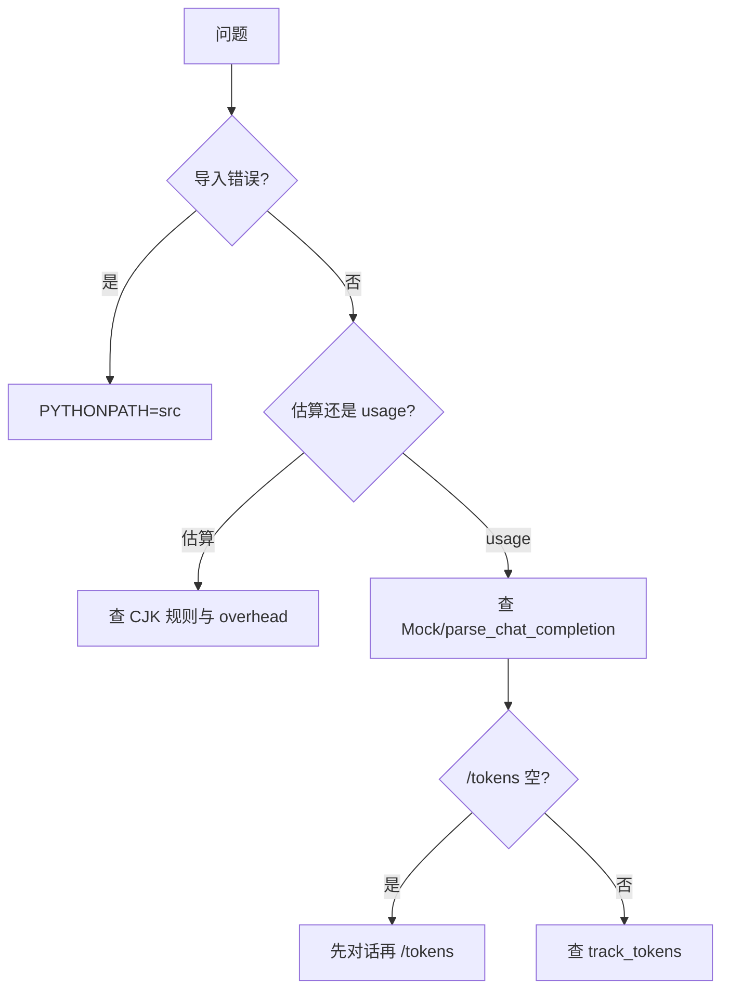

# Day 15 常见问题与排错指南

---

## 1. 环境与导入

### Q：`ModuleNotFoundError: No module named 'llm'`

```bash
cd nexus-agent-platform
export PYTHONPATH=src
```

所有 demo 与 pytest 均需 `PYTHONPATH=src`。

### Q：`pytest tests/day15/` 找不到测试

确认路径：`nexus-agent-platform/tests/day15/test_token_counter.py`  
从项目根目录运行：`python3 -m pytest tests/day15/ -v`

---

## 2. 估算相关

### Q：手算与 `estimate_tokens` 不一致

检查：

1. 是否忘记 CJK 扩展区与全角标点  
2. 英文是否用 `(len + 3) // 4` 向上取整  
3. 是否混淆「纯文本」与「含 MESSAGE_OVERHEAD 的消息」

### Q：`compare_estimate` 显示很大偏差

**正常现象**。启发式非 BPE，偏差 ±30% 常见。若需精确，见 [13_深度扩展_tiktoken与BPE.md](13_深度扩展_tiktoken与BPE.md)。

### Q：空字符串返回多少？

`estimate_tokens("")` → **0**。`estimate_message_tokens` 空 content 仍为 **4**（仅 overhead）。

---

## 3. API usage

### Q：`prompt_tokens` 全为 0

1. Mock 样本是否含 `usage` 字段  
2. `parse_chat_completion` 是否被调用  
3. 真实 API 部分旧接口不返回 usage，需查文档

### Q：`total_tokens` 不等于 prompt + completion

以 API 返回为准；`TokenUsage.from_usage_dict` 若缺 `total_tokens` 会 fallback 为二者之和。

---

## 4. ChatAssistant 集成

### Q：`/tokens` 显示「Token 追踪未启用」

构造时设置了 `track_tokens=False`，或 `token_tracker` 为 `None`。

### Q：报表一直「暂无 token 数据」

尚未成功完成任何 `chat_turn`（需先对话再 `/tokens`）。

### Q：`messages_snapshot` 用错导致估算偏差

必须在 `add_assistant` **之前**、 `complete` **之前或之后**（项目实现在 complete 前截取，含本轮 user、不含 assistant 回复）。若包含 assistant 回复会高估 prompt。

正确顺序（与源码一致）：

```python
self.history.add_user(user_text)
messages_snapshot = list(self.history.messages)
result = self.client.complete(self.history.messages)
self.history.add_assistant(reply)
self.token_tracker.record_turn(result, messages_snapshot)
```

---

## 5. 费用显示

### Q：费用显示很多位小数

`format_yuan()` 使用 6 位小数，因单次对话费用常小于 ¥0.01。可阅读性增强可四舍五入到 4 位（非 MVP 范围）。

### Q：与云账单对不上

教学单价 `DEFAULT_*_PRICE_PER_M` 为近似值；真实单价以厂商官网为准。本地估算仅供参考。

---

## 6. 测试失败

### Q：`test_assistant_tokens_command` 失败

确认 `SAMPLE["usage"]["total_tokens"]` 为 120，且 `report()` 输出含 `120` 或 `tokens`。

### Q：`test_compare_estimate` 失败

`usage` 需设置 `estimated_prompt=40` 且 `prompt_tokens=50` 才会出现 `+10` 或「偏差」。

---

## 7. 多轮上下文

### Q：聊得越多越慢越贵？

是。每轮发送完整历史，prompt 增长 → 延迟与费用双升。缓解策略（后续 Sprint）：摘要、滑动窗口、RAG 只检索相关 chunk。

---

## 排错流程图



---

## 求助渠道

1. 对照 [20_完整代码走查.md](20_完整代码走查.md)  
2. 运行 `pytest tests/day15/ -v --tb=short`  
3. 课堂答疑 / 助教论坛
