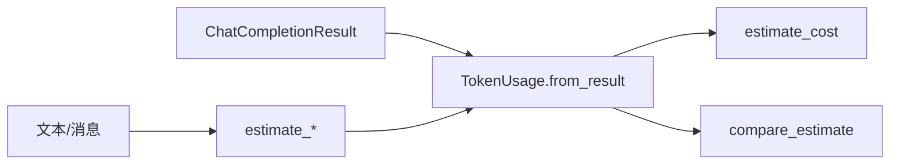

# Day 15 Token 计数详解

**专题**：从字符到账单 — NexusAgent 计量全链路

---

## 1. 为什么需要 Token 计数？

大模型 API 的三个硬约束都与 token 相关：

1. **计费**：按 token 计价  
2. **上下文窗口**：如 128K token 上限  
3. **延迟**：prompt 越长，首 token 越慢（Day 16 流式可缓解感知）

Day 14 实现了「能记住」，Day 15 回答「记住多少、花多少钱」。

---

## 2. OpenAI 兼容 usage 结构

```json
{
  "usage": {
    "prompt_tokens": 42,
    "completion_tokens": 18,
    "total_tokens": 60
  }
}
```

NexusAgent 在 `ChatCompletionResult` 扁平化三字段，与 Day 5 一致。

---

## 3. 本地估算算法详解

### 3.1 CJK 判定

```python
def _is_cjk(char: str) -> bool:
    code = ord(char)
    return (
        0x4E00 <= code <= 0x9FFF   # 基本汉字
        or 0x3400 <= code <= 0x4DBF  # 扩展 A
        or 0x3000 <= code <= 0x303F  # CJK 符号标点
    )
```

未覆盖日文假名、韩文等时，会按「4 字符 1 token」处理，可能低估。

### 3.2 非 CJK 分块

`(other + 3) // 4` 等价于 `ceil(other / 4)` 对于正整数。

| other 长度 | tokens |
|------------|--------|
| 1–4 | 1 |
| 5–8 | 2 |
| 9–12 | 3 |

### 3.3 消息级估算

```python
MESSAGE_OVERHEAD_TOKENS = 4

def estimate_message_tokens(message: ChatMessage) -> int:
    return MESSAGE_OVERHEAD_TOKENS + estimate_tokens(message.content)
```

OpenAI messages API 真实开销含 role、name、tool_calls 等，4 是教学近似。

---

## 4. TokenUsage 数据类

```python
@dataclass
class TokenUsage:
    prompt_tokens: int = 0
    completion_tokens: int = 0
    total_tokens: int = 0
    estimated_prompt: int = 0  # 本地估算，非 API 字段
```

`estimated_prompt` 仅在 `usage_from_result` 时填入，用于 `compare_estimate`。

---

## 5. TokenCounter 工作流



---

## 6. 会话累计语义

`TokenSessionStats` 字段：

| 字段 | 含义 |
|------|------|
| `turns` | 成功记录轮数 |
| `prompt_tokens` | 累计输入 token |
| `completion_tokens` | 累计输出 token |
| `total_tokens` | 累计合计 |
| `total_cost_yuan` | 累计估算费用 |
| `history` | 每轮 TokenUsage 列表 |

**注意**：累计的是每轮 API 回报之和，不是「当前 prompt 快照」。第 5 轮的 `prompt_tokens` 已含前 4 轮历史，因此**各轮 prompt 相加会重复计算历史**——这是会话「总输入 token 量」统计，不是上下文长度。

---

## 7. 与 /tokens 命令输出

```
--- Token 会话报表 ---
会话累计 2 轮 | 输入 155 + 输出 27 = 182 tokens | 约 ¥0.000209
最近一轮: tokens: 输入=100, 输出=20, 合计=120
输入估算偏差: +8 (+8.0%)
```

---

## 8. 多轮上下文增长 — 数学直觉

设第 i 轮新增内容 token 为 a_i（user+assistant），无裁剪时：

\[
\text{prompt}_n \approx \text{system} + \sum_{i=1}^{n-1} a_i + \text{user}_n
\]

随 n 线性累积；若每轮 a_i 相近，prompt 约 **O(n²)** 总输入量（各轮 prompt 之和）。

---

## 9. MVP 局限与升级路径

| 局限 | 升级 |
|------|------|
| 启发式偏差 | tiktoken / 厂商 SDK |
| 无流式计数 | Day 16 流结束汇总 |
| 无预算告警 | 扩展 EFR-002 |
| 无持久化报表 | 导出 JSON / BI |

---

## 10. 实操命令速记

```bash
python3 src/day15/token_principle_demos.py
python3 src/day15/token_counter_demo.py
NEXUS_LLM_MOCK=1 python3 src/day15/assistant_token_demo.py
```
