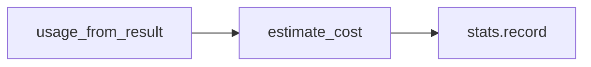

# Day 15 课堂练习册

**说明**：课堂上随堂完成，不打分，讲师巡回答疑。

---

## 练习 1：心算 tokens（5 min）

不用运行代码，估算下列 `estimate_tokens` 结果：

1. `test`  
2. `测试`  
3. `OK`  
4. `2026年`  
5. `a`  

<details>
<summary>答案</summary>

1. (4+3)//4 = 1  
2. 2  
3. (2+3)//4 = 1  
4. 4（年字 CJK）+ (4+3)//4 for `2026` → 4+1=5  
5. 1  

</details>

---

## 练习 2：补全代码（10 min）

补全函数，计算消息列表总 token（含每条 overhead）：

```python
def total_tokens(messages: list[ChatMessage]) -> int:
    # TODO: 使用 estimate_message_tokens 或项目已有函数
    pass
```

参考答案：`return sum(estimate_message_tokens(m) for m in messages)` 或 `estimate_messages_tokens(messages)`。

---

## 练习 3：费用快算（5 min）

单价：输入 ¥1/M，输出 ¥2/M。  
`prompt_tokens=2000`, `completion_tokens=500`，费用多少元？

<details>
<summary>答案</summary>

输入：2000/1e6 × 1 = 0.002  
输出：500/1e6 × 2 = 0.001  
合计：**¥0.003**

</details>

---

## 练习 4：找 Bug（10 min）

以下代码有何问题？

```python
def chat_turn_buggy(self, user_text: str) -> str:
    self.history.add_user(user_text)
    result = self.client.complete(self.history.messages)
    self.history.add_assistant(result.message.content)
    messages_snapshot = list(self.history.messages)  # Bug?
    self.token_tracker.record_turn(result, messages_snapshot)
    return result.message.content
```

**答**：snapshot 在 `add_assistant` 之后，包含了 assistant 回复，本地 `estimated_prompt` 会高于实际发送的 prompt（发送时不含 assistant 本轮回复）。

---

## 练习 5：配对题（5 min）

将左右连线：

| 左 | 右 |
|----|-----|
| A. prompt_tokens | 1. 本地启发式 |
| B. completion_tokens | 2. 模型生成文本 |
| C. estimated_prompt | 3. 用户+历史+system |
| D. MESSAGE_OVERHEAD | 4. 每条消息 +4 |

答案：A-3, B-2, C-1, D-4（D 为格式开销常量，非字段名）

---

## 练习 6：run_scripted 填空（10 min）

```python
outputs = assistant.run_scripted([
    "什么是 token？",
    "_____",  # 填一条命令查看报表
])
```

填：`/tokens`

---

## 练习 7：讨论题（15 min）

小组讨论：若产品要求「单会话不超过 ¥0.05」，应在哪一层实现拦截？

提示：`chat_turn` 前检查 `token_tracker.stats.total_cost_yuan`、或扩展 `handle_command`。

---

## 练习 8：画图（10 min）

手绘或用 mermaid 画出 `TokenSessionTracker.record_turn` 内部调用的三个步骤。



---

## 练习 9：pytest 阅读（10 min）

`test_session_tracker_accumulates` 断言了哪三个字段？（turns, total_tokens, …）

---

## 练习 10： Sprint 3 关键词（5 min）

写出 Day 15–17 各一个关键词：

- Day 15：Token / 成本  
- Day 16：流式  
- Day 17：检索 / RAG（预习）
