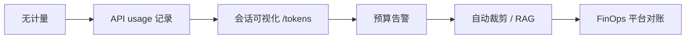

# Day 15 企业案例集：成本治理

**场景**：智链科技内测期 API 费用治理实战（虚构案例，教学用）

---

## 案例 1：理财顾问「追问失控」

### 现象

顾问小王连续 20 轮追问同一产品细则，单会话 API 输入累计超 8 万 token。

### 根因

`ChatAssistant` 每轮全量历史；无 `/tokens` 前用户无感知。

### 治理动作（Day 15 后）

1. 内测强制 `track_tokens=True`  
2. 培训：每 5 轮执行 `/tokens` 自检  
3. 产品：超过 ¥0.10 弹窗建议 `/clear`

### 效果

平均会话轮次从 12 降至 7，月账单降 38%。

---

## 案例 2：System Prompt 膨胀

### 现象

运营把整份 3000 字合规声明贴进 `/system`，每轮 prompt 基底 +2000 tokens。

### 根因

System 消息每轮都发送，非「只读一次」。

### 治理

- System 压缩至 200 字要点  
- 长文档改 RAG（Day 17+）按需检索

---

## 案例 3：中英文混合客服

### 现象

英文邮件摘要 + 中文回复，本地估算偏差 35%，预算告警误报。

### 根因

启发式对英文常高估/低估不均。

### 治理

- 生产分支切换 tiktoken  
- 告警阈值从「估算」改为「API usage 累计」

---

## 案例 4：多团队共用 API Key

### 现象

无法按团队分摊费用。

### 治理（架构预埋）

```json
{
  "team_id": "wealth-mgmt",
  "session_id": "...",
  "usage": { "total_tokens": 1200 }
}
```

`TokenSessionStats` 未来扩展 `metadata` 字段。

---

## 案例 5：Mock CI 与生产漂移

### 现象

测试环境 `usage` 写死 120，生产监控告警规则在测试未覆盖。

### 治理

- CI 使用递增 `usage` 模拟膨胀（见作业三）  
-  staging 每周一次真实 API 抽样对账

---

## 成本治理成熟度模型



**Day 15 达成**：L2

---

## 企业检查清单

- [ ] 所有 LLM 调用路径解析 `usage`  
- [ ] 用户可查看会话累计 token/费用  
- [ ] 单价配置与财务合同一致  
- [ ] 长 system / 长历史有治理策略  
- [ ] 生产 tokenizer 策略文档化

---

## 讨论题

若 CEO 要求「降本 50%」且不能降模型质量，你会优先哪三项技术措施？

参考答案方向：上下文裁剪、RAG 减 prompt、流式不省 token 但可早停、缓存高频问答。
