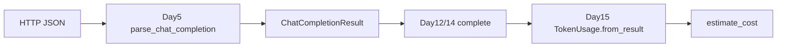

# Day 15 与 Day 5 usage 对照表

**目的**：串联「API 解析」与「计量可视化」两条线。

---

## 时间线

| Day | 能力 | 模块 |
|-----|------|------|
| Day 5 | 解析 HTTP JSON → `ChatCompletionResult` | `llm/response.py` |
| Day 12 | `LLMClient.complete` 返回 result | `llm/client.py` |
| Day 14 | 多轮 `complete(messages)` | `chat/cli_assistant.py` |
| Day 15 | 展示、累计、计费 | `llm/token_counter.py` |

---

## 字段对照

| API JSON | ChatCompletionResult | TokenUsage |
|----------|---------------------|------------|
| `usage.prompt_tokens` | `.prompt_tokens` | `.prompt_tokens` |
| `usage.completion_tokens` | `.completion_tokens` | `.completion_tokens` |
| `usage.total_tokens` | `.total_tokens` | `.total_tokens` |
| — | — | `.estimated_prompt`（Day 15 本地） |

---

## 解析代码对照

### Day 5：parse_chat_completion

```python
usage = response.get("usage", {}) or {}
return ChatCompletionResult(
    ...
    prompt_tokens=int(usage.get("prompt_tokens", 0)),
    completion_tokens=int(usage.get("completion_tokens", 0)),
    total_tokens=int(usage.get("total_tokens", 0)),
)
```

### Day 15：TokenUsage.from_result

```python
return cls(
    prompt_tokens=result.prompt_tokens,
    completion_tokens=result.completion_tokens,
    total_tokens=result.total_tokens,
    estimated_prompt=estimated_prompt,
)
```

**关系**：Day 15 不重复解析 JSON，直接消费 Day 5  dataclass。

---

## 数据流图



---

## usage_summary 对照

| 来源 | 方法 | 示例输出 |
|------|------|----------|
| Day 5 | `ChatCompletionResult.usage_summary()` | `tokens: prompt=42, completion=18, total=60` |
| Day 15 | `TokenUsage.format_line()` | `tokens: 输入=42, 输出=18, 合计=60` |

教学项目统一中文版在 Day 15；英文版保留在 result 上。

---

## Mock 样本对照

Day 15 `assistant_token_demo.py`：

```python
"usage": {"prompt_tokens": 55, "completion_tokens": 12, "total_tokens": 67}
```

Day 15 测试 `SAMPLE`：

```python
"usage": {"prompt_tokens": 100, "completion_tokens": 20, "total_tokens": 120}
```

与 Day 5 测试样本量级一致，便于跨日回归。

---

## 常见问题

**Q**：Day 5 学了 usage，Day 15 新在哪？  
**A**：累计、费用、本地估算对比、CLI `/tokens`，从「能解析」到「能治理」。

**Q**：能否跳过 Day 5 直接学 Day 15？  
**A**：不建议；`ChatCompletionResult` 是计量入口。

---

## 练习

在 REPL 中手动构造 `ChatCompletionResult`，调用 `TokenUsage.from_result` 与 `TokenCounter.estimate_cost`，验证与 `token_counter_demo.py` 输出一致。
