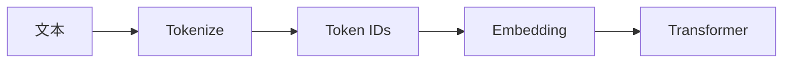
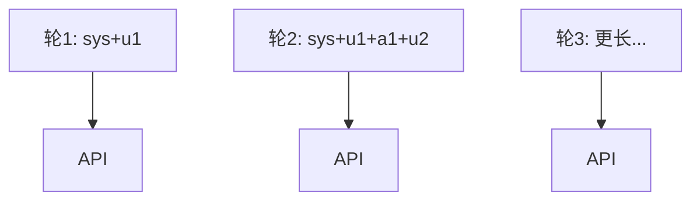

# Day 15 大模型原理深度讲义

**课时**：可拆 2×45 分钟讲座  
**层次**：原理科普，非数学证明

---

## 第一章：从文字到向量

大模型不直接「读汉字」。流程：

```
文本 → Token 序列 → Token ID → Embedding 向量 → Transformer 层
```

Token 是嵌入层查表的索引。词表大小常见 32K–128K。



---

## 第二章：为何不用「字」或「词」

| 粒度 | 问题 |
|------|------|
| 字（中文） | 词表爆炸、未登录词 |
| 词（英文） | 形态变化多、词表无限 |
| 子词 BPE | 平衡 OOV 与序列长度 |

中文在 BPE 下常接近一字一 token，故教学启发式「1 字 1 token」在中文场景尚可。

---

## 第三章：上下文窗口

模型一次能「看见」的最大 token 数。包含：

- system + 全部历史 + 当前 user（输入侧）  
- 生成中的 assistant（输出侧，占窗口）

超长会截断或报错。Day 15 多轮实验是窗口压力的微缩版。

---

## 第四章：计费经济学

```
成本 ≈ f(prompt_tokens, completion_tokens, 模型单价, 基础设施)
```

企业还需考虑：重试（Day 13）会重复计费、失败请求可能仍计部分 token。

---

## 第五章：输入与输出的不对称

- **Prompt**：并行编码，一次前向  
- **Completion**：自回归，每生成 1 token 需一次前向（简化模型）

故输出单价常更高；长回答比长问题更「贵」在算力上。

---

## 第六章：温度、top_p 与 token

采样策略不改变「已生成 token 数」计费方式，但影响：

- 重复啰嗦 → completion 变长 → 费用升  
- 早停 `finish_reason=stop` → 自然结束

---

## 第七章：多轮记忆的代价



每轮重复发送历史 → **输入 token 线性累积** → 费用与延迟双升。

缓解策略预览：

| 策略 | Sprint |
|------|--------|
| /clear | Day 15 已有 |
| 滑动窗口 | 后续 |
| 摘要压缩 | 后续 |
| RAG 按需检索 | Day 17+ |

---

## 第八章：可观测性三角

1. **计量**（Day 15）：token、费用  
2. **体验**（Day 16）：流式、首 token 延迟  
3. **质量**（后续）：检索命中率、工具调用成功率

---

## 第九章：与 Agent 的关系

Agent 多步调用工具，每步都是一次 LLM 或 API 调用，token **逐步累加**。今日会话 tracker 是 Agent 级账单的原子单元。

---

## 第十章：课堂讨论

「若模型免费但 token 仍有限制，你还会优化 prompt 吗？」

引导：窗口限制、延迟、碳排放与 Responsible AI。

---

## 附录：术语表

| 术语 | 解释 |
|------|------|
| BPE | 字节对编码，构建子词词表 |
| prompt | 发给模型的输入 |
| completion | 模型生成输出 |
| usage | API 返回的计量块 |
| context window | 最大上下文 token 数 |
