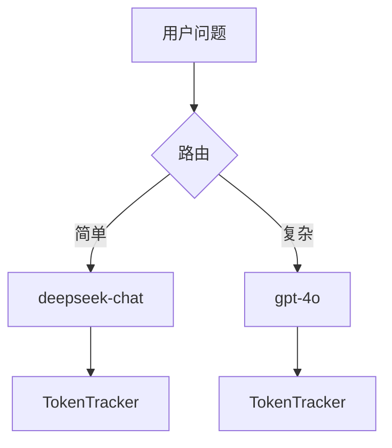

# Day 15 Token 成本企业实践

**读者**：开发、产品、运维、财务协作

---

## 1. 成本可见性分级

| 级别 | 能力 | NexusAgent 对应 |
|------|------|-----------------|
| L0 盲飞 | 不知 token | Day 14 前 |
| L1 单轮 | 看 API usage | Day 5 |
| L2 会话 | `/tokens` 累计 | Day 15 |
| L3 组织 | 分团队报表 | 扩展 EFR |
| L4 自动 | 预算拦截 | 未实现 |

---

## 2. 单价管理

### 配置化示例（未来）

```yaml
pricing:
  deepseek-chat:
    input_per_m: 1.0
    output_per_m: 2.0
  gpt-4o:
    input_per_m: 15.0
    output_per_m: 60.0
```

`TokenCounter` 构造注入即最小实现。

### 对账流程

1. 导出云厂商月度账单  
2. 对比应用内 `sum(total_cost_yuan)`  
3. 偏差 >5% 排查：单价过期、重试重复、缓存未命中

---

## 3. 会话级 KPI

| KPI | 公式 | 目标示例 |
|-----|------|----------|
| 均轮次 | turns / 会话 | < 8 |
| 均 prompt | sum(prompt)/turns | 监控趋势 |
| 单会话成本 | total_cost_yuan | < ¥0.05 |
| 输出/输入比 | completion/prompt | 0.2–0.5 |

---

## 4. 降本杠杆（按 ROI 排序）

1. **缩短 system** — 零开发  
2. **/clear 培训** — 零开发  
3. **历史滑动窗口** — 低开发  
4. **RAG 替代全量文档** — 中开发  
5. **小模型路由** — 高开发  
6. **缓存高频 QA** — 中开发

---

## 5. 告警规则示例

```python
def check_budget(stats: TokenSessionStats, limit: float = 0.05) -> str | None:
    if stats.total_cost_yuan > limit:
        return f"会话费用 ¥{stats.total_cost_yuan:.4f} 超过预算 ¥{limit}"
    return None
```

可挂入 `chat_turn` 返回前（扩展）。

---

## 6. 合规与审计

- 日志记录 usage，不记录完整 prompt（脱敏策略）  
- 费用估算标注「非正式账单」  
- 保留模型版本与单价生效日期

---

## 7. 多模型场景

路由到贵模型时加倍监控：



---

## 8. 与重试（Day 13）的交互

`ResilientLLMClient` 重试成功一次，只计成功那次 usage；若每次尝试都计费（部分厂商），需读厂商文档。教学 Mock 仅一次。

---

## 9. 案例演算

假设 10 轮对话，每轮 prompt 平均 800，completion 平均 150：

```
输入：10 × 800 = 8000 tokens → 8000/1e6 × 1 = ¥0.008
输出：10 × 150 = 1500 tokens → 1500/1e6 × 2 = ¥0.003
合计约 ¥0.011
```

1000 活跃顾问/天 → ¥11/天 → ¥330/月（仅 LLM 直接费，未含基础设施）。

---

## 10. 行动项模板

| 角色 | 本周行动 |
|------|----------|
| 开发 | 默认 `track_tokens=True` |
| 产品 | 内测说明加 `/tokens` 引导 |
| 运维 | CI 跑 `tests/day15` |
| 财务 | 确认教学单价与合同单价差异 |
