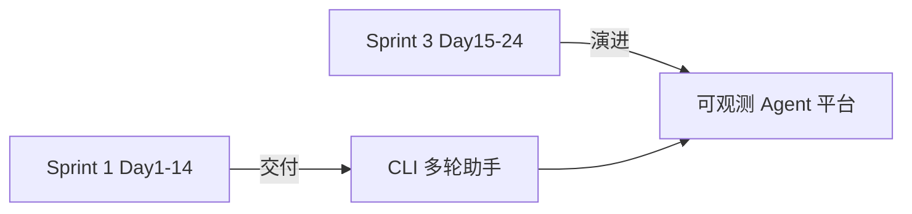
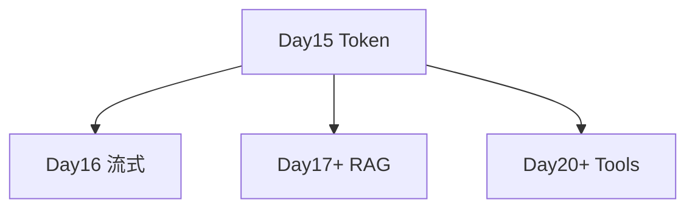

# Sprint 3 阶段开启

**Phase 2 · Sprint 3**  
**周期**：Day 15 – Day 24（2026-07-20 起）  
**主题**：可观测、体验、检索与 Agent 能力栈

---

## 1. 从 Sprint 1 到 Sprint 3

| 维度 | Sprint 1 | Sprint 3 |
|------|----------|----------|
| 目标 | 能对话、能保存 | 能计量、能流式、能检索、能调工具 |
| 用户价值 | 记得住 | 看得见、快起来、答得准 |
| 技术栈 | 同步 HTTP | +流式 +向量检索 +工具协议 |

---

## 2. Sprint 3 日程预览

| Day | 主题 | 需求/关键词 |
|-----|------|-------------|
| **15** | **Token 计算器** | **ZL-NA-REQ-015** |
| 16 | 流式输出 | SSE、async |
| 17 | 文档切块 | chunk、embedding 入门 |
| 18 | 向量检索 | similarity |
| 19 | RAG 整合 | retrieve + generate |
| 20 | 函数调用 | tools schema |
| 21 | 工具执行 | sandbox |
| 22 | 多 Agent 草图 | orchestration |
| 23 | 观测与日志 | tracing |
| 24 | Sprint 3 评审 | 阶段交付 |

> 具体需求号以项目仓库为准；上表为教学路线图。

---

## 3. Day 15 在 Sprint 3 的定位

**第一块基石：可观测性**

- 没有 token 计量，后续 RAG 加多少 chunk 进 prompt 无法量化  
- 没有成本意识，流式与 Agent 多步调用会「账单爆炸」

---

## 4. 交付标准（Sprint 3 累计）

Phase 2 结束时学员应能：

1. 解释并读取 `usage` 三字段  
2. 使用 `/tokens` 查看会话报表  
3. 描述多轮上下文膨胀与治理思路  
4. （后续日累积）流式消费、RAG 问答、简单工具调用

---

## 5. 团队仪式

### 启动会 checklist

- [ ] 回顾 Sprint 1 演示视频  
- [ ] 阅读 [01_企业背景与今日任务.md](01_企业背景与今日任务.md)  
- [ ] 拉取最新 `nexus-agent-platform`  
- [ ] 跑通 `pytest tests/day14/ tests/day15/ -v`

### 每日站会三问

1. 昨天学了什么模块？  
2. 今天 token/流式/RAG 哪块？  
3. 有什么阻塞？

---

## 6. 风险与依赖

| 风险 | 缓解 |
|------|------|
| API Key 费用 | Mock 默认、预算提醒 |
| 学员 async 陌生 | Day 16 零基础讲起 |
| 课件与代码不同步 | 以 `tests/day15` 为准 |

---

## 7. 成功画像

**Sprint 3 结束时**，智链科技内测顾问可以：

- 终端多轮对话（Sprint 1）  
- 随时 `/tokens` 看账单（Day 15）  
- 流式看到字蹦出（Day 16）  
- 问企业文档得检索增强回答（Day 17–19）  
- 让助手调简单工具（Day 20–21）

---

## 8. 今日口号

> **「先看见 token，再优化一切。」**

---

## 9. 相关课件

- [00_旁白解读.md](00_旁白解读.md)  
- [24_Sprint3阶段开启.md](24_Sprint3阶段开启.md)（本文）  
- Day 14 [README](../day14/README.md) Sprint 1 收官

---

## 10. Day 16 预习作业

阅读流式相关概念：SSE、`data:` 行、`[DONE]`、首 token 延迟。无需写代码。
