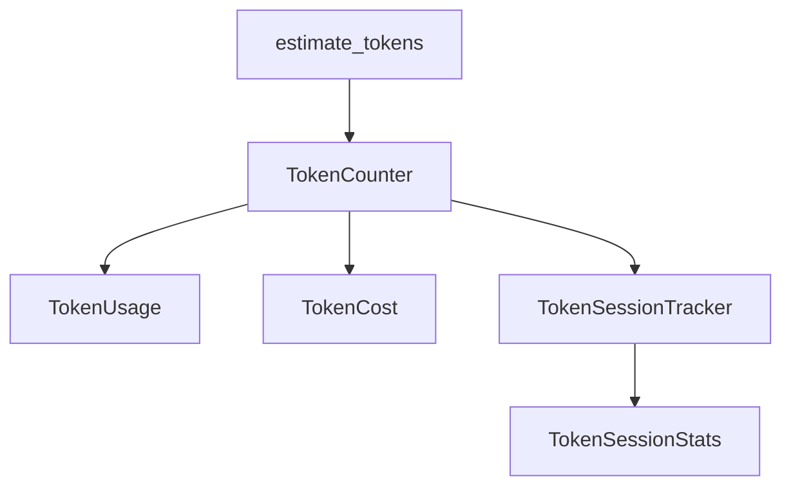

# Day 15 token_counter 精读

**精读目标**：逐类理解 `llm/token_counter.py`，能独立复现核心逻辑。

---

## 精读地图



建议阅读顺序：A → C → D → B → F → E → cli 集成。

---

## 第一节：纯函数层

### estimate_tokens

**契约**：

- 输入：`str`  
- 输出：非负 `int`  
- 副作用：无

**边界**：

| 输入 | 输出 |
|------|------|
| `""` | 0 |
| 仅空格 | 按 other 计 |
| 仅 emoji | 按 other 计（可能偏差大） |

### 为何不用正则？

逐字符 `ord` 判断 CJK 范围，零依赖、够快、教学清晰。

---

## 第二节：TokenUsage 精读

### 字段语义

- `prompt_tokens` / `completion_tokens`：来自 API，权威  
- `total_tokens`：通常二者之和，以 API 为准  
- `estimated_prompt`：仅本地，用于 `compare_estimate`

### from_result vs from_usage_dict

| 工厂 | 场景 |
|------|------|
| `from_result` | 已有 `ChatCompletionResult` |
| `from_usage_dict` | 直接解析 JSON 子树、流式最后一包 |

### format_line

用户可见字符串，中文版便于 CLI。与 `ChatCompletionResult.usage_summary()` 互补。

---

## 第三节：TokenCost 精读

```python
input_cost = usage.prompt_tokens / 1_000_000 * self.input_price_per_m
```

注意 **整数除法前先转 float 语境**：Python 3 中 `/` 已是真除法，OK。

`format_yuan` 六位小数：单次对话费用常 < 1 分。

---

## 第四节：TokenCounter 精读

### 依赖注入

```python
TokenCounter(input_price_per_m=0.5, output_price_per_m=1.0)
```

单测 `test_token_counter_cost` 用百万 token 验证精度。

### usage_from_result 核心

```python
estimated = self.estimate_messages(messages_before_reply)
return TokenUsage.from_result(result, estimated_prompt=estimated)
```

**messages_before_reply** 必须是不含本轮 assistant 的快照。

### compare_estimate 边界

- `estimated_prompt <= 0` → 返回「无本地估算」  
- 除零保护在 pct 计算

---

## 第五节：TokenSessionStats 精读

`record` 做四件事：

1. `turns += 1`  
2. 累加三 token 字段  
3. `total_cost_yuan += cost.total`  
4. `history.append(usage)`

`last_usage()` 取 `history[-1]`，空则 `None`。

---

## 第六节：TokenSessionTracker 精读

薄封装层：

- 组合 `TokenCounter` + `TokenSessionStats`  
- `record_turn` 是唯一写入口  
- `report` 是唯一详细读出口

**设计模式**：外观（Facade）— 对 `ChatAssistant` 隐藏 Counter 细节。

---

## 第七节：与 cli_assistant 契约

| ChatAssistant 责任 | Token 模块责任 |
|------------------|----------------|
| 何时 snapshot | 如何估算 |
| 是否 track_tokens | 如何累计 |
| `/tokens` 路由 | `report()` 格式 |

不循环依赖：`token_counter` 不 import `cli_assistant`。

---

## 第八节：精读习题

1. 若把 `MESSAGE_OVERHEAD_TOKENS` 改为 0，对 `compare_estimate` 有何影响？  
2. `history` 列表会否内存无限增长？生产如何改？  
3. 写出 `record_turn` 的时序图（3 步）。

---

## 第九节：对照源码阅读清单

| 行段（约） | 内容 |
|------------|------|
| 21–26 | 常量 |
| 29–53 | CJK + estimate |
| 66–99 | TokenUsage |
| 102–114 | TokenCost |
| 117–155 | TokenCounter |
| 158–212 | Session stats/tracker |

打开 `nexus-agent-platform/src/llm/token_counter.py` 对照本表跳读。

---

## 第十节：自测通过标准

- [ ] 能白板写出 `estimate_tokens`  
- [ ] 能说明 `estimated_prompt` 来源  
- [ ] 能解释 `report()` 三行输出含义  
- [ ] `pytest tests/day15/ -v` 全绿
