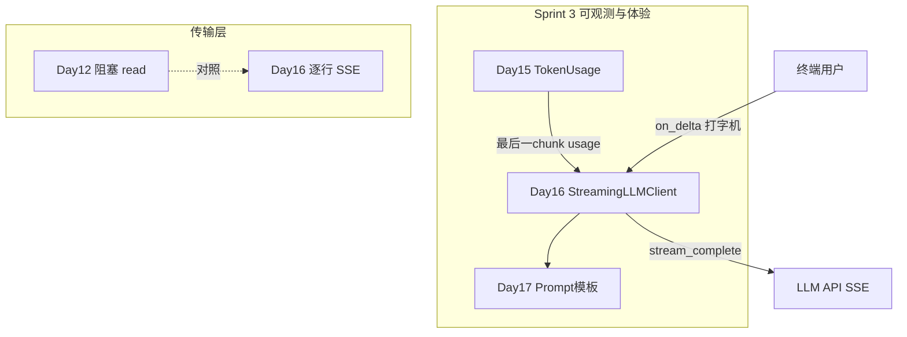

# Day 16 旁白解读：让回复「活」起来

> **前置要求**：完成 Day 15 `TokenCounter`、Day 12 `LLMClient.complete`、Day 5 `parse_chat_completion`

---

## 旁白

2026 年 7 月 21 日，周二。智链科技产品周会，赵岩播放了两段录屏：

左边：用户输入「帮我写一段理财建议」，光标转圈 **8 秒**，整段文字一次性弹出。  
右边：竞品助手 **0.5 秒** 出现第一个字，随后像打字机一样逐字显示。

会议室安静了两秒。林晓小声说：「我们 Day 12 的 `complete` 是等 HTTP 响应体全部读完才解析 JSON……用户感知就是『卡住了』。」

陈默在白板上写下三个词：

```
stream=True  →  SSE  →  on_delta
```

> 「API 支持流式。请求体加一个 `stream: true`，响应不再是单个 JSON，而是 **Server-Sent Events**：一行行 `data: {...}`，最后 `data: [DONE]`。我们要做的，是**边读边解析边回调**。」

周航补充运维视角：

> 「阻塞读和流式读对连接占用不同。Day 12 用 `resp.read()` 一次拿完；今天用 `for raw_line in resp` **逐行**。长回复时，流式能更早释放『首 token 焦虑』。」

下午，林晓跑通 `streaming_demo.py`，终端里「你好，我是 NexusAgent 助手。」一个字一个字蹦出来。她盯着最后的 `usage_summary()`：

> 「Token 还是在最后一个 chunk 里——和 Day 15 一样。流式改变的是**体验**，不是计费规则。」

陈默点头，并在站会末尾预告 Day 17：

> 「流式解决了『怎么显示』。明天解决『怎么说』——Prompt 模板，让 system 提示词可配置、可版本化。」

---

## 今日在架构中的位置



---

## 林晓的学习建议

1. 先读 `llm/sample_data/stream_mock.sse`，肉眼辨认 `data:` 行与 `[DONE]`  
2. 运行 `sse_parse_demos.py`，理解 `parse_sse_line` → `parse_stream_chunk` 链路  
3. 运行 `NEXUS_LLM_MOCK=1 streaming_demo.py`，观察 `on_delta` 与 `usage_summary()`  
4. 对照 `streaming.py` 中 `default_stream_transport` 与 Day 12 `complete` 的 urllib 差异  
5. 阅读 `tests/day16/test_streaming.py`，掌握 Mock transport 注入方式  
6. 预习 `async_stream_demos.py`，思考异步场景下如何不阻塞事件循环

---

## 与前后日的衔接

| 方向 | 内容 |
|------|------|
| 回顾 Day 5 | `parse_stream_chunk` 解析 `choices[0].delta.content` |
| 回顾 Day 12 | `urllib` 阻塞 `read()` vs 流式 `for line in resp` |
| 回顾 Day 15 | 最后一 chunk 的 `usage` 字段为权威计量 |
| 今日核心 | `StreamingLLMClient.stream_complete` + `on_delta` |
| 预告 Day 17 | Prompt 模板、system 角色工程化 |
| 预告 Day 18+ | 流式 + RAG 检索结果拼接进 prompt |

---

## 今日一句话

> **流式输出不是新 API，而是同一种 Chat Completions 的另一种「读法」——把等待变成看见。**
