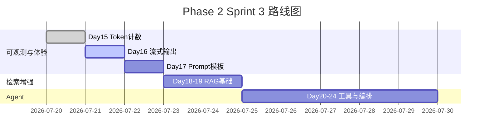

# Day 16 企业背景与今日任务

**日期**：2026 年 7 月 21 日  
**Sprint**：Sprint 3 第二日 — 体验升级

## 晨会纪要

### 赵岩（产品）

> 「内测问卷第一名抱怨：『助手思考太久』。技术分析表明：模型首 token 约 300–800ms，但完整回复 2–8 秒。用户把**全部等待**都算成『卡住』。今日交付流式输出，让 CLI 与 Web 都能逐字显示。」

### 陈默（架构）

> 「在 `LLMClient` 之上新增 `StreamingLLMClient`，不破坏 Day 12 阻塞路径。核心模块 `llm/streaming.py`：`build_stream_request_body` 设 `stream=True`；`parse_sse_line` 处理 SSE 协议；`stream_complete` 串联 transport → 解析 → 累积 → 回调。」

### 周航（DevOps）

> 「Mock 模式读 `stream_mock.sse`，CI 不依赖外网。真实模式仍用 urllib 逐行读，timeout 120s。验收：`pytest tests/day16/ -v` 全绿。」

### 林晓（学员代表）

> 「Day 5 讲过 `parse_stream_chunk`，今天终于接上完整链路了？」

陈默：「上午协议，下午客户端，晚上你对照 Day 12 写一张对照表。」

## 任务分配

| ID | 任务 | 负责人 | 优先级 |
|----|------|--------|--------|
| ZL-NA-REQ-016 | 实现 `llm/streaming.py` | 全员 | P0 |
| ZL-NA-091 | `parse_sse_line` / `iter_sse_events` | 林晓 | P0 |
| ZL-NA-092 | `StreamAccumulator` + `parse_stream_chunk` | 林晓 | P0 |
| ZL-NA-093 | `StreamingLLMClient.stream_complete` | 助教 | P0 |
| ZL-NA-094 | `mock_stream_from_sse_file` + 样本 | 周航 | P0 |
| ZL-NA-095 | `day16/*` 演示脚本 | 助教 | P1 |
| ZL-NA-096 | `tests/day16/` 全绿 | 周航 | P0 |

## Definition of Done

- [ ] `python3 src/day16/sse_parse_demos.py` 正确拼接 Mock 文本
- [ ] `NEXUS_LLM_MOCK=1 python3 src/day16/streaming_demo.py` 打字机效果
- [ ] `pytest tests/day16/ -v` 全绿
- [ ] 能口述：`stream=True` 请求体与阻塞调用的差异
- [ ] 能解释：`data: [DONE]` 的含义与处理时机
- [ ] 能说明：`on_delta` 与 `StreamAccumulator` 的职责分工
- [ ] 能指出：usage 出现在哪个 chunk（Day 15 衔接）

## 今日节奏

| 时段 | 内容 |
|------|------|
| 09:00-09:30 | 流式体验对比、SSE 协议入门 |
| 09:30-10:30 | `parse_sse_line` / `parse_stream_chunk` 手写练习 |
| 10:45-12:00 | `default_stream_transport` 逐行读取 |
| 14:00-15:30 | `StreamingLLMClient` + `on_delta` 集成 |
| 15:45-17:00 | Mock SSE、单测、Day 12 对照实验 |

## 环境准备

```bash
cd nexus-agent-platform
export PYTHONPATH=src
export NEXUS_LLM_MOCK=1

python3 src/day16/sse_parse_demos.py
python3 src/day16/streaming_demo.py
python3 -m pytest tests/day16/ -v
```

## Sprint 3 全景（Day 15–24 预览）



## 与 Day 12 的差异

| 维度 | Day 12 阻塞 `complete` | Day 16 流式 `stream_complete` |
|------|------------------------|--------------------------------|
| 请求体 | `stream` 缺省 false | `stream: true` |
| 响应格式 | 单个 JSON | SSE 多行 `data:` |
| 读取方式 | `resp.read()` | `for raw_line in resp` |
| 用户感知 | 一次显示 | `on_delta` 逐字 |
| Usage 时机 | 响应根 `usage` | 最后 chunk 内 `usage` |
