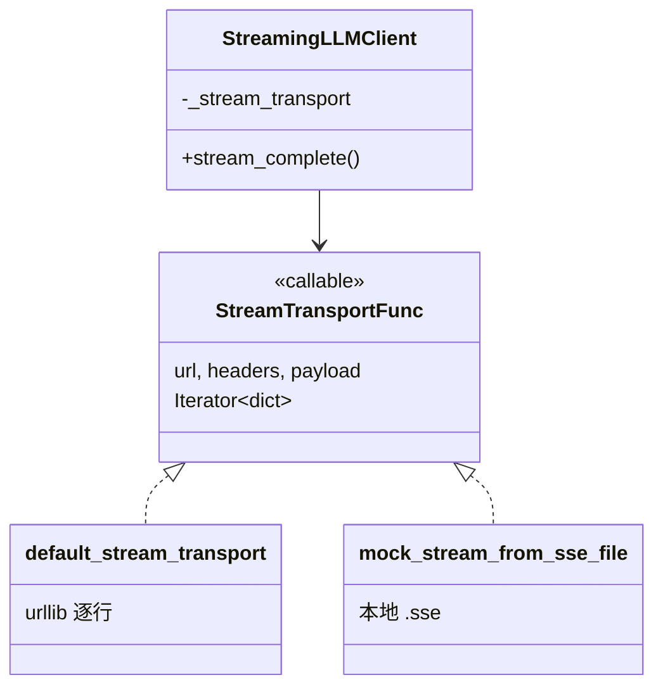

# ZL-NA-REQ-016 需求文档（扩展）

**关联主文档**：[02_需求文档.md](02_需求文档.md)  
**读者**：架构师、高级学员、Code Reviewer

---

## 扩展 1：为何选择 SSE 而非 WebSocket？

| 维度 | SSE | WebSocket |
|------|-----|-----------|
| 方向 | 服务端 → 客户端单向 | 双向 |
| HTTP 兼容 | 是，长连接 HTTP/1.1 | 需 Upgrade |
| LLM 场景 | 生成流天然单向 | 过度设计 |
| 代理/CDN | 部分需关闭缓冲 | 配置更复杂 |

OpenAI Chat Completions 流式采用 **SSE over POST**，NexusAgent MVP 对齐此协议，降低网关改造成本。

## 扩展 2：Transport 抽象边界



**设计意图**：`stream_complete` 只关心「迭代 JSON chunk」，不关心字节从网线还是文件来。单测注入 `mock_stream_from_text`，集成测读 `stream_mock.sse`，生产用 `default_stream_transport`。

## 扩展 3：首 Token 延迟（TTFT）与流式

产品指标 **TTFT（Time To First Token）** 衡量从请求发出到第一个 content delta 的时间。阻塞模式下用户 TTFT ≈ 完整生成时间；流式模式下 TTFT ≈ 模型首包延迟，**感知延迟显著下降**。

注意：流式**不减少**总 token 数与总生成时间，只改变**呈现节奏**。

## 扩展 4：finish_reason 语义

| 值 | 含义 |
|----|------|
| `stop` | 自然结束或遇到 stop 序列 |
| `length` | 达到 max_tokens |
| `content_filter` | 内容策略拦截 |
| `tool_calls` | 工具调用（后续 Sprint） |

`stream_complete` 在遍历中记录**最后一个非空** `finish_reason`，写入 `StreamCompletionResult`。

## 扩展 5：错误中途断开

若 transport 在 `[DONE]` 前抛 `HTTPError`：

1. `default_stream_transport` 读取 error body，封装 `APIError`
2. 已累积的 `accumulator.content` **不返回**（当前实现整体失败）
3. 企业扩展可考虑：部分回复 + 重试策略（Out of Scope）

## 扩展 6：与 Day 15 Token 计量的衔接

流式响应中 `usage` **通常仅出现在最后一个 chunk**（`finish_reason` 非 null 那一包）。部分厂商中间 chunk 也可能带 `usage`（增量统计），MVP 采用**覆盖式**更新：

```python
usage_raw = raw_chunk.get("usage")
if usage_raw:
    usage = TokenUsage.from_usage_dict(usage_raw)
```

即：见到 `usage` 就刷新，最后一包为准。

## 扩展 7：CLI 集成路线图（未在本日交付）

| 阶段 | 行为 |
|------|------|
| Day 16 | 独立 `streaming_demo.py` |
| Day 17+ | `ChatAssistant.stream_turn` 可选 |
| 未来 | `/stream on` 切换阻塞/流式 |

扩展文档记录此演进，避免学员疑惑「为何 CLI 主路径仍是阻塞」。

## 扩展 8：安全与日志

- **勿**将完整 SSE 流默认打入 INFO 日志（含用户隐私）
- 调试时可采样前 3 个 chunk
- `on_delta` 回调内避免同步慢 IO，以免阻塞读取循环

## 扩展 9：验收用例矩阵

| 用例 | 输入 | 期望 |
|------|------|------|
| 正常 Mock | `stream_mock.sse` | 拼接固定问候语 |
| 空 delta 跳过 | role-only 首包 | 不触发 on_delta |
| [DONE] 终止 | 文件末行 | 不 yield done 给 parse_stream_chunk |
| 无 content | 全空 delta | APIError |
| 注入 transport | `mock_stream_from_text` | chunk_count == len(text)+1 |

## 扩展 10：Day 17 衔接 — Prompt + Stream

明日 `system_prompt` 将通过模板注入 `stream_chat`。流式不改变 messages 结构，只改变**响应消费方式**。扩展需求预登记：

- FR-017-001：`PromptTemplate.render()` 输出 system 字符串
- FR-017-002：`stream_chat(..., system_prompt=template.render(ctx))`
