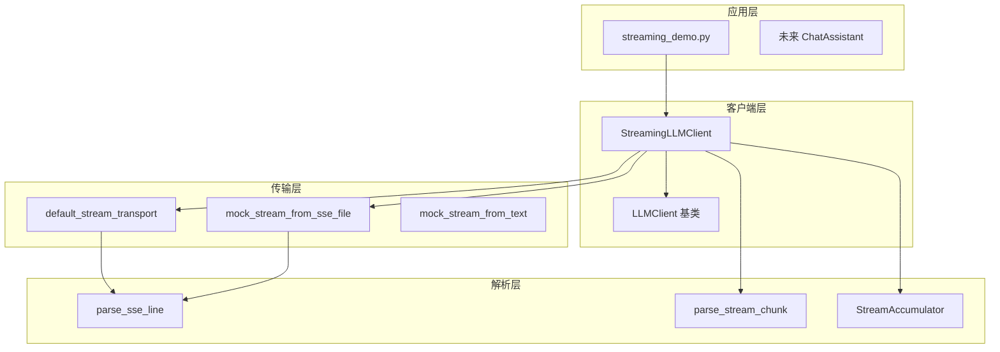
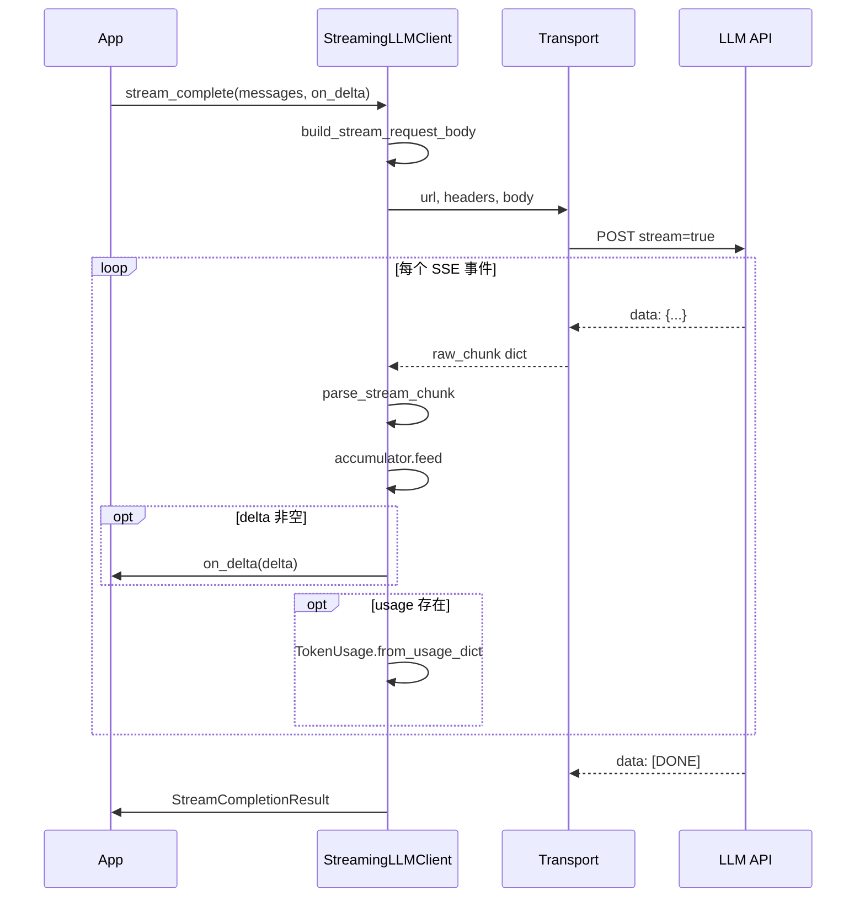

# Day 16 架构设计

**模块**：`llm/streaming.py`  
**需求**：ZL-NA-REQ-016

---

## 1. 分层架构



## 2. 核心类与函数

| 符号 | 职责 |
|------|------|
| `build_stream_request_body` | 组装 `stream=True` JSON body |
| `parse_sse_line` | 单行 SSE → dict 或 None |
| `iter_sse_events` | 行迭代器 → 事件迭代器 |
| `parse_stream_chunk` | chunk dict → `StreamChunk` |
| `StreamAccumulator` | delta 拼接为完整 content |
| `StreamingLLMClient` | 编排 transport + 解析 + 回调 |
| `StreamCompletionResult` | 流结束汇总（含 usage） |

## 3. stream_complete 控制流



## 4. 与 LLMClient 的关系

`StreamingLLMClient` **继承** `LLMClient`，复用：

- `ModelConfig` / `EnvConfig`
- `_headers()` API Key 与 Content-Type
- `chat_completions_url`

**不覆盖** `complete()`，阻塞与流式两条路径并存，符合开闭原则。

## 5. Transport 注入策略

```python
if stream_transport is not None:
    self._stream_transport = stream_transport
elif self.env.mock:
    self._stream_transport = mock_stream_from_sse_file(sse_path)
else:
    self._stream_transport = default_stream_transport
```

优先级：**显式注入 > Mock 文件 > 真实 urllib**。

## 6. 数据类设计

### StreamChunk

轻量解析结果，避免业务层直接操作原始 JSON。

### StreamCompletionResult

对齐 Day 5 `ChatCompletionResult` 语义，额外增加 `chunk_count` 便于可观测：

```python
def usage_summary(self) -> str:
    return f"tokens: prompt={...}, chunks={self.chunk_count}"
```

## 7. 错误处理策略

| 场景 | 行为 |
|------|------|
| HTTP 4xx/5xx | `APIError` + status_code + body |
| 网络不可达 | `APIError` 包装 URLError |
| SSE JSON 坏行 | `APIError` 解析失败 |
| 零 content | `APIError` 业务校验 |

## 8. 文件与路径

| 路径 | 说明 |
|------|------|
| `llm/streaming.py` | 主模块 |
| `llm/sample_data/stream_mock.sse` | Mock 样本 |
| `day16/sse_parse_demos.py` | 解析演示 |
| `day16/streaming_demo.py` | 端到端演示 |
| `day16/async_stream_demos.py` | 异步预习 |
| `tests/day16/test_streaming.py` | 单元测试 |

## 9. 扩展点（后续 Sprint）

1. `ChatAssistant.stream_turn` 挂接 `on_delta`
2. Web 层 SSE 代理：`text/event-stream` 转发
3. 异步 transport：`async for chunk in transport`
4. 流式 tool_calls delta 解析

## 10. 设计原则小结

- **单一职责**：解析、传输、累积、编排分离  
- **可测试**：Transport 可注入，无需真实 API  
- **协议对齐**：OpenAI SSE 格式，降低迁移成本  
- **渐进增强**：不破坏 Day 12 阻塞路径
