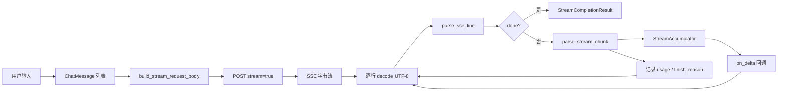
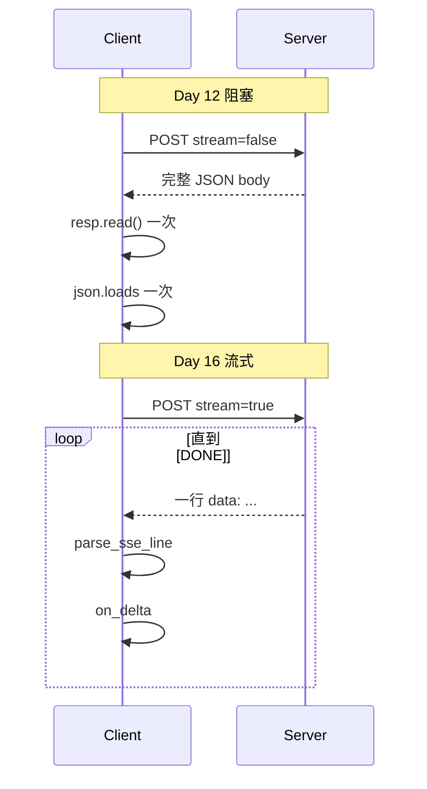
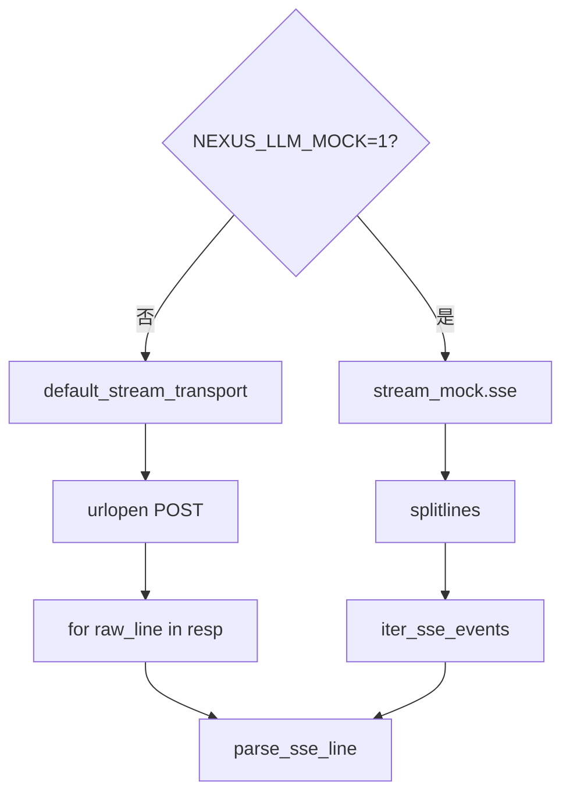
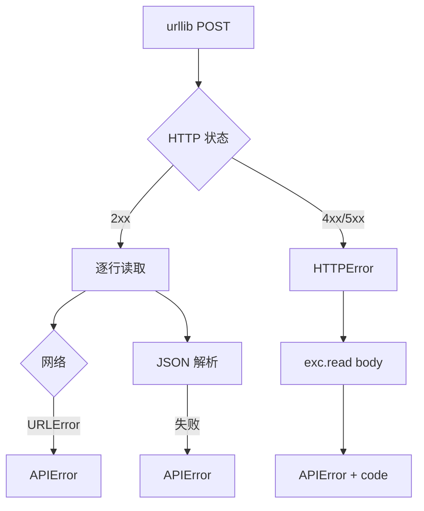
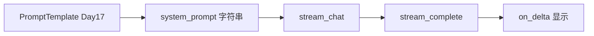

# Day 16 流程图与示意图

---

## 1. 端到端数据流



## 2. SSE 报文结构（stream_mock.sse）

```
┌─────────────────────────────────────────────┐
│ data: {"choices":[{"delta":{"role":...}}]}  │  ← 首包常含 role，content 可能为空
├─────────────────────────────────────────────┤
│ data: {"choices":[{"delta":{"content":"你"}}]} │
│ data: {"choices":[{"delta":{"content":"好"}}]} │
│ ... 若干 content delta ...                    │
├─────────────────────────────────────────────┤
│ data: {..., "finish_reason":"stop",          │
│        "usage":{"prompt_tokens":32,...}}     │  ← 末包带 usage
├─────────────────────────────────────────────┤
│ data: [DONE]                                  │  ← 协议终止
└─────────────────────────────────────────────┘
```

## 3. parse_sse_line 决策树

```mermaid
flowchart TD
    Start[输入 line] --> Strip[strip 空白]
    Strip --> Empty{空行?}
    Empty -->|是| None1[返回 None]
    Strip --> Comment{以 : 开头?}
    Comment -->|是| None2[返回 None]
    Strip --> Prefix{以 data: 开头?}
    Prefix -->|否| None3[返回 None]
    Prefix -->|是| Extract[取 data: 后 payload]
    Extract --> DoneCheck{payload == [DONE]?}
    DoneCheck -->|是| Done[返回 done True]
    DoneCheck -->|否| JSON[json.loads]
    JSON -->|失败| Err[APIError]
    JSON -->|成功| Dict[返回 chunk dict]
```

## 4. Day 12 vs Day 16 读取对比



## 5. on_delta 与 Accumulator 分工

```
         ┌──────────────┐
 chunk ──►│ parse_stream │──► delta_content
         └──────┬───────┘
                │
       ┌────────┴────────┐
       ▼                 ▼
┌─────────────┐   ┌──────────────┐
│ on_delta    │   │ StreamAccum. │
│ 打字机/UI   │   │ 完整字符串    │
└─────────────┘   └──────┬───────┘
                         │
                         ▼
                  ChatMessage assistant
```

## 6. Mock 模式路径



## 7. 错误传播路径



## 8. 课堂白板示意（ASCII）

```
  messages + config
        │
        ▼
  ┌─────────────┐     stream=True
  │ build_body  │──────────────────► API
  └─────────────┘
        ▲
        │         data: {chunk}
        │         data: {chunk}
        │         data: [DONE]
        └──────── transport 逐行
```

## 9. 与 Day 17 衔接示意



流式模块消费的是 **已组装好的 messages**；Prompt 工程在 messages 组装阶段介入。
