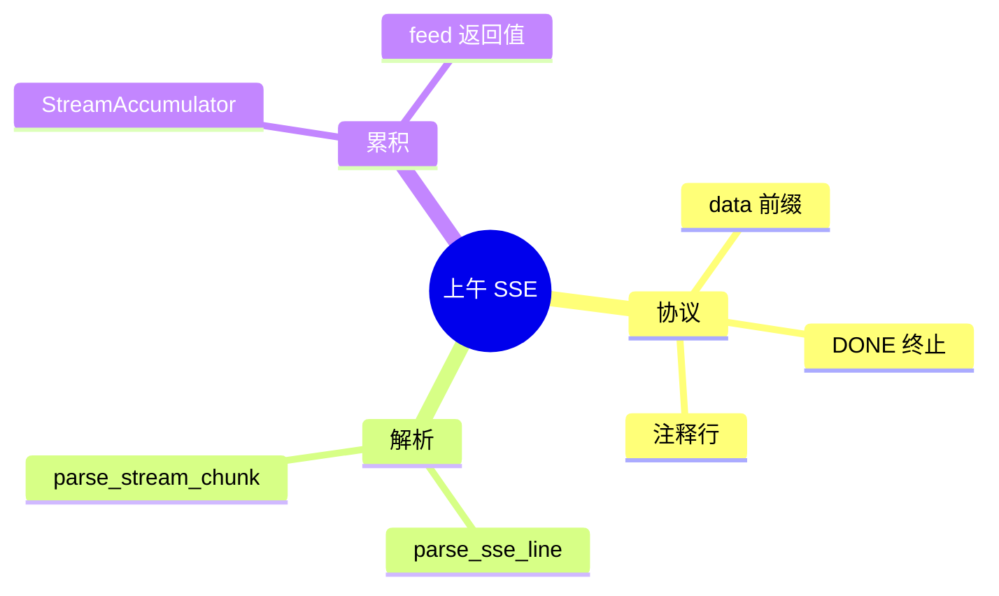

# Day 16 课堂笔记（上午）

**时段**：09:00–12:00  
**主题**：SSE 协议 + 解析层实现

---

## 09:00 开场：为什么需要流式？

赵岩播放竞品对比视频。关键数据：

- 阻塞模式：用户平均 **6.2s** 才看到任何输出
- 流式模式：**0.4s** 出现首字，完成时间相同

陈默强调：**流式优化的是感知，不是总算力。**

## 09:30 SSE 协议速览

**Server-Sent Events** 要点：

1. 媒体类型：`text/event-stream`
2. 每条事件一行或多行，我们以 OpenAI 格式为主：**每行一个 `data:`**
3. 注释行以 `:` 开头，解析器应忽略
4. 终止：`data: [DONE]`（非 JSON）

课堂练习：打开 `stream_mock.sse`，数一共有多少个 `data:` 行。

## 10:00 parse_sse_line 手写

```python
def parse_sse_line(line: str) -> dict[str, Any] | None:
    line = line.strip()
    if not line or line.startswith(":"):
        return None
    if not line.startswith("data:"):
        return None
    data = line[5:].strip()
    if data == "[DONE]":
        return {"done": True}
    return json.loads(data)
```

**讲师强调**：

- `[5:]` 是 `data:` 五个字符之后
- `[DONE]` 不是 JSON，不能 `json.loads`
- 空 `data:` 行在 OpenAI 实现中少见，但 strip 后空串要处理

## 10:30 parse_stream_chunk 复习（Day 5 衔接）

```python
choices = data.get("choices", [])
delta = choices[0].get("delta", {}) or {}
delta_content = delta.get("content") or ""
finish_reason = choices[0].get("finish_reason") or ""
```

首包可能只有 `delta.role`，`content` 为空字符串——**正常，不要当错误**。

## 11:00 StreamAccumulator

```python
class StreamAccumulator:
    def feed(self, chunk: StreamChunk) -> str:
        if chunk.delta_content:
            self._parts.append(chunk.delta_content)
        return chunk.delta_content
```

`feed` 返回值即本次 delta，方便 `on_delta` 链式调用。

## 11:30 iter_sse_events 演示

运行：

```bash
python3 src/day16/sse_parse_demos.py
```

观察输出：

```
delta: '你'
delta: '好'
...
→ [DONE]
拼接结果: 你好，我是 NexusAgent 助手。
```

## 11:50 上午小结

| 概念 | 要点 |
|------|------|
| SSE | `data:` 行 + `[DONE]` |
| delta | 增量 content，非完整消息 |
| 累积 | `"".join(parts)` 得全文 |
| 首包 | 可能有 role 无 content |

**思考题**：若某一 chunk 的 `delta.content` 是 `null`（JSON）而非缺失，我们的 `or ""` 如何处理？（答：Python 中 `None or ""` → `""`）

## 图示：上午知识块


