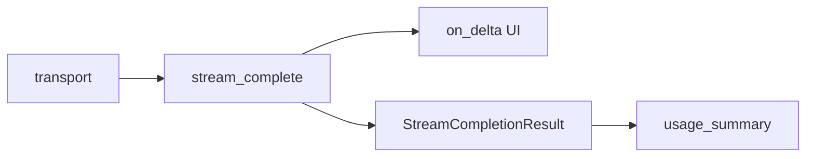

# Day 16 课堂笔记（下午）

**时段**：14:00–17:00  
**主题**：Transport + StreamingLLMClient + 演示

---

## 14:00 build_stream_request_body

```python
def build_stream_request_body(messages, config):
    body = build_request_body(messages, config)
    body["stream"] = True
    return body
```

就一行关键差异，但请求/响应形态完全不同。

## 14:20 default_stream_transport 逐行读

```python
with urllib.request.urlopen(req, timeout=120) as resp:
    for raw_line in resp:
        line = raw_line.decode("utf-8")
        parsed = parse_sse_line(line)
        ...
```

**与 Day 12 对比**：

| Day 12 | Day 16 |
|--------|--------|
| `body = resp.read()` | `for raw_line in resp` |
| 一次 JSON | 多行 SSE |
| 阻塞到全文就绪 | 首行即可处理 |

讲师演示：在 `on_delta` 里 `print(ch, end="", flush=True)` 的必要性——不 flush 终端可能缓冲。

## 14:50 Mock transport

```python
mock_stream_from_sse_file(path)  # CI 友好
mock_stream_from_text("异步流式")  # 单测逐字符
```

`NEXUS_LLM_MOCK=1` 时 `StreamingLLMClient` 自动选 SSE 文件。

## 15:30 stream_complete 主循环精读

核心逻辑：

1. `build_stream_request_body`
2. 初始化 `accumulator`、`usage`、`chunk_count`
3. `for raw_chunk in self._stream_transport(...)`
4. `parse_stream_chunk` → `accumulator.feed` → 可选 `on_delta`
5. 捕获 `usage`、`finish_reason`
6. 校验 content 非空，构造 `StreamCompletionResult`

## 15:50 streaming_demo 实操

```bash
export PYTHONPATH=src NEXUS_LLM_MOCK=1
python3 src/day16/streaming_demo.py
```

预期输出：

```
  助手: 你好，我是 NexusAgent 助手。

  tokens: prompt=32, completion=14, total=46, chunks=8
  finish_reason: stop
```

## 16:20 Day 15 usage 衔接

最后一 chunk：

```json
"usage": {"prompt_tokens": 32, "completion_tokens": 14, "total_tokens": 46}
```

流式下 **不能** 每来一个 delta 就估算 completion token——以 API 最后一包为准。

## 16:40 单测导读

`tests/day16/test_streaming.py` 覆盖：

- `parse_sse_line` 边界
- `mock_stream_from_text` 拼接
- `stream_complete` 端到端 Mock

## 17:00 下午小结



**明日预习**：Prompt 模板如何把 system 提示词塞进 `stream_chat`。

## 林晓笔记摘录

> urllib 的 `for raw_line in resp` 本质是边读 socket 边迭代，不必等 Content-Length 全部到齐。  
> `[DONE]` 后 transport `break`，不再 yield。  
> 若忘记 `flush=True`，打字机效果在 IDE 终端可能一坨输出。
