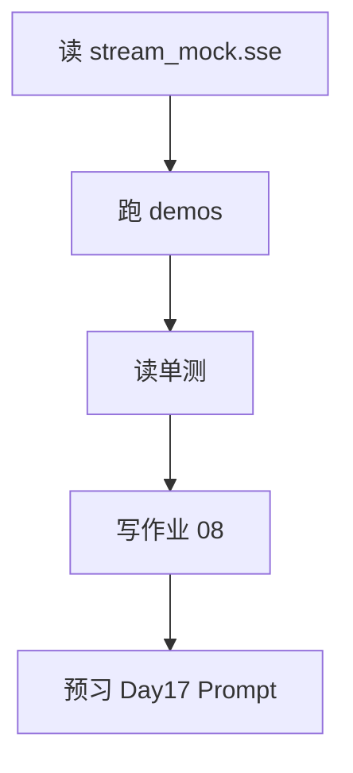

# Day 16 晚自习

**建议时长**：90 分钟  
**环境**：`PYTHONPATH=src`、`NEXUS_LLM_MOCK=1`

---

## 一、必做任务（60 min）

### 任务 1：精读 stream_mock.sse（15 min）

1. 打开 `nexus-agent-platform/src/llm/sample_data/stream_mock.sse`
2. 标注：首包、首个 content delta、含 usage 的包、`[DONE]`
3. 手算拼接结果，与 `sse_parse_demos.py` 对照

### 任务 2：运行三个演示（20 min）

```bash
cd nexus-agent-platform
export PYTHONPATH=src

python3 src/day16/sse_parse_demos.py
NEXUS_LLM_MOCK=1 python3 src/day16/streaming_demo.py
python3 src/day16/async_stream_demos.py
```

在笔记本回答：

- `chunk_count` 为何等于 8？（对照 SSE 文件非 [DONE] 的 data 行数）
- 异步 demo 为何用 `asyncio.to_thread`？

### 任务 3：单测跟读（25 min）

```bash
python3 -m pytest tests/day16/ -v
```

选 2 个测试用例，写出 Given-When-Then。

---

## 二、选做任务（30 min）

### 选做 A：自制 on_delta

写 10 行脚本，在 `on_delta` 里把每个 delta 包上 `[` `]` 打印，例如 `[你][好]`。

### 选做 B：Day 12 对照

阅读 `llm/client.py` 中 `complete` 的 `resp.read()`，写 3 条与 `default_stream_transport` 的差异（见 18 篇对照表草稿）。

### 选做 C：坏 SSE 实验

本地建 `bad.sse`：

```
data: {not json}
```

用 `iter_sse_events` 读取，观察异常类型是否为 `APIError`。

---

## 三、反思问题

1. 流式能否减少 API 费用？为什么？  
2. 若用户在 `[DONE]` 前按 Ctrl+C，当前实现有什么行为？  
3. Web 前端要用什么 API 消费 SSE？（提示：EventSource 仅 GET；Chat 流式常用 fetch ReadableStream）

---

## 四、明日预告

Day 17 **Prompt 模板**：

- Jinja2 风格或 f-string 变量插值
- system / user 分离
- 与 `stream_chat(system_prompt=...)` 组合

今晚可思考：理财顾问的 system 提示词应包含哪些约束？

---

## 五、晚自习检查清单

- [ ] 能默写 `parse_sse_line` 三种返回（None / dict / done）
- [ ] 能解释 `StreamAccumulator` 与 `on_delta` 分工
- [ ] 能说出 usage 出现在哪个 chunk
- [ ] `pytest tests/day16/` 全绿


