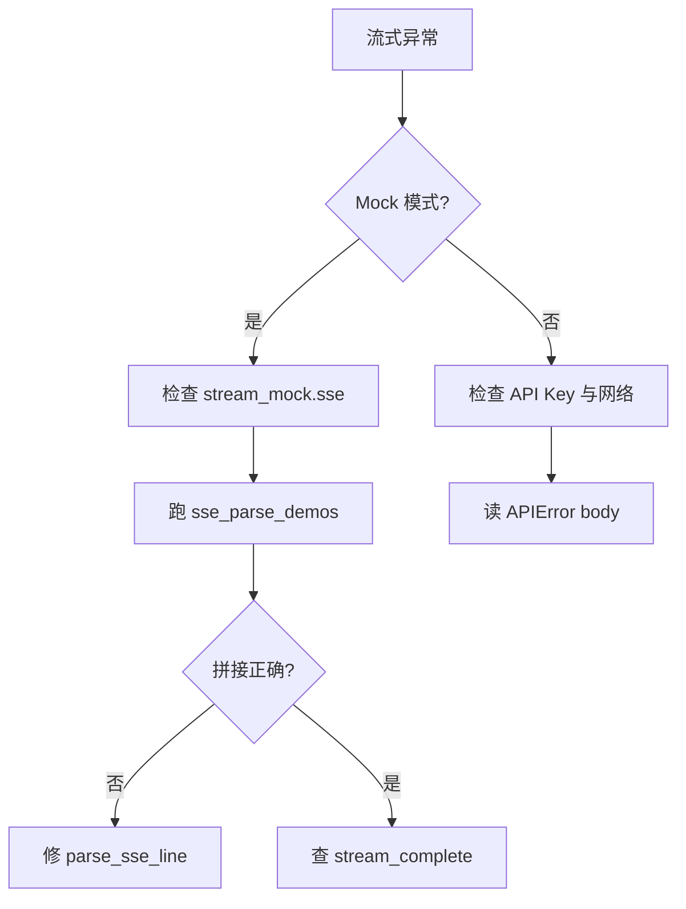

# Day 16 常见问题与排错指南

---

## Q1：运行 streaming_demo 没有任何输出？

**现象**：程序卡住或瞬间结束无文字。

**排查**：

```bash
echo $NEXUS_LLM_MOCK    # 应为 1
echo $PYTHONPATH        # 应含 nexus-agent-platform/src
ls src/llm/sample_data/stream_mock.sse
```

**解决**：`export NEXUS_LLM_MOCK=1 PYTHONPATH=src`

---

## Q2：SSE JSON 解析失败

**现象**：`APIError: SSE JSON 解析失败`

**原因**：

- 把 `data: [DONE]` 送去 `json.loads`
- 行首有 BOM 或奇怪前缀
- 代理把多条 `data` 粘在一行

**解决**：确认 `parse_sse_line` 先判断 `[DONE]`；用 `sse_parse_demos.py` 对本地文件调试。

---

## Q3：打字机变成一次性输出

**原因**：`print(ch, end="")` 未 `flush=True`；或 IDE 终端缓冲。

**解决**：

```python
print(ch, end="", flush=True)
```

---

## Q4：流式响应未产生任何 content

**现象**：`APIError: 流式响应未产生任何 content`

**原因**：

- Mock 文件只有 role 包无 content delta
- 模型返回全空 delta（异常场景）
- transport 未 yield 任何 chunk

**解决**：检查 SSE 样本；用 `mock_stream_from_text("测试")` 验证客户端逻辑。

---

## Q5：usage 全是 0

**原因**：Mock 末包无 `usage` 字段；或真实 API 需 `stream_options` 才回 usage（视厂商而定）。

**解决**：对照 `stream_mock.sse` 最后一包；查阅模型文档是否需额外参数。

---

## Q6：HTTP 401 / 403

**排查**：

```bash
echo $DEEPSEEK_API_KEY  # 或项目 EnvConfig 变量名
```

Mock 模式不应走外网；若未设 `NEXUS_LLM_MOCK=1` 会打真实 API。

---

## Q7：超时 120s

**现象**：`urllib` timeout。

**原因**：网络慢或生成长文本。

**解决**：教学环境用 Mock；生产考虑调大 timeout 或异步取消。

---

## Q8：中文乱码

**原因**：`decode("utf-8")` 缺失或错误编码。

**解决**：`default_stream_transport` 已用 UTF-8；检查终端 locale。

---

## Q9：chunk_count 与肉眼行数不一致

**说明**：`chunk_count` 统计 transport **yield 的 JSON 包**，不含 `[DONE]`；空行、注释不计。

---

## Q10：单测失败 mock 路径

**解决**：使用 `get_path("stream_mock_sse")` 或测试内 `tmp_path` 自建 `.sse`。

---

## 排错流程图



---

## 日志建议

调试时临时打印：

```python
# 勿提交
print("RAW", line[:120])
```

生产禁用完整 SSE 日志。

---

## 联系助教

提供：命令、环境变量（打码 Key）、完整 traceback、`pytest` 输出。
