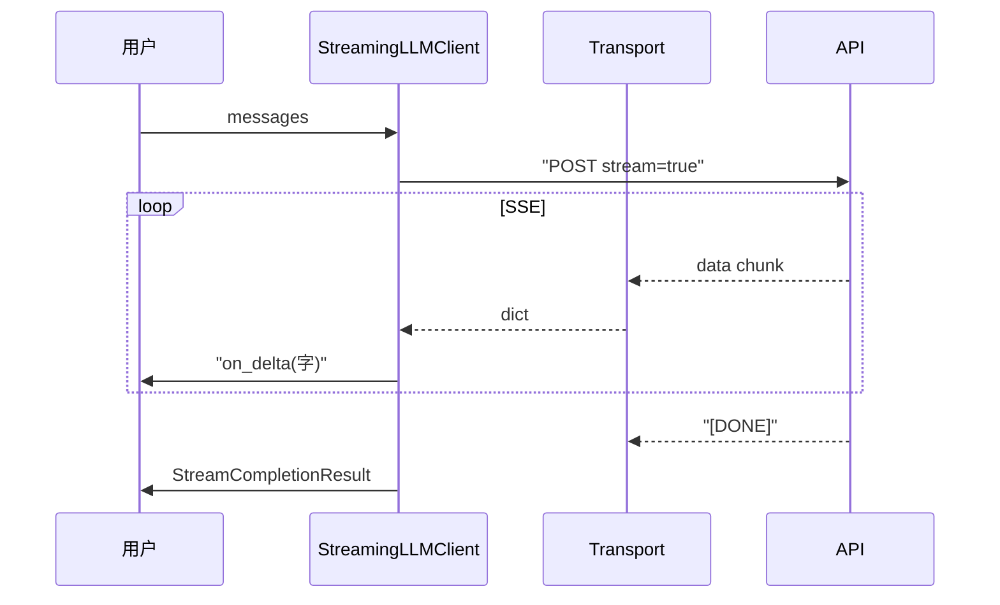

# Day 16 流式输出详解

**专题**：从 `stream=True` 到打字机效果 — NexusAgent 流式全链路

---

## 1. 为什么需要流式输出？

大模型生成是**顺序解码**过程：token 一个个采样。阻塞 API 等全部完成才返回 JSON；用户全程面对空白或转圈。

流式输出的价值：

1. **降低感知延迟**：首 token 到达即可显示  
2. **可中断**：用户可提前停止阅读或取消（扩展）  
3. **渐进渲染**：Web/CLI 体验接近 ChatGPT

**不改变的**：总 token 数、计费、模型推理总时间（近似）。

---

## 2. 请求侧：stream=True

```python
def build_stream_request_body(messages, config):
    body = build_request_body(messages, config)
    body["stream"] = True
    return body
```

与阻塞请求共享 `model`、`messages`、`temperature` 等，仅多一个布尔字段。

---

## 3. 响应侧：chat.completion.chunk

阻塞响应 `object: chat.completion`；流式每包 `object: chat.completion.chunk`。

典型结构：

```json
{
  "object": "chat.completion.chunk",
  "model": "deepseek-chat",
  "choices": [{
    "index": 0,
    "delta": {"content": "你"},
    "finish_reason": null
  }]
}
```

末包：

```json
{
  "choices": [{
    "delta": {},
    "finish_reason": "stop"
  }],
  "usage": {
    "prompt_tokens": 32,
    "completion_tokens": 14,
    "total_tokens": 46
  }
}
```

---

## 4. SSE 传输格式

每条事件一行（OpenAI 风格）：

```
data: {"object":"chat.completion.chunk",...}

```

协议终止：

```
data: [DONE]
```

空行分隔事件（可选，解析时 strip 即可）。

---

## 5. parse_sse_line 详解

| 输入 | 输出 |
|------|------|
| `""` | `None` |
| `: ping` | `None`（注释） |
| `data: [DONE]` | `{"done": True}` |
| `data: {"id":"..."}` | dict |

**坑**：`data:` 后必须 strip 再判断 `[DONE]`。

---

## 6. parse_stream_chunk 与 Day 5

Day 5 在阻塞专题中介绍过 delta 结构；Day 16 在循环中反复调用：

```python
parsed = parse_stream_chunk(raw_chunk)
delta = accumulator.feed(parsed)
if delta and on_delta:
    on_delta(delta)
```

`delta` 为**本次**新增字符串，可能是单字或多字（取决于模型分词）。

---

## 7. StreamAccumulator

```python
@property
def content(self) -> str:
    return "".join(self._parts)
```

流结束后用于：

```python
message = ChatMessage("assistant", content)
```

与 `on_delta` 并行：一个给存储，一个给展示。

---

## 8. default_stream_transport

```python
with urllib.request.urlopen(req, timeout=120) as resp:
    for raw_line in resp:
        line = raw_line.decode("utf-8")
        parsed = parse_sse_line(line)
        if parsed is None:
            continue
        if parsed.get("done"):
            break
        yield parsed
```

**关键**：`for raw_line in resp` 是**边读边迭代**，不同于 `read()`。

---

## 9. StreamingLLMClient.stream_complete

编排顺序：

1. 构建 body  
2. 调用 transport 得 raw_chunk 迭代器  
3. 解析 + 累积 + 回调  
4. 更新 usage（Day 15）  
5. 校验并返回 `StreamCompletionResult`

`on_delta` 类型：`Callable[[str], None]`，可选。

---

## 10. Mock 策略

| 函数 | 场景 |
|------|------|
| `mock_stream_from_sse_file` | 还原真实 SSE 文件 |
| `mock_stream_from_text` | 单测逐字符可控 |

---

## 11. 流式与 Token（Day 15）

- 中间 chunk **通常无** usage  
- 最后一包带 `usage` → `TokenUsage.from_usage_dict`  
- `usage_summary()` 含 `chunks` 便于调试

---

## 12. 全链路图



---

## 13. Day 17 预览

流式解决**输出**；Prompt 模板解决**输入**：

```python
client.stream_chat(
    user_content="推荐一款理财",
    system_prompt=template.render(advisor_name="林晓"),
    on_delta=print_delta,
)
```

---

## 14. 今日一句话

> **delta 是增量，accumulator 是全文，on_delta 是体验，最后一包 usage 是账单。**
