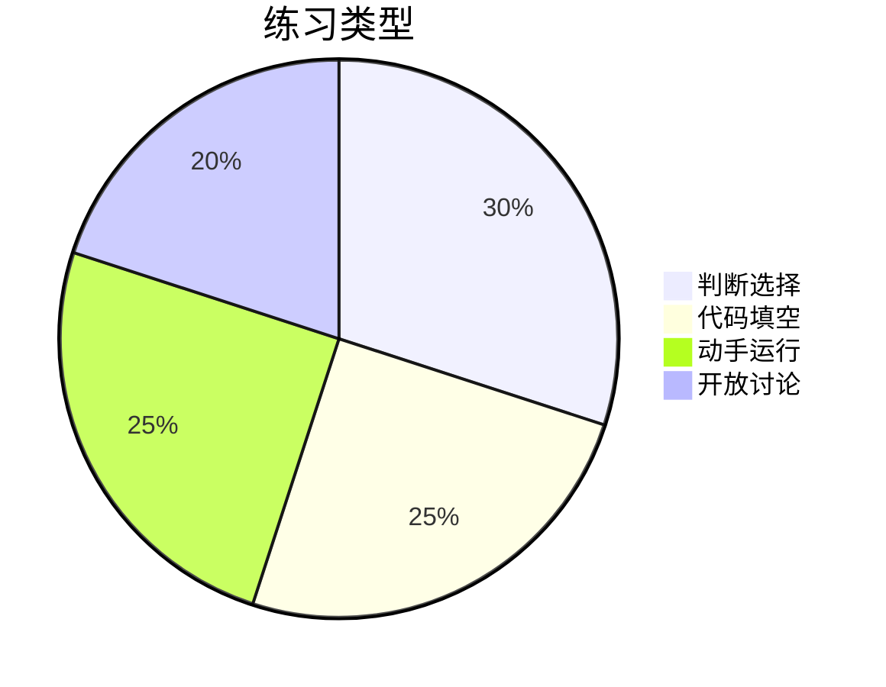

# Day 16 课堂练习册

**用途**：课堂随堂练，不计分  
**时长**：各 10–15 分钟

---

## 练习 1：火眼金睛认 SSE

给定片段：

```
data: {"choices":[{"delta":{"content":"A"}}]}

data: [DONE]
```

**问题**：

1. 有几条有效事件？  
2. `parse_sse_line` 对第二行返回什么？  
3. 拼接结果是什么？

<details>
<summary>答案</summary>
1. 两条 data 行  
2. `{"done": True}`  
3. `A`
</details>

---

## 练习 2：填空

```python
def build_stream_request_body(messages, config):
    body = build_request_body(messages, config)
    body["______"] = True
    return body
```

---

## 练习 3：判断题

1. 流式可以减少 prompt_tokens。（ ）  
2. 首包 delta 可能没有 content。（ ）  
3. `[DONE]` 应该用 `json.loads` 解析。（ ）  
4. `on_delta` 在 Mock 模式下不会被调用。（ ）  
5. usage 可能在最后一个 chunk。（ ）

<details>
<summary>答案</summary>
× √ × × √
</details>

---

## 练习 4：手绘序列图

在纸上画出：`App → stream_complete → transport → parse → on_delta` 的调用顺序。  
对照课件 04 自检。

---

## 练习 5：改错

```python
def bad_parse(line):
    data = line[6:]  # 错误 1
    return json.loads(data)  # 错误 2
```

列出至少 2 个问题并改正。

<details>
<summary>提示</summary>
应用 `data:` 长度 5；先判断 [DONE] 和空行。
</details>

---

## 练习 6：结对编程

学员 A 写 `on_delta` 打印大写；学员 B 运行 `streaming_demo` 改回调。  
观察中文是否受影响。

---

## 练习 7：chunk 计数

对 `stream_mock.sse`：

- 数 `data:` 行（含 [DONE]）  
- 数 transport yield 次数（不含 done）  
- 解释差 1 的原因

---

## 练习 8：快速 API 设计

若产品要「暂停流式」，你会在哪一层加 `cancel_flag`？  
（开放题，讨论 transport 循环）

---

## 练习 9：代码阅读

```python
if parsed.get("done"):
    break
yield parsed
```

若把 `break` 写在 `yield parsed` 之后，[DONE] 会怎样？（讨论）

---

## 练习 10：预习连线

将左右连线：

| 左 | 右 |
|----|-----|
| Day 15 | Prompt 模板 |
| Day 16 | TokenUsage 末包 |
| Day 17 | SSE on_delta |

<details>
<summary>答案</summary>
Day15-TokenUsage末包；Day16-SSE on_delta；Day17-Prompt模板
</details>

---

## 练习册结构图


