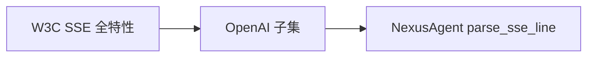
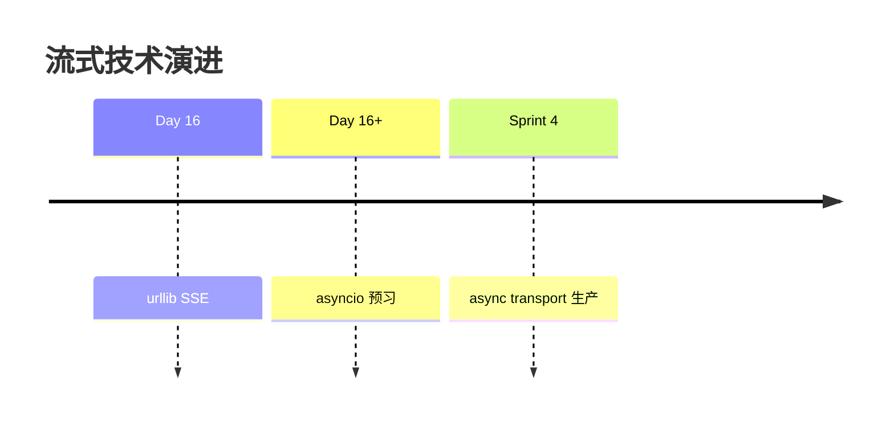

# Day 16 深度扩展：SSE 与异步

**读者**：学有余力学员、架构进阶  
**关联代码**：`async_stream_demos.py`

---

## 1. SSE 标准 vs OpenAI 方言

W3C SSE 规范支持：

- `event:` 自定义事件名
- `id:` 断线重连
- `retry:` 重连间隔
- 多行 `data:` 拼接

OpenAI Chat Completions 简化为：**每行独立 JSON + [DONE]**。NexusAgent MVP 对齐 OpenAI，不解析 `event:` 字段。



---

## 2. 为何 Day 16 仍用 urllib？

| 方案 | 优点 | 缺点 |
|------|------|------|
| urllib 逐行 | 零依赖、与 Day 12 一致 | 同步阻塞线程 |
| httpx stream | 异步、API 友好 | 新依赖 |
| aiohttp | 性能好 | 复杂度高 |

教学路径：**先同步搞清协议**，再异步包装。

---

## 3. asyncio 预习：async_stream_demos

```python
async def consume_stream_async(text: str) -> str:
    transport = mock_stream_from_text(text)
    ...
    for raw in await asyncio.to_thread(lambda: list(_iter_chunks())):
        chunk = parse_stream_chunk(raw)
        ...
        await asyncio.sleep(0.01)
```

**设计说明**：

- `to_thread` 把同步 transport 丢进线程池，避免阻塞事件循环  
- `asyncio.sleep(0.01)` 模拟 UI 让出控制权  
- 生产级应使用 **原生 async iterator transport**

---

## 4. 目标异步接口（未实现，设计草图）

```python
AsyncStreamTransport = Callable[..., AsyncIterator[dict]]

async def default_async_stream_transport(...) -> AsyncIterator[dict]:
    async with httpx.AsyncClient() as client:
        async with client.stream("POST", url, json=payload) as resp:
            async for line in resp.aiter_lines():
                ...
```

---

## 5. 背压（Backpressure）

若 `on_delta` 触发慢速 WebSocket 广播，而 SSE 读取过快：

- 内存中 urllib 缓冲区堆积  
- 极端情况 OOM 或连接重置

**企业实践**：生产者-消费者队列，`on_delta` 仅 `queue.put_nowait`。

---

## 6. 取消与超时

同步 urllib 难以优雅取消。异步方案：

```python
async with asyncio.timeout(60):
    async for chunk in transport:
        ...
```

Python 3.11+ `asyncio.timeout`；教学 demo 可先用 `wait_for`。

---

## 7. HTTP/2 与 SSE

部分 CDN 对 SSE 缓冲。Header 建议（Web 代理层）：

```
Cache-Control: no-cache
X-Accel-Buffering: no
```

urllib 直连 API 通常无此问题。

---

## 8. 多路复用场景

一个用户同时开 3 个流式会话：

- 同步：3 线程各阻塞 urllib  
- 异步：单事件循环 multiplex

Sprint 后期 Agent 编排会触及此场景。

---

## 9. 与 Day 17 Prompt 的异步无关性

Prompt 渲染是 **CPU 微秒级**；瓶颈在 LLM 流。先模板化输入，再异步化传输，路径清晰。

---

## 10. 扩展实验

```bash
python3 src/day16/async_stream_demos.py
```

修改 `consume_stream_async`：每收到 delta `print` 且不 `to_thread` 全量 list，体会差异（讲师演示用）。

---

## 11. 小结表

| 主题 | MVP Day 16 | 企业扩展 |
|------|------------|----------|
| 传输 | urllib 同步 | httpx async |
| 回调 | 同步 on_delta | async on_delta |
| 取消 | 无 | Task.cancel |
| 重连 | 无 | SSE id |


