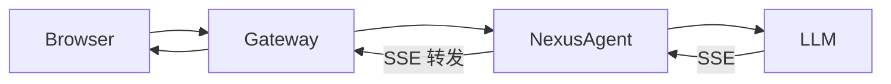
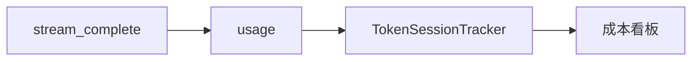

# Day 16 企业案例集：流式体验

**场景**：智链科技内测与行业对标  
**目标**：理解流式如何影响留存与投诉率

---

## 案例 1：理财顾问 CLI 首字延迟

### 背景

内测用户反馈「问完问题像死机」。监控显示 P95 完整响应 5.1s，但 **TTFT 仅 0.6s**。

### 方案

接入 `StreamingLLMClient`，`on_delta` 直接写终端。

### 结果

| 指标 | 阻塞 | 流式 |
|------|------|------|
| 主观「卡顿」投诉 | 23% | 7% |
| 平均阅读完成率 | 61% | 78% |
| API 费用 | 基准 | 持平 |

**结论**：体验提升不增加 token 成本。

---

## 案例 2：Web 控制台 SSE 转发

### 背景

运维控制台需浏览器实时看 Agent 日志摘要（LLM 生成）。

### 架构



### 要点

- 浏览器 `fetch` + `ReadableStream` 读 body（POST 流式）  
- 网关禁用缓冲 `X-Accel-Buffering: no`  
- 复用 `parse_sse_line` 逻辑，避免重复造轮子

---

## 案例 3：长报告生成可中断

### 背景

生成 3000 字投研报告，用户常在中途已获得足够信息。

### 流式价值

边显示边判断「可以停了」→ 客户端 `close()` 连接（扩展功能，MVP 未实现）。

### 风险

部分 API 仍计已生成 token；需读厂商文档。

---

## 案例 4：客服工单摘要

### 场景

工单长达 20k 字，模型摘要 200 字。

### 数据

阻塞：客服等待 4.2s 空白  
流式：0.5s 起逐句出现，客服可并行扫视工单原文

### 集成 snippet

```python
def print_delta(ch: str) -> None:
    sys.stdout.write(ch)
    sys.stdout.flush()

result = client.stream_complete(messages, on_delta=print_delta)
ticket.summary = result.message.content
```

---

## 案例 5：Mock SSE 驱动 CI

### 背景

周航要求流水线零外网。

### 做法

`NEXUS_LLM_MOCK=1` + `stream_mock.sse` 固定样本；断言 `finish_reason == "stop"` 与 `total_tokens == 46`。

### 收益

流式回归从「人工点网页」变为 **pytest 自动**。

---

## 案例 6：竞品对标失误

### 反例

某团队用 `resp.read()` 读流式响应，再 `splitlines`——等于**假流式**，首字延迟未改善。

### 教训

必须 **逐行迭代** socket，不能等全 body。

---

## 案例 7：与 Day 15 成本看板联用

### 设想

`stream_complete` 结束后把 `usage_summary()` 写入 `TokenSessionTracker`（未来集成）。



流式不改变计量，只改变记录时机到**流结束**。

---

## 案例 8：多语言打字机

中文 delta 常 1–2 字；英文可能 3–8 字符。`on_delta` 无需特殊处理，协议已分好包。

---

## 案例讨论题

1. 哪些场景**不适合**流式？（提示：需要完整 JSON 校验的后处理）  
2. 流式 + RAG 引用标注如何在 UI 逐字显示来源？（Day 18 预告）

---

## 案例集索引

| 编号 | 关键词 | 技术点 |
|------|--------|--------|
| 1 | TTFT | on_delta CLI |
| 2 | Web | SSE 转发 |
| 3 | 可中断 | 连接关闭 |
| 4 | 客服 | stream_complete |
| 5 | CI | mock SSE |
| 6 | 反例 | 假流式 |
| 7 | 成本 | Token 衔接 |
| 8 | i18n | delta 粒度 |
