# Day 16 授课实录（节选）

**讲师**：陈默  
**日期**：2026-07-21  
**教室**：智链科技 3F 实训室

---

## 开场（09:05）

「昨天我们数 token，今天让 token **动起来**。谁还记得 Day 5 的 `delta`？」

林晓：「choices 里增量 content，不是完整 message。」

「对。阻塞模式一次性给你完整 `message.content`；流式是一路 `delta` 拼出来。本质一样，**吃法不同**。」

---

## SSE 白板（09:40）

陈默画线：

```
data: {"..."}\n
data: [DONE]\n
```

「注意三件事：前缀 `data:`、中间 JSON、`[DONE]` 不是 JSON。我见过不少人在这里 `json.loads` 炸掉。」

---

## _live coding parse_sse_line（10:15）

现场 typo：`line[6:]` 写成 `line[5:]` 的讨论——`data:` 五个字符，第六个才是空格或 `{`。

学员问：「为啥不用正则？」

「可以，但教学要**看得懂**。生产再加严谨也不迟。」

---

## 午休前答疑（11:55）

**问**：首包 `content: ""` 算不算错误？  
**答**：不算。role 包常空 content。

**问**：流式是不是更贵？  
**答**：同模型同回复，token 一样。贵是因为你聊多了，不是流式开关。

---

## 下午 transport 演示（14:30）

打开 `client.py` 对比：

```python
# Day 12
body = resp.read()

# Day 16
for raw_line in resp:
```

「这一行 `for` 就是今日核心之一。」

---

## streaming_demo 现场（15:10）

终端打字机响起，教室有轻微笑声。

赵岩：「产品就要这个效果。」

陈默：「`flush=True`，说三遍。」

---

## 单测绿了对勾（16:50）

```bash
pytest tests/day16/ -v
# 12 passed
```

「Mock transport 注入会了吗？不会今晚看 20 篇走查。」

---

## 收尾预告 Day 17（16:55）

「今天管**怎么流**；明天管**说什么**——Prompt 模板。`stream_chat` 的 `system_prompt` 别写死在代码里。」

---

## 实录金句

1. 「假流式比不流式更气人——用户以为坏了，其实你在偷偷 `read()`。」  
2. 「`on_delta` 要轻，别在里面发邮件。」  
3. 「账单在最后一包，别数 delta 个数当 completion token。」

---

## 课堂节奏回顾

```mermaid
gantt
    title Day16 授课节奏
    dateFormat HH:mm
    section 上午
    协议讲解     :09:00, 90m
    解析编码     :10:30, 90m
    section 下午
    transport    :14:00, 90m
    客户端集成   :15:30, 90m
```



---

## 讲师自省

- 异步部分易超纲，已压到 13 篇扩展  
- 建议明日课前 5 分钟复习 `build_request_body`
