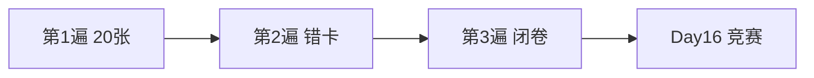

# Day 16 复习卡片

> 打印裁剪，正面问题背面答案

---

## 卡片 1

**Q**：流式请求体与阻塞相比多什么字段？  
**A**：`"stream": true`（`build_stream_request_body`）

---

## 卡片 2

**Q**：SSE 终止行格式？  
**A**：`data: [DONE]`

---

## 卡片 3

**Q**：`parse_sse_line` 对注释行返回？  
**A**：`None`（以 `:` 开头）

---

## 卡片 4

**Q**：delta 在哪里取？  
**A**：`choices[0].delta.content`

---

## 卡片 5

**Q**：`StreamAccumulator` 做什么？  
**A**：拼接 delta 为完整 assistant 文本

---

## 卡片 6

**Q**：`on_delta` 参数类型？  
**A**：`Callable[[str], None]`，每收到 content delta 调用

---

## 卡片 7

**Q**：Day 16 默认如何读 HTTP 响应？  
**A**：`for raw_line in resp` 逐行，非 `read()`

---

## 卡片 8

**Q**：usage 通常在哪出现？  
**A**：最后一个含 `finish_reason` 的 chunk（Day 15 衔接）

---

## 卡片 9

**Q**：Mock 模式默认读哪个文件？  
**A**：`llm/sample_data/stream_mock.sse`

---

## 卡片 10

**Q**：零 content 流结束抛什么？  
**A**：`APIError("流式响应未产生任何 content")`

---

## 卡片 11

**Q**：`finish_reason: stop` 含义？  
**A**：自然结束生成

---

## 卡片 12

**Q**：`chunk_count` 计什么？  
**A**：transport yield 的 JSON chunk 数（不含 [DONE]）

---

## 卡片 13

**Q**：首包常有什么无 content？  
**A**：`delta.role`（如 assistant）

---

## 卡片 14

**Q**：`mock_stream_from_text` 用途？  
**A**：单测可控逐字符 chunk

---

## 卡片 15

**Q**：打字机为何 flush？  
**A**：避免 stdout 缓冲导致一次性输出

---

## 卡片 16

**Q**：流式能否降低总 token？  
**A**：不能，只改善感知延迟

---

## 卡片 17

**Q**：`StreamTransportFunc` 作用？  
**A**：可注入传输层，解耦网络与解析

---

## 卡片 18

**Q**：`iter_sse_events` 输入？  
**A**：`Iterator[str]` 文本行

---

## 卡片 19

**Q**：Day 17 与流式关系？  
**A**：Prompt 模板管输入；流式管输出呈现

---

## 卡片 20

**Q**：今日模块路径与需求号？  
**A**：`llm/streaming.py`，ZL-NA-REQ-016

---

## 复习计划

建议：与 21 篇知识竞赛配合使用。
