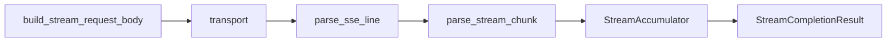

# Day 16 streaming 速查手册

**模块**：`llm/streaming.py`  
**版本**：0.1.0

---

## 快速运行

```bash
export PYTHONPATH=src NEXUS_LLM_MOCK=1
python3 src/day16/streaming_demo.py
python3 -m pytest tests/day16/ -v
```

---

## API 一览

| 符号 | 签名摘要 | 说明 |
|------|----------|------|
| `build_stream_request_body` | `(messages, config) -> dict` | 追加 stream=True |
| `parse_sse_line` | `(line) -> dict \| None` | 解析单行 SSE |
| `iter_sse_events` | `(lines) -> Iterator[dict]` | 行→事件 |
| `parse_stream_chunk` | `(data) -> StreamChunk` | chunk JSON→结构体 |
| `StreamAccumulator` | `feed / content / reset` | 累积 delta |
| `default_stream_transport` | `(url, headers, payload)` | urllib 逐行 |
| `mock_stream_from_sse_file` | `(path) -> Transport` | 文件 Mock |
| `mock_stream_from_text` | `(text) -> Transport` | 文本 Mock |
| `StreamingLLMClient` | 继承 `LLMClient` | 流式客户端 |
| `stream_complete` | `(messages, on_delta?)` | 主入口 |
| `stream_chat` | `(user, system_prompt?, on_delta?)` | 单轮便捷 |
| `collect_stream_text` | 返回 `str` | 工具函数 |

---

## 数据类

### StreamChunk

```python
delta_content: str = ""
finish_reason: str = ""
model: str = "unknown"
raw: dict
```

### StreamCompletionResult

```python
message: ChatMessage
model: str
finish_reason: str = ""
chunk_count: int = 0
prompt_tokens / completion_tokens / total_tokens: int
usage_summary() -> str
```

---

## 最小示例

```python
from llm.streaming import StreamingLLMClient
from models import ChatMessage, ModelConfig

client = StreamingLLMClient(ModelConfig())
result = client.stream_complete(
    [ChatMessage("user", "你好")],
    on_delta=lambda ch: print(ch, end="", flush=True),
)
print(result.usage_summary())
```

---

## 注入 Mock Transport

```python
from llm.streaming import StreamingLLMClient, mock_stream_from_text

client = StreamingLLMClient(
    ModelConfig(),
    stream_transport=mock_stream_from_text("测试"),
)
```

---

## SSE 行速查

| 行 | 处理 |
|----|------|
| 空 | 跳过 |
| `: ping` | 跳过 |
| `data: {...}` | JSON |
| `data: [DONE]` | 结束 |

---

## 错误码

| 异常 | 常见原因 |
|------|----------|
| `APIError` SSE JSON | 坏行、误解析 [DONE] |
| `APIError` 流式 HTTP | 401/500 |
| `APIError` 无 content | 空流 |

---

## 环境变量

| 变量 | 作用 |
|------|------|
| `NEXUS_LLM_MOCK=1` | 使用 stream_mock.sse |
| `PYTHONPATH=src` | 导入路径 |

---

## 与邻日对照

| Day | 关联 |
|-----|------|
| 5 | parse_stream_chunk |
| 12 | urllib / build_request_body |
| 15 | TokenUsage |
| 17 | system_prompt 模板 |

---

## 调用链口诀

```
body → transport → parse_sse → parse_chunk → feed → on_delta → result
```


