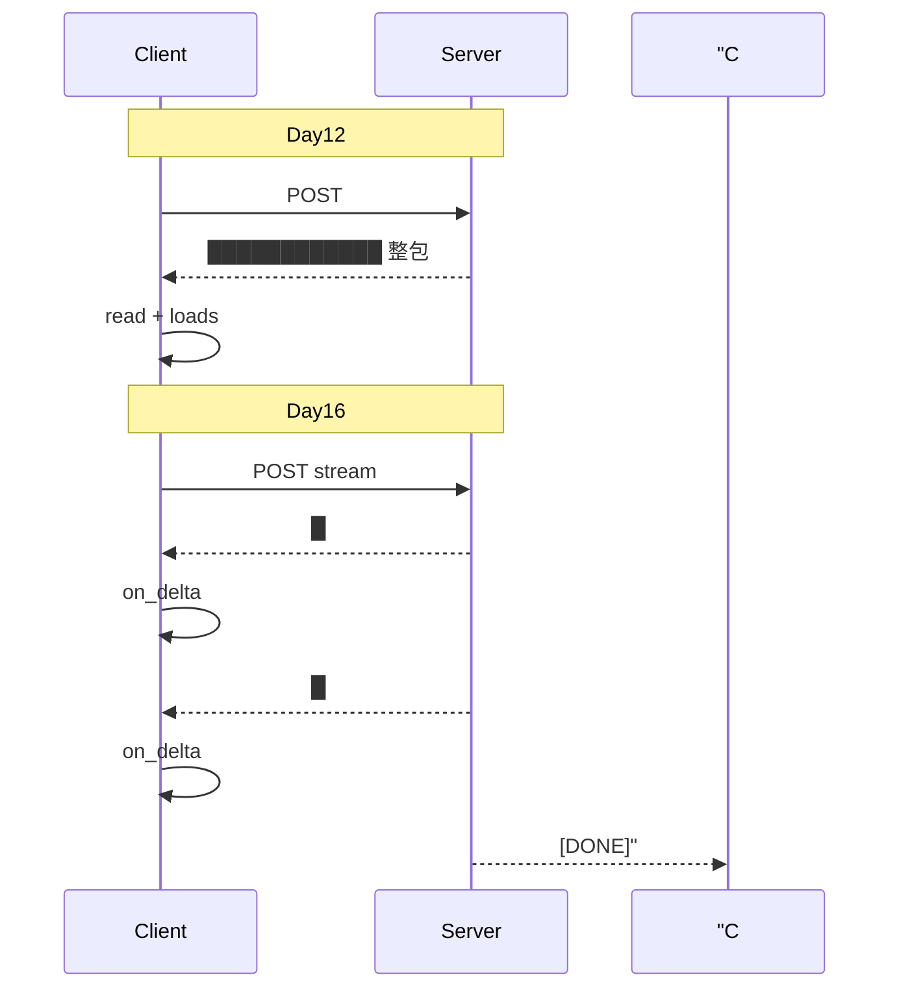
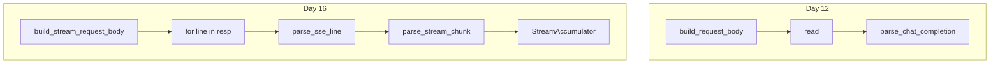

# Day 16 与 Day 12 阻塞调用对照表

**目的**：厘清 `complete` 与 `stream_complete` 两条路径  
**代码**：`llm/client.py` vs `llm/streaming.py`

---

## 总览对照

| 维度 | Day 12 `LLMClient.complete` | Day 16 `StreamingLLMClient.stream_complete` |
|------|----------------------------|---------------------------------------------|
| 需求 | ZL-NA-REQ-012 阻塞调用 | ZL-NA-REQ-016 流式输出 |
| 请求体 | `build_request_body` | `build_stream_request_body`（+`stream: true`） |
| HTTP 方法 | POST | POST |
| 响应 Content-Type | `application/json` | `text/event-stream`（通常） |
| 读取 API | `resp.read()` | `for raw_line in resp` |
| 解析单元 | 整个 JSON 一次 | 每行 SSE → chunk dict |
| 解析函数 | `parse_chat_completion` | `parse_sse_line` + `parse_stream_chunk` |
| 输出结构 | `ChatCompletionResult` | `StreamCompletionResult` |
| 中间回调 | 无 | `on_delta(delta: str)` |
| 文本拼接 | API 直接给全文 | `StreamAccumulator` 本地拼 |
| usage 位置 | 响应根 `usage` | 流末 chunk `usage` |
| Mock | `mock_complete_*` | `mock_stream_from_sse_file` |
| 典型场景 | 脚本批处理 | CLI/Web 打字机 |

---

## 请求体差异

### Day 12

```python
body = build_request_body(messages, config)
# stream 缺省 false 或不存在
```

### Day 16

```python
body = build_request_body(messages, config)
body["stream"] = True
```

其余 `model`、`messages`、`temperature` 一致。

---

## HTTP 读取差异（核心）

### Day 12 阻塞

```python
with urllib.request.urlopen(req, timeout=60) as resp:
    raw = resp.read()           # 阻塞直到全文到达
    data = json.loads(raw)      # 一次解析
```

**特点**：内存峰值 = 完整响应体；用户等待 = 全程。

### Day 16 流式

```python
with urllib.request.urlopen(req, timeout=120) as resp:
    for raw_line in resp:       # 边收边迭代
        line = raw_line.decode("utf-8")
        parsed = parse_sse_line(line)
        ...
```

**特点**：首行到达即可处理；内存友好（单行级）。



---

## 解析链路对照

| 阶段 | Day 12 | Day 16 |
|------|--------|--------|
| 1 | bytes → str 全文 | bytes → str 单行 |
| 2 | `json.loads` | `parse_sse_line` |
| 3 | `choices[0].message` | `choices[0].delta` |
| 4 | 直接 `content` 字段 | 多次 `delta.content` 累加 |
| 5 | 根级 `usage` | chunk 内 `usage`（末包） |

Day 5 同时讲过 `message`（阻塞）与 `delta`（流式），今日闭环。

---

## 返回类型对照

### ChatCompletionResult（Day 5/12）

- `message: ChatMessage`
- `model`, `finish_reason`
- `prompt_tokens`, `completion_tokens`, `total_tokens`

### StreamCompletionResult（Day 16）

- 同上语义字段
- **额外** `chunk_count` 用于流式诊断

---

## 错误处理对照

| 场景 | Day 12 | Day 16 |
|------|--------|--------|
| HTTP 错误 | `HTTPError` → `APIError` | 同左 |
| JSON 错误 | `parse` 阶段 | 每行 SSE 都可能 |
| 业务空内容 | choices 空 | accumulator 空 |

---

## 何时选哪条路径？

| 选阻塞 complete | 选流式 stream_complete |
|-----------------|------------------------|
| 批处理离线任务 | 交互式 CLI/Chat |
| 下游要完整 JSON 一次校验 | 长文生成 UX |
| 极简脚本 | 需要 TTFT 指标 |
| 单测简单 mock | 需要逐 chunk 断言 |

**NexusAgent 策略**：两条 API 并存，由调用方选择。

---

## 常见误区

| 误区 | 正解 |
|------|------|
| `read()` 后再 `splitlines` 当流式 | 假流式，TTFT 无改善 |
| 每个 delta 更新 usage | 等末包 usage |
| 流式更省 token | 只省时间感，不省 token |
| 必须 asyncio 才能流式 | urllib 同步即可逐行 |

---

## 对照实验步骤

```bash
# 1. Mock 阻塞（Day 12 demo 若有）
# 2. Mock 流式
NEXUS_LLM_MOCK=1 python3 src/day16/streaming_demo.py
# 3. 记录首字出现时间与总时间
```

---

## 与 Day 15 三角关系

```
Day12 complete ──usage──► Day15 TokenUsage
Day16 stream   ──末包usage──► Day15 TokenUsage
```

计量权威均为 API `usage`，非本地 delta 计数。

---

## 一页记忆图


