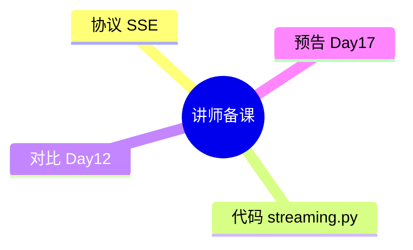

# Day 16 讲师补充阅读

**受众**：讲师备课、助教深度答疑

---

## 1. OpenAI 流式文档要点摘录

- 请求 `stream: true`  
- 响应为 SSE，`data` 字段为 JSON 字符串  
- 最后一包可能含 `usage`（视 `stream_options` 配置）  
- 终止于 `data: [DONE]`

官方文档常更新，备课时核对厂商 changelog。

---

## 2. urllib 逐行读取原理

`http.client.HTTPResponse` 实现迭代协议时按 `\n` 切分缓冲区。对于 chunked transfer，库在收到 chunk 后即可 yield 行——**不必等完整 Content-Length**。

这与 Day 12 `read()` 形成鲜明对比，是今日技术内核。

---

## 3. 为何不用 requests `stream=True`？

项目约束：**标准库优先**（NFR-001）。`requests` 的 `iter_lines()` 语义类似，但引入第三方依赖与 Day 1–14 风格不一致。扩展阅读可向学员展示 requests 等价写法。

---

## 4. finish_reason 与空 delta 末包

末包常：

```json
"delta": {},
"finish_reason": "stop"
```

`parse_stream_chunk` 返回空 `delta_content` 但非空 `finish_reason`。`on_delta` 不应被调用（空 delta 短路）。

---

## 5. role delta 首包

```json
"delta": {"role": "assistant", "content": ""}
```

OpenAI 兼容实现习惯先发 role。教学时强调**勿抛错**。

---

## 6. 测试策略讲师笔记

| 层级 | 手段 |
|------|------|
| 单元 | `parse_sse_line` 表驱动 |
| 集成 | `mock_stream_from_text` |
| 文件 | `stream_mock.sse` 金样本 |
| E2E | `NEXUS_LLM_MOCK=1` demo |

避免 CI 依赖真实 API 流式（不稳定、计费）。

---

## 7. 课堂易错点 TOP5

1. `data:` 切片下标  
2. `[DONE]` 当 JSON  
3. 忘记 `flush`  
4. 假流式 `read()`  
5. 把 chunk 数当 token 数

---

## 8. 与 Web 前端授课衔接

若学员有前端背景，可对比：

| 层 | 机制 |
|----|------|
| Python CLI | `on_delta` + stdout |
| Browser | `fetch` + `ReadableStream` |
| 规范 SSE GET | `EventSource`（不适用于 POST Chat） |

---

## 9. 深度学员问题预案

**Q**：多 choices（n>1）？  
**A**：MVP 只取 `choices[0]`，与 Day 5 一致。

**Q**：tool_calls delta？  
**A**：Sprint 后期；当前忽略未知 delta 字段。

**Q**：gzip 压缩流？  
**A**：urllib 自动解压；透明。

---

## 10. Day 17 备课衔接

准备展示：

```python
SYSTEM = """你是{advisor_name}，合规提示..."""
client.stream_chat(user, system_prompt=SYSTEM.format(...), on_delta=...)
```

引出模板引擎必要性。

---

## 11. 推荐阅读顺序（讲师）

1. `streaming.py` 全文  
2. `stream_mock.sse`  
3. `test_streaming.py`  
4. Day 12 `client.py` 对比  
5. 13 篇异步扩展  

---

## 12. 元数据

| 项 | 值 |
|----|-----|
| 课件日 | Day 16 |
| 代码版本 | streaming 0.1.0 |
| 修订 | 2026-07-21 |


